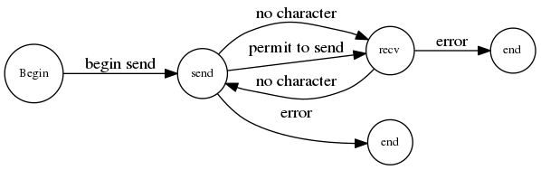

## 双击接口通讯实验报告

---

1. 实验代码解析

   实验代码的大体框架

   * 初始化 LCR 线路控制寄存器

     ```c
     MOV		DX,	3FBH		; 读入线路控制器的地址
     ; 退出间断状态，偶校验，1位停止位，7位数据位
     MOV		AL, 00011010B
     OUT		DX, AL
     ```

   * 写入分频系数等初始化参数

     ```c
     ; 写入 LCR 线路状态寄存器，准备初始化除数寄存器
     MOV		DX, 3FBH
     MOV		AL, 80H		; DLAB = 1, 准备初始化除数寄存器
     OUT		DX, AL
       
     ; 写入除数寄存器
     ; 实验要求比较模糊，这里采用的是 9600 波特率， 16 位波特率因子
     ; 如果采用 64 位的波特率因子，计算公式 (1843200 / 64) / 9600, 求得 9600 波特率下的 64 位波特率下的对应的除数寄存器的内容写入 3F8H, 3F9H 地址内即可
     MOV		DX, 3F8H
     MOV		AL, 0CH
     OUT		DX, AL
     MOV		DX, 3F9H
     MOV		AL, 00H
     OUT 	DX, AL
       
     ; 写 FIFO 寄存器 FCR
     MOV		DX, 3FBH
     MOV		AL, 00001010B
     OUT		DX, AL
     MOV		AL, 87H
     MOV		DX, 03FAH
     OUT		DX, AL
       
     ; 初始化 Modem 寄存器 MCR, 进行实验前的自发自收检测
     MOV		DX, 3FCH
     MOV		AL, 13H			; 13H 自发自收模式，03H进行实验
     OUT		DX, AL
     ```

   * 发送部分代码

     ```c
     ; 读取线路状态寄存器判是否存在错误
     MOV		3FDH
     IN		AL, DX
     TEST	AL, 1EH		; 检验是否存在帧格式错误，奇偶校验错误，覆盖错误等等
     JNZ		ERROR
       
     ; 检测是否可以发送，不可发送跳转到接收状态
     TEST	AL, 20H
     JZ		RECEIVE
       
     ; 读取键盘输入并发送,没有接收到跳转到接收状态
     MOV		DL, 0FFH
     MOV		AH, 06H
     INT		21H
     JZ		RECEIVE
       
     MOV		DX, 3F8H
     OUT		DX, AL
     ```

   * 接收部分代码

     ```c
     ; 读取线路状态寄存器判断是否存在输入数据，没有跳入发送状态
     MOV		DX, 3FDH
     IN		AL, DX
     TEST	AL, 01H
     JZ		SEND
       
     ; 象征性检验是否存在奇偶校验错误
     TEST	AL, 04H
     JNZ		ERROR
       
     ; 接收数据
     MOV		DX, 3F8H
     IN		AL, DX
     ```

2. 发送接收状态转换图

   

3. 双击通讯的接口图

   ​

   ​