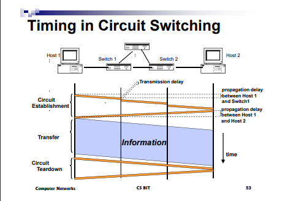
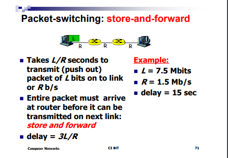
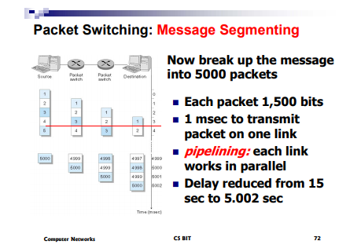

## 计算机网络

---

1. 有用的指导原则

   * 异步处理
   * 网络是不稳定，不可预测，随机的

2. 不同角度观察网络

   * 不同的层级的网络

   * 不同地域范围的网络

     * LAN
     * Enterprise
     * WAN
     * Interdomain

   * 不同概念的网络

     * 网络架构
     * 网络协议
     * 网络算法

   * 不同的功能方面

     不同的网络层级关注不同的处理任务

3. 网络的层级基础划分

   1. 应用层 : email, www, phone
   2. 应用协议层 : SMTP, HTTP, RTP, FTP
   3. 可依赖传输层 : TCP, UDP, ...
   4. 包转发机制 : IP
   5. 底层网路 : etherent(以太网), PPP, ...
   6. 物理层 : CSMA, async, sonet, ...

---

### 计算机网络

1. 自主的电脑通过沟通科技连接构成的内部网络
   * 这里的网络强调的是计算机之间的网络，计算机内部的进程网络并不计算在内
   * 连接技术在这里是多种多样的
     1. 电话线路网络 : 调制解调器
     2. 交换机网络
     3. 无线网络
     4. 内部网和外部网
   * 计算机网络 = 计算机 + 连接
2. 计算机网络提供的服务
   * 共享资源
   * 共享数据和文件
   * 沟通
   * 信息传播

### 网络核心和网络边界(edge and core)

1. 边界 : 应用和主机，资源

2. 核心 : 路由器和子网络，以及路由器和子网络等构成的链接

3. 链接链路

4. 端到端的沟通协议

   * CS

     客户端和服务器是指通信中的两个应用进程，客户是服务的请求方，服务器是服务的提供方

   * peer-peer

     没有客户端和服务端，所有的主机都是对等的

5. 传输控制协议 TCP

   1. 可依赖的
   2. 流式传输
   3. 阻塞控制 : 当网络阻塞的时候延迟发送数据

6. 网络核心

   网状互联的路由器

   数据传输的方式

   * 电路交换传输 : 专用电话网络

     交换的含义就是转接，使用某种方式动态的分配传输线路的

     1. 链路带宽和容量

     2. 资源是专用的不共享

        当电话网络中的主机数目庞大的时候，需要大量的电话线，不合要求

        所以需要使用交换机来取代大量的电话网，作为中转，将网状结构变成星型结构

        电话网络中的传输过程

        1. 建立连接 : 建立到目的地之间的链接
        2. 传输数据 : 流式传输
        3. 销毁连接释放资源

        

     3. 需要提前建立好请求链路

   * 信息交换传输

   * 分组交换传输 : 数据分成离散的块传输

7. 共享连接

   核心 : 将网络中的资源切分成小块

   切分方式

   1. FDM : 频率切分，不同的用户不同的频率，可能不存在时间的延迟
   2. TDM : 分时，时间片使用,可能会有延时
   3. 空间切分

   数据包转发

   1. 端到端之间的数据被切分成了包，在发送端将数据切分成了固定长度的数据段
      1. 包头 : 包含有控制数据和信息，目的地地址，**包的顺序**等等
         * 地址控制信息
         * 按照节点在链路上的顺序存储转发数据包
      2. 包数据
      3. trailer
   2. 存储转发网络 : 一旦一个节点接收到了一个数据包，存储并转发给下一个节点
   3. 每一个数据包都会按照在 header 中的要求一些发送路径在链路上传送

   节点

   网络中的每一个节点负责将接收到的数据包发送到下一个节点中，节点中内部的书包排队在不同的出端口上实现了链路的共享，这样子还可以有效的解决不同个的主机和网络的传输速度不同造成的矛盾，因为内部都是使用了排队的机制，所以，可以同意不同的网络的传输速度，速度快的网络在一个相同的时间片之内发送的数据包也就多，否则反之

   存储转发的时间消耗

   整体发送的时间消耗

   

   存储转发的时间消耗

   

   * 不像一次全部传输那样，我们将包切分之后所有的交换机其实都是并行工作的，消耗的时间仅仅只是延迟的包传送的时间，可以降低发送的延迟

8. 电路交换传输和存储转发的优缺点

   1. 电路交换传输

      * 保证了带宽，传输行为可以预测
      * 简单
      * 传播简单
      * 传输的数据少(没有附加的地址控制信息等)

      ---

      * 浪费带宽
      * 阻塞其他的用户(如果网络资源申请过多)
      * 连接延迟

   2. 存储转发网络

      * 可依赖的传输
      * 包转发机制很高效
      * 可以连接不同的网络
      * 允许更多的用户使用网络

      ---

      * 包转发机制必须要处理阻塞的情况
      * 处理手段更加的复杂

9. 网络的物理基础设施

10. 传输技术

    * 端到端
    * 广播传输

11. 网络类型

    * 局域网

      总线结构(不好排查错误，适合广播，出现的断开会影响很多的主机)，环形结构，星型结构(容易排查错误，出现的错误不会影响其他的主机)，树型结构

    * 城域网

    * 广域网

      1. 资源子网络(edge)
      2. 通信子网络(core)

12. 网络的节点的传输时间消耗

    1. 节点处理时间 : 节点内部对数据包检验错误和决定发送的输出端口
    2. 排队时间
    3. 传输时间 (等待发送出去的那段时间) 
    4. 传播时间

    甚至如果队列已经满的话，会出现发送失败的异常

13. 传输协议

    1. 模块化控制
    2. ​