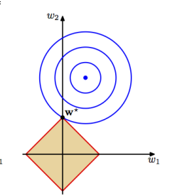
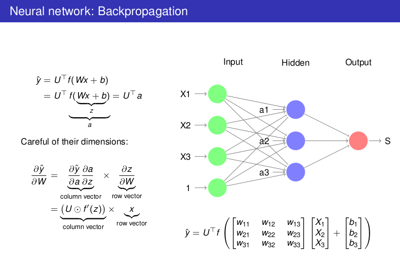

1. 训练集和测试集应该是同一个分布的，为了保证这一点需要多次 shufflue 得到不同的训练接和测试集获得尽可能同分布的效果进而保证训练的结果可以避免奇异点

2. 准确率测定
   $$
   acc = \frac{correct}{sum}
   $$
   但是并不是准确率是唯一的测评标准，有时候如果分类器中的样本的类别中的数据相差悬殊，准确率很高的分类器不一定就是有用的分类器。

3. 量化评估的标准

   `True` 是分类器和实际标签一致，`Positive` 针对分类器的结果的正误

   1. TP: 分类器正确，实际标签正确
   2. TN: 分类器错误，实际标签错误
   3. FP: 分类器正确，实际标签错误
   4. FN: 分类器错误，实际标签正确

   准确率: $$acc = \frac{TP}{TP + FP}$$

   召回率: $$recall = \frac{TP}{TP+FN}$$

   调和平均值: $$F1=\frac{2* acc * recall}{acc + recall}$$,F1 分值偏向于二者中的更小的值，只有更均衡的两个分数才能获得更高的分数，当两个分类中的数据大小相差过于悬殊的时候，使用的 F1 值是最好的

4. 无监督学习

   * k-means

   * LDA

     1. 每一篇文档都有一个隐含的主体分布 (document embedding文档抽象成向量)
     2. 每一篇文章都有一个词的分布

   * autoencoder:
     $$
     X \rightarrow Z \rightarrow X
     $$
     学习到的 Z 是 X 的隐含表示，如果这种表示是一种概率分布。按照一个我们学习得到的参数，采样出来的新的分布再解码之后会得到类似与 X 的数据。

   * GAN

5. 优化方法

   高维没有办法一次性的求得最优解，但是可以递归的进行，多次向着最优解靠近，利用梯度进行优化

   梯度是等高线的法线。

   优化方法可以使用 牛顿法则也可以使用 upbound 函数，进行优化的研究都是考虑对海森矩阵的逆的近似

6. 正则化项的目的在于

   尽量减少的参数的大小，在一个划定的区域内寻找参数(如果是 L2 范数表示在一个圆心在圆的近似范围内寻找很小的参数)

   * Ln 范数: $$(\theta_{1}^q + \theta_{2}^q + ... + \theta_{n}^q)^{\frac{1}{q}}$$, 其中 $$\theta$$ 是模型的参数

   * L1 范数的好处是: 对很多的参数是0，得到的解是稀疏的，如果为了得到稀疏的模型使用 L1 范数，最小的参数如下图 $$w^*$$点处可以发现，这样的很多的参数都是 0 (轴线上)得到的模型参数很稀疏，压缩存储。

   * L1 + L2: 两个正则化项的共同使用也可以

   * 当 $$q$$ 趋向于无穷的时候表示的是求 $$max(\theta)$$

     

7. 回归模型

   softmax 是 logistic 的扩展
   $$
   \frac{e^{\theta_1x}}{e^{\theta_1x} + e^{\theta_2x}}=\frac{1}{1+e^{(\theta_2-\theta_2)x}}=\frac{1}{1+e^{\theta_3 x}}
   $$
   softmax 的交叉熵计算中， tensorflow 内部的机制是只计算 $$x^T\theta$$ 因为分母都是相同的，并且分子是一个指数函数，大量数据的 feed 可以利用这种方式加速

8. 神经网络

   为数据寻找新的适合的描述方式，并在最后的输出层采用不同的 softmax, logistic 等方式进行有效的分类或者回归任务
   $$
   L(f_{\theta}(x),y)
   $$
   在神经网络的梯度求导过程中，如果如下图所示

   

   其中的对(input - hidden)参数矩阵 $$W$$ 进行求导得到上式，其中的 $$\frac{z}{W}$$ 的求导过程中，得到的是输入的向量 $$X$$ ，并且每一个 $$\frac{z_i}{W_i}$$ 计算的结果都是 $$X$$ (并且只有对应的 z, w 计算的结果是 X 否则是 0,入网络图下面的公式所示， $$Z_1 $$ 对应对 $$W_1$$ 求导结果是 $$X_1$$ ，但是对 $$W_2$$ 的求导结果是 0)

9. CNN

   卷积神经网络中使用 RELU 的原因在于整体的导数是部分导数的和，只要一个导数不为 0 就不会出现梯度消失的现象，但是在全连接层中最好不要使用 RELU 因为在全连接网络中导数不是求和计算的，使用 RELU 很容易出现梯度消失的现象。

   对 pooling 层求导: 误差反向传播的时候，只会沿着最大的那个路径进行反向传播 (max pooling)

   **求对每一个像素对数据特征提取的影响，可以保持模型参数，对数据求导**

10. NLP

  因为 RNN 中的梯度计算是按照按照时间步的反向传播，导数是乘积的，所以很容易发生梯度消失和梯度下降，但是 LSTM 中的梯度的求导并不是这样的，举例
  $$
  C_t = f_t * C_{t-1} + i_t * \ddot{C_{t-1}}\\
  \frac{d C_t} {d C_{t-1}} = \frac{d f_t * C_{t-1}}{d C_{t-1}} + \frac{d (i_t * \ddot(C_{t-1}))}{d C_{t-1}}\\
  = \frac{d f_t}{d C_{t-1}}C_{t-1} + f_t + ...
  $$
  其中 $$f_t$$, $$i_t$$ 都含有 $$C_{t-1}$$ 可以保证在 LSTM 中的求导中存在有类似的 $$f_t$$ 在原本的 RNN 中 sigmoid 的导数最大值是 0.25 但是这里的 $$f_t$$ 可以在 0 ~ 1 之间，可以保证一个很好的梯度值 (但是如果对应的 $$f_t$$ 也是的很小的情况呢，这种在工程上可以通过加大偏置的情况下，这时候 sigmoid 的值接近于 1 可以将梯度保证在一开始的时候训练可以从一个很大的值范围内训练，这样的以前的经验可以有效的保留在长期记忆中) ，只要保证主干道上的随时间的反向传播中可以减少梯度下降的影响的话 LSTM 就已经很好的完成了这个任务，可以有效的利用在其他的一些实际环境中。

  ---

  RNN - W 初始化是恒定矩阵的话可以一部分减少梯度下降的影响

  **LSTM - 长期记忆 $$c$$, 短期的经验 $$h$$, 长短期的经验都会传播到下一个 LSTM Cell 中，长期的经验有可能会被更新门校正，短期的经验是根据上一个 cell 的长期经验(更新后) 进行选择得到的。输出门的先用 $$tanh$$ 压缩之后再用输出门更新一下（短期记忆）。门都可以考虑成按照百分比混合或者选取，在遗忘门和更新门中的作用是是按照百分比混合经验(长期经验)，在输出门中的作用是按照百分比选取一些经验(短期经验)。**长期经验是全局的，短期经验是序列之后服务的。

  但在实际中，因为 sigmoid 函数基本上取值都是二值化的，所以这时候也可以将其理解成是开关，其中的 $$c, a, h$$ 都是向量的形式，向量的大小是 $$n$$, 可以表示成是需要记住的 $$n$$ 个特征，通过门对特征进行按找元素的开关选择操作。从而使得 LSTM 可以有效的将之前学习到的序列的特征可以传递到之后的神经元中进行分析和使用功能。

  如果序列之前的一部分的变化对之后的序列的变化很大，这样的特征就会被有效的学习到。

  ​

  Attention

  不同的序列元素对最后的 encoder 的输出的表达式的影响不同，把每一个 encoder 的序列元素都和 decoder 中的元素按照权重连接起来，比如说翻译一个文字中会受到 encoder 中的序列不同元素的影响，但是权重不同。输入的词向量和 encoder 输出的向量的做内积，然后对这些内积结果做 softmax,得到不同的权重概率大小，(内积很大，方向相似)方向一致的向量的权重大。

  ---

  在自然语言处理中，如果句子的词数过长，计算的概率会比较小，这时候可以采用集合均值的方法将其归一化。

  ---

  在机器翻译中，经常会出现名词被错误翻译的情况，这主要是因为使用 word2vec 不同的单词具有相似的词向量导致的。

  ---

  softmax的trick,如果计算出来的 softmax 的值过大的时候，可以讲所有的 softmax 的概率值统一除以最大值，从而归一化。

