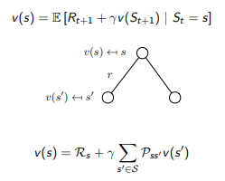
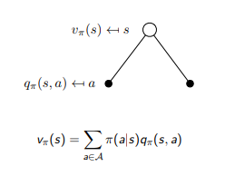
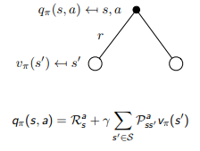
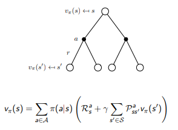
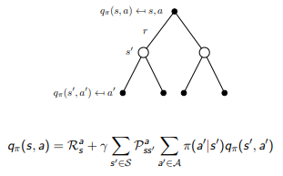
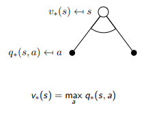
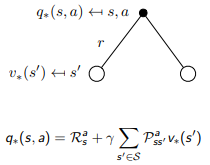
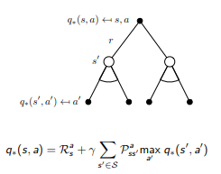

# MDP

---

## 1. Markov Process

1. Introduction to MDPs

   * MDP 可以形式化的被描述成强化学习的环境
   * 这种环境是可观测的
   * 几乎所有的强化学习问题可以被某种形式的转换成 MDP 
     * 部分可观测的 MDP
     * 优化控制问题是连续的 MDP

2. Markov 性质

   未来和过去无关只和当前有关，如果状态是 Markov 的当前只当
   $$
   P[S_{t+1}|S_t]=P[S_{t+1}|S_1,...,S_t] \tag{1}
   $$
   换句话说，状态 state 收集了历史的所有相关信息，**这些信息中主要就包括之后的状态转移的概率**

   对于一个 Markov 状态 $$s$$ 和后继状态 $$s'$$，状态转移的概率描述如下
   $$
   P_{ss'}=P[S_{t+1}=s'|S_t=s] \tag{2}
   $$
   状态转移矩阵 $$P$$ 定义了所有状态到下一个状态的转移概率
   $$
   P=\left[
    \begin{matrix}
      P_{11} ... P_{1n} \\
      ......\\
      P_{n1} ... P_{nn}
     \end{matrix}
     \right] \tag{3}
   $$
   矩阵的每一行的和是 1 满足概率的性质

3. 总结

   Markov 过程是无状态的随机过程，随机状态序列满足 Markov 性质，定义如下

   MP 是对于 $$S,P$$ 的 tuple ，其中 $$S$$ 是有限的状态结合， $$P$$ 是状态转移矩阵

## 2. Markov Reward Process

1. MRP

   一个 MRP 是一个带有价值的 Markov 链，允许我们记录一个 sample 的 MRP 序列的好坏(累计价值)，定义如下:

   MRP 是 $$S,P,R,\gamma$$ 的元组，其中 $$S$$ 是有限状态，$$P$$ 是状态转移矩阵，$$R$$ 是奖励函数表示我们从状态 $$S$$ 开始可以获得的下一步立即奖励的期望大小是多少(可能有不同的转移概率需要考虑，奖励函数可以描述状态的好坏)，虽然我们最终关心的是奖励的和， **$$R_s$$ 衡量进入状态 $$s$$ 获得的立即奖励**
   $$
   R_s = \mathbb{E}[R_{t+1}|S_t=s]\tag{4}
   $$
   $$\gamma$$ 是折扣因子表示了对未来价值的期待程度，值域在 $$\gamma \in[0,1]$$，采用折扣的具体原因在于对于环境的不确信程度，避免无限的 Markov 序列，数学计算的方便。

   我们真正关心的是之后的折扣价值和 $$G_t$$ ($$G_t$$ 是针对一个样本序列的)
   $$
   G_t=R_{t+1} + \gamma R_{t+2} + ...=\sum_{k=0}^\infty \gamma^kR_{t+1+k}\tag{5}
   $$

2. 价值函数

   价值函数 $$v(s)$$ 定义了从状态 $$s$$ 开始的 $$G_t$$ 的期望，衡量了状态的好坏程度，定义如下
   $$
   v(s)=\mathbb{E}[G_t | S_t=s]\tag{6}
   $$

3. MRP 的 Bellman 方程

   价值函数可以分解为两部分

   * 立即奖励 $$R_{t+1}$$，**进入状态 $$s$$ 会获得的立即奖励**
   * 折扣奖励 $$\gamma v(S_{t+1})$$

   $$
   \begin{equation*}
   \begin{split}
    v(s)&=\mathbb{E}[G_t|S_t=s]\\
   &=\mathbb{E}[R_{t+1}+\gamma R_{t+2} +\gamma^2R_{t+3} ...|S_t=s]\\
   &=\mathbb{E}[R_{t+1} + \gamma(R_{t+2} + \gamma R_{t+3} + ...) | S_t=s]\\
   &=\mathbb{E}[R_{t+1} + \gamma G_t | S_t=s]\\
   &=\mathbb{E}[R_{t+1} + \gamma v(S_{t+1}) | S_t=s]
   \end{split}
   \end{equation*} \tag{7}
   $$

   

4. MRP Bellman in Vector form
   $$
   v = R + \gamma P v \tag{8}
   $$

   * $$v$$ 是状态价值的列向量
   * $$R$$ 是状态奖励的列向量
   * $$P$$ 是状态转移矩阵 

5. 我们的目的是求解出每一个状态的价值函数，以便于之后进行最优决策，因为 Bellman 方程是线性方程是可以解的，求解过程如下
   $$
   v=R+\gamma Pv\\
   (1-\gamma P) v = R\\
   v = (1-\gamma P)^{-1}R  \tag{9}
   $$

   * 计算矩阵逆的复杂度是 $$O(n^3)$$ 如果状态的数目是 n 的话
   * 小矩阵可以直接求逆，大矩阵不可以需要使用迭代方法
     * 动态编程
     * 差分学习 ...
     * 蒙特卡洛评估

## 3. Markov Decision Process

1. MDP 定义

   MDP 是带有决策的 MRP 过程，环境状态都是 Markov 的，环境状态完全可视

   MDP is a tuple of $$(S,A,P,R,\gamma)$$

   * $$S$$ 是有限状态集

   * $$A$$ 是有限动作集

   * $$P$$ 是状态转移矩阵
     $$
     P_{ss'}^a=\mathbb{P}[S_{t+1}=s'|S_t=s,A_t=a]\tag{10}
     $$

   * $$R$$ 是奖励函数，**或者理解为从特定状态执行一步动作的代价与收益**，环境提供
     $$
     R_s^a = \mathbb{E} [R_{t+1}|S_t=s,A_t=a]\tag{11}
     $$

   * $$\gamma \in [0,1]$$

2. 形式化决策

   决策是在状态下执行动作的概率
   $$
   \pi(a|s)=\mathbb{P}[A_t=a|S_t=s]\tag{12}
   $$

   * 不同的状态具有不同的动作概率分布
   * 定义了 agent 的行为
   * 在 MDP 中决策只依赖与当前的状态
   * 强化学习中需要优化的部分

3. MDP 的价值函数及其 Bellman 方程

   1. 状态价值函数

      在策略 $$\pi$$ 指导下可以获得的价值和的期望，显示了状态 $$s$$ 的好坏，策略 $$\pi$$ 体现折扣奖励部分
      $$
      v_{\pi}(s)=\mathbb{E}_{\pi}[G_t|S_t=s]\tag{13}
      $$

      $$
      v_{\pi}(s)=\mathbb{E}_{\pi}[R_{t+1}+\gamma v_{\pi}(S_{t+1})|S_t=s]\tag{14}
      $$

   2. 动作价值函数

      从状态 $$s$$ 开始经过动作 $$a$$ 遵循策略 $$\pi$$，显示了从特定的状态采用特定的动作的好坏 ，条件概率是由策略 $$\pi$$ 控制的
      $$
      q_{\pi}(s,a)=\mathbb{E}_{\pi}[G_t|S_t=s,A_t=a]\tag{14}
      $$

      $$
      q_{\pi}(s,a)=\mathbb{E}_{\pi}[R_{t+1} + \gamma q_{\pi}(S_{t+1}, A_{t+1}) | S_t=a,A_t=a]\tag{15}
      $$

   3. 综合

      

      ---

      

      ---

      

      ---

      

      ---

4. 最优价值函数

   * 最优状态价值函数 $$v_{\pi}$$ 是所有策略下最优的那个状态价值函数
   * 最优动作价值函数 $$q_{\pi}$$ 是所有策略下最优的那个动作价值函数，MDP 问题解决
   * 最优动作价值函数描述了 MDP 的最好结果，只要我们找到了最优的价值函数，MDP问题解决

5. 最优决策
   $$
   \pi \geq \pi'\ if\ v_{\pi}(s) \geq v_{\pi'}(s), \forall s
   $$

   * 对于 MDP，该最优策略必然存在且不唯一

   * 最优策略可以得到最优状态价值函数，和最优动作价值函数

   * **可以通过最大化动作价值函数的方式寻找到最优决策**，这种情况下决策的概率分布变成 one-hot 向量，指向最优的动作

   * Bellman 最优方程

     1. 一个状态的最优价值等于从该状态出发采取的所有行为产生的行为价值中最大的那个行为价值

        

     2. 必须考虑环境因素计算期望

        同样提供一种思路，只要知道了$$v_{*}$$ 即可求解 $$q_{*}$$

        

     3. 

     4. 非线性的递归(max函数)不存是在显示的求解公式，只能使用迭代的方法计算求解，比如价值迭代或者策略迭代，Q-Learing，Sarsa等等算法

##  4. Extension to MDPs

