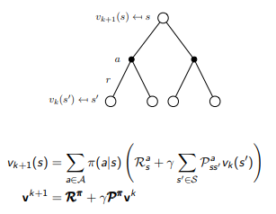
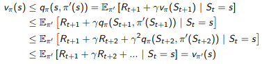
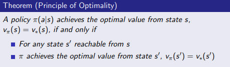
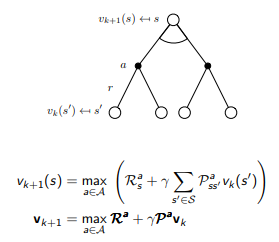
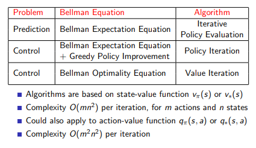
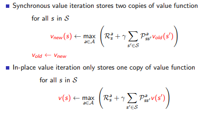
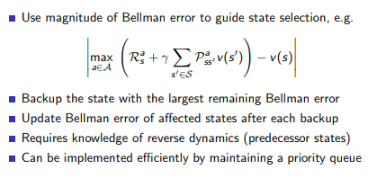

# Planning by Dynamic Programming

---

## 1. Introduction

1. 一种解决复杂问题的方法，动态的时序过程优化程序
2. 通过将复杂的问题分解成子问题，解决子问题然后合并答案
3. 限制
   * 最优子结构: 子问题的最优解可以构成问题的最优解
   * 重叠子问题: 子问题会重复很多次，可以缓存再利用
4. MDP 满足动态规划的性质，并且 Bellman 方程提供了分解子问题的方式，价值函数存储了重叠的子问题信息
5. 因为 MDP 的所有信息都是已知的，这是一个 planning 的问题不是强化学习的问题
   1. 预测问题: 给出了具体的 MDP 和对应的策略 $$\pi$$ ，求解价值函数 $$v_{\pi}$$
   2. 控制问题: 给出了 MDP 的信息，求解最优的价值函数和策略 $$v_{*}$$ ，$$\pi_{*}$$

## 2. Policy Evaluation

> 知道了 MDP，知道了一个特定的策略，最好的奖励是多少，这个最好的奖励将会衡量我们的策略的好坏

1. 问题： 评估一个给定的策略

2. 解决方式: **迭代使用 Bellman 方程**
   $$
   v_1 \rightarrow v_2 \rightarrow v_3 \rightarrow ... \rightarrow v_{\pi} \tag{1}
   $$
   可以理解，$$v(s)$$ 是状态，下面的公式是状态转移方程，通过不断的迭代求解最优的状态的过程，通过先前看一步将后续状态(子问题)的解加入公式进行运算可以得到下一个迭代状态的新的解，**同步迭代**的思想就是每一次迭代对所有的状态都进行处理。

   **$$R_s^a$$ 代表进入状态 $$s$$ 的立即奖励，之后的折扣奖励都是从 $$s$$ 到后续状态的折扣奖励**

   

## 3. Policy Iteration

提供一个初始的 $$v_{\pi}$$ ，返回一个新的更好的 $$v_{\pi}$$

1. 评估一个 $$v_{\pi}$$ 在 `Policy Evaluation` 中提到的使用迭代 Bellman 方程的方式实现
   $$
   v_{\pi}(s) = \mathbb{E}[R_{t+1}+\gamma R_{t+2} + ... | S_t=s]\tag{2}
   $$

2. 根据评估出来的价值函数提升策略(贪心)
   $$
   \pi'=greedy(v_{\pi})\tag{3}
   $$

通过迭代的过程不断的优化这个策略，并且过一定会收敛到最优的策略 $$v_{*}$$，过程示例

策略提升的理论证明

1. $$a=\pi(s)$$ 初始策略

2. 贪心提升策略

   这里的 $$q_{\pi}$$ 内容是立即奖励(可以理解成方格游戏走一步的代价)加上折扣奖励(方格游戏中的目的地的收益)
   $$
   \pi'(s)=\arg \max_{a\in A} q_{\pi}(s,a)\tag{4}
   $$
   新的策略是可以提高动作价值函数的(至少不降低)，证明如下
   $$
   q_{\pi}(s,\pi'(s))=\max_{a\in A}q_{\pi}(s,a) \geq q_{\pi}(s,\pi(s))=v_{\pi}(s)\tag{5}
   $$
   状态价值函数的提升证明，证 $$v_{\pi'}(s)\geq v_{\pi}(s)$$

   

   如果对策略的提升不会在提高我们的价值函数的时候，函数收敛
   $$
   q_{\pi}(s,\pi'(s))=\max_{a\in A}q_{\pi}(s,a) = q_{\pi}(s,\pi(s))=v_{\pi}(s)\tag{6}
   $$

   $$
   v_{\pi}(s)=\max_{a\in A} q_{\pi}(s,a)=v_{*}(s) \ \ for \ all \ s\in S\tag{7}
   $$

   $$
   q_{*}(s,a)=R_s^a + \gamma \sum_{s'\in S}P_{ss'}^av_{*}(s')\tag{8}
   $$

   这时候 Bellman 最优方程成立，找到了最优的策略和价值函数，**策略迭代算法解决了 MDP 问题**

通用修正策略迭代算法：有时候没有必要到收敛的时候就可以得到最好的策略，使用精度比较停止或者 k 轮迭代后提前停止

## 4. Value Iteration

1. 最优原则

   

2. 迭代过程

   1. 知晓当前状态 $$s$$ 的所有子状态 $$s'$$ 的最优价值函数 $$v_{*}(s')$$

   2. 更新当前状态 $$s$$ 的价值函数
      $$
      v_{*}(s)\leftarrow \max_{a\in A} R_s^a + \gamma \sum_{s'\in S}P_{ss'}^av_{*}(s')\tag{9}
      $$

   3. 不断重复上述过程迭代直到收敛找到最好的价值函数，和策略迭代的过程不同这里我们只是迭代价值函数

3. Bellman 最优方程

   

4. 

## 5. Extensions to Dynamic Programming

1. 异步同步更新

   异步更新需要知道状态之间的优先顺序才可以高效的计算

   

2. 通过变化的大小找到最重要的状态，指导异步更新的顺序

   

## 6. Contraction Mapping