## Model-Free Prediction

---

>一个环境可以用马尔可夫决策过程展现，但是没有提供完整的环境信息(没有提供 MDP)

## 1. Introduction

对一个未知的 MDP 进行价值函数的估计，直接从 agent 和环境的交互的经验中获得对价值函数的估计

下一堂课解决的是如何最优化这样的一个未知的 MDP 的决策问题，可以理解本节属于预测问题，下节属于控制问题

## 2. Monte-Carlo Learning

1. 定义

   * 直接从应用 episode 的经验中学习
   * 无模型的学习方法: 不需要知道实际的 MDP (状态转移概率，奖励信息)
   * 从一个完整的 episode 结束后学习调整
   * 核心概念: $$value = mean\ G$$
   * 必须要终止一个 episode 之后才可以应用 MC
     * 所有的 episode 必须有终结状态

2. 算法

   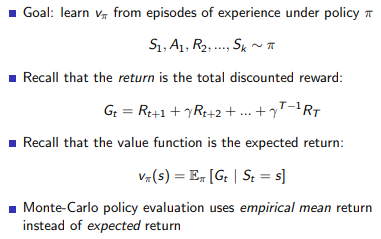

   * 从一个 episode 完整的序列(状态，动作，奖励的序列)中学习经验
   * 价值函数是所有的 $$G_t$$ 的平均
   * 使用经验均值反馈替代预期反馈

3. 如何得到隐含的 MDP 中的所有的状态的价值函数

   1. First-Visit Monte-Carlo Policy Evaluation

      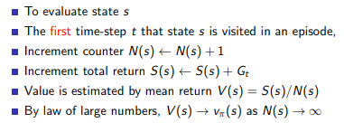

      在一个片段(episode)中，某个状态不一定只出现一次，事实上很有可能多次重复该状态并进行不同的状态转移，初访蒙特卡罗就是只记录第一次到达该状态时的情况，并给计数器加1，计数器是为了求经验均值用的。

      **实际中计算的时候，采样很多的 episode 并对每一个计算 $$N,S,V$$ **

      根据大数定律，模拟次数很多情况下随机变量的平均值趋向于真正的价值函数，只是在进入一个 episode 的第一次计算

   2. Every-Visit Monte-Carlo Policy Evaluation

      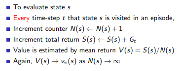

      与初访不同的是，在这里我们又回到这样一个片段，并且在每次达到状态 $$s$$ 时增加计数器并记录其状态反馈。也就是说我从状态$$s$$ 转了一圈又回到原点时，不仅需要考虑原来的回报还要考虑这个状态转了一圈后的二次回报。

      同上，在一个 episode 的每一个出现的状态都进行计算。

4. 增量平均

   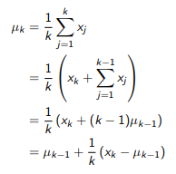

   使用增量平均的增量 MC 更新，在运行 MC 算法的时候，可以不断的使用递增的平均公式，这种方式还可以运行时的平均值，在其他的很多方面都有用。超参数 $$\alpha$$ 可以调节。

   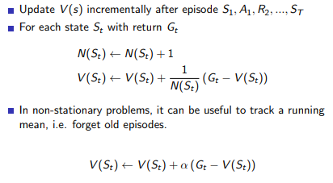

## 3. Temporal-Difference Learning

1. 定义

   * TD 直接从 episode 的经验中学习，和环境的互动中学习，在线学习在线更新
   * TD 方法是无模型的算法
   * TD 从不结束的 episode 中学习经验，使用估计量代替之后实际的真实反馈，仅仅使用前几步的反馈值
   * 使用自己的估计作为反馈的一部分(折扣奖励)

2. 算法 TD(0)

   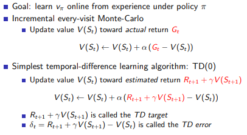

   $$G_t$$ 是从当前的时间步下到终止状态的返回值包含进入当前的状态 $$S_t$$ 的立即奖励，$$S_t$$ 是 episode 中的第 $$t$$ 时刻的状态

3. 和 MC 比较

   1. 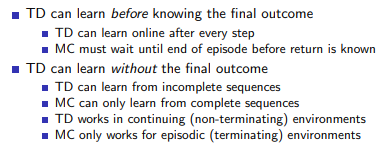

   2. 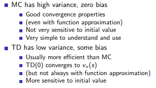

      这里 TD(0) 对初始值会更敏感，因为第一次的估计需要使用到初始值。 MC 很好的容易收敛到真实的价值函数。但是 TD(0) 也是可以收敛到真实的价值函数上，并且 TD 有时候非常高效。这时候对 $$\alpha$$ 超参数也要有很好的调整

   3. 收敛性方面

      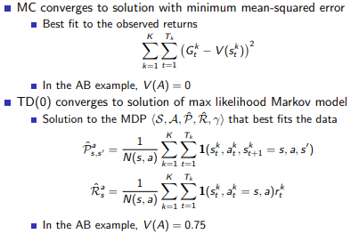

      TD 算法在尽可能的模拟尝试寻找最合适的 MDP，最大相似与真实的 MDP。TD 算法更适合 Markov 环境，在这种环境下比 MC 算法更加的高效。

4. 偏差和方差的平衡

   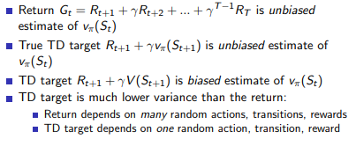

   * 真实的 $$G_t$$ 是无偏估计，没有引入任何偏差
   * TD 偶尔可以得到无偏估计，但是经常得到的是有偏估计，是不准确的(是上一次迭代得到的结果一种猜测)，虽然偏差存在但是降低了方差，使得估计越来越准确

## 4. TD($\lambda$)

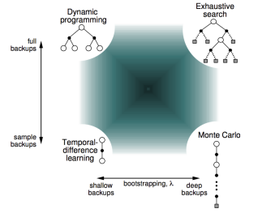

1. n 步预测 TD 

   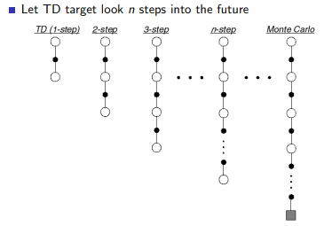

   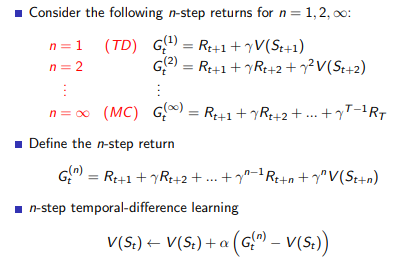

2. 前向TD($$\lambda$$)

   在不增加算法的复杂度的情况下，综合考虑所有的步数的预测。

   引入了 $$\lambda $$ 之后，会发现要更新一个状态的状态价值，必须要走完整个Episode获得每一个状态的即时奖励以及最终状态获得的即时奖励。这和MC算法的要求一样，因此TD($$\lambda$$)算法有着和MC方法一样的劣势。$$\lambda$$ 取值区间为[0,1]，当 $$\lambda = 1$$ 时对应的就是MC算法。这个实际计算带来了不便。

   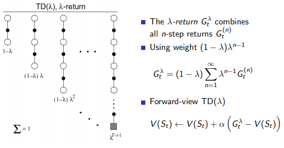

   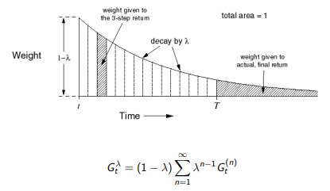

   最终的部分权重直接取完，保证权重综合是 1，这种几何加权平均是计算高效的。

   存在和 MC 一样的限制

   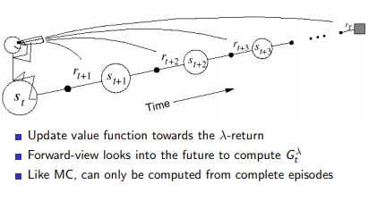

3. 反向 TD($$\lambda$$) 

   给每一个状态引入一个数值：**效用追踪**（**Eligibility Traces, ES，也有翻译成“资质追踪”，这是同一个概念从两个不同的角度理解得到的不同翻译**），可以结合上述两个启发将频率和最近因素统一考虑。定义：

   如果 $$S_t = s$$ 不满足的话，$$E_t$$ 不加 1 信用机制呈指数下降
   $$
   E_0(s) = 0\\
   E_t(s)=\gamma \lambda E_{t-1}(s) + 1\ (if \ S_t=s)
   $$
   

   该图横坐标是时间，横坐标下有竖线的位置代表当前进入了状态  ，纵坐标是效用追踪值  。可以看出当某一状态连续出现，E值会在一定衰减的基础上有一个单位数值的提高，此时将增加该状态对于最终收获贡献的比重，因而在更新该状态价值的时候可以较多地考虑最终收获的影响。同时如果该状态距离最终状态较远，则其对最终收获的贡献越小，在更新该状态时也不需要太多的考虑最终收获。

   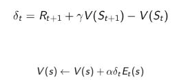

   $$\delta_t$$ 代表是第 $$t$$ 步的单步误差， $$E_t$$ 表示的是根据这个效用追踪提供的比例修正这个误差的程度。

   当 $$\lambda = 0$$: TD(0)

   ​