# Model-Free Control

---

>没有 MDP，如何得到最大化奖励的策略

## 1. Introduction

1. Model-Free

   上一节课学习的是无模型学习的预测算法，在 MDP 中估算可以获得的最大的价值函数

   本节课学习的是无模型学习的控制算法，在未知 MDP 中最优化价值函数并得到对应的策略
   1. MDP 未知，但是可以采样获取经验
   2. MDP 已知，但是状态数目过于巨大，只能通过采样获取经验

2. On-policy and Off-Policy

   1. On-Policy

      跟着目前学习到的策略决定行动的学习方式，在经验中采样，但是经验是从学习到的策略中采样的

      learn about policy $$\pi$$ from experience sampled from $$\pi$$

   2. Off-Policy

      跟着观察到的其他的策略决定行动的学习方式

      learn about policy $$\pi$$ from experience sampled from $$\mu$$

      其基本思想是，虽然个体有一个自己的策略，但是个体并不针对这个策略进行采样，而是基于另一个策略进行采样，这另一个策略可以是先前学习到的策略，也可以是人类的策略等一些较为优化成熟的策略，通过观察基于这类策略的行为，或者说通过对这类策略进行采样，得到这类策略下的各种行为，继而得到一些奖励，然后更新价值函数，即在自己的策略形成的价值函数的基础上观察别的策略产生的行为，以此达到学习的目的。

      离线策略学习 (Off-Policy Learning) 则指的是在遵循一个策略 $$\mu(a|s)$$ 的同时评估另一个策略 $$\pi(a|s)$$

3. 学习框架

   Generalised Policy Iteration (GPI) 通用策略迭代

   

## 2. On-Policy MC 

1. 无模型的策略迭代不使用状态价值函数，而是使用动作价值函数

   原因是，在 GPI 的框架下，贪心的策略提升针对 $$V(s)$$ 需要对 MDP 有所了解，这是不合理的，但是 $$Q(s,a)$$ 不用，如果求得了最优的 $$V(s)$$ 但是没有状态转移概率 $$P$$ 无法计算最优的 $$Q$$
   $$
   \pi'(s)=\arg \max_{a\in A} Q(s) =\arg\max_{a\in A}R_s^a + P_{ss'}^aV(s')\tag{1}
   $$

   $$
   \pi'(s)=\arg \max_{a\in A} Q(s,a)\tag{2}
   $$

2. 使用动作价值函数迭代的 GPI 框架

   1. Policy evaluation

      

      每一次评估都需要跑几组 MC ，得到对应的每一个状态的评估值 $$Q=q_{\pi}$$，使用贪心的方式不断迭代

   2. Policy improvement

      策略提升中如果只是用贪心的方法的话，我们会发现，策略会很容易的陷入局部最优中跳不出来(利用太多，探索太少)

      改进的方法就是 $$\epsilon$$-greedy 方案，在探索和利用之间权衡

      * 所有的动作(m个)的尝试概率都不是 0
      * $$1-\epsilon$$ 概率贪心选择，$$\pi(a|s)=1 - \epsilon + \frac{\epsilon}{m}$$
      * $$\epsilon$$ 的概率随机选择，$$\pi(a|s)=\frac{\epsilon}{m}$$

      可以证明，$$\epsilon-$$ greedy 每一次策略提升的效果都会更好的(至少不会差)

   3. 实际中对 MC 进行评估可能是非常耗时的，所以我们经常可以采用 $$Q \approx q_{\pi}$$ 的方式，少跑几组直接更新策略

      一组实验之后优化策略

      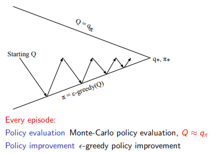

   4. GLIE

      在探索和利用的这种权衡情况下， GLIE 是一种可以适应任何探索模式的贪心算法，$$\epsilon$$-greedy 是 GLIE 的必须满足 $$\epsilon$$ 最终趋向于 0

      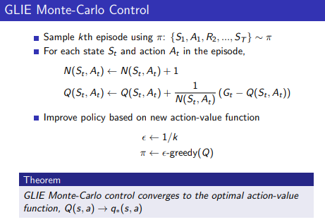

      其中 $$\epsilon$$ 随着采样的次数增加不断的趋向于 0，$$Q(s,a) \rightarrow q_{*}(s,a)$$

## 3. On-Policy TD - Sarsa

1. Sarsa 算法更新动作价值函数 $$Q$$

   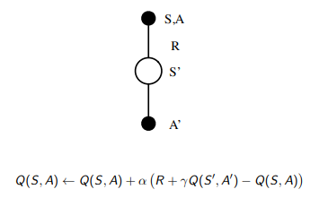

   从状态 $$s$$ 中根据上一次的选择 $$A$$ 得到奖励 $$R$$ 进入新的状态 $$s'$$ 并抽选下一次的动作 $$A'$$ (SARSA)

2. Sarsa in GPI

   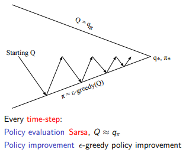

3. 算法

   

   Sarsa 会收敛到最优的动作价值函数的前提是，但是实际中并不 care

   * GLIE $$\epsilon$$ for $$\pi$$
   * 合适的 $$\alpha$$

4. Sarsa($$\lambda$$)

   1. n-step Sarsa

      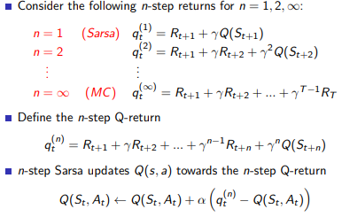

   2. Sarsa($$\lambda$$)

      1. Forward

         有和 MC 一样需要跑完一组实验才可以更新的缺点

         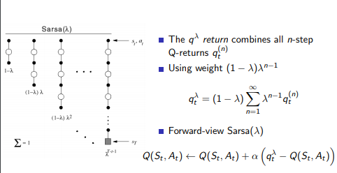

      2. Backward

         真实的 Sarsa($$\lambda$$) 算法，没有 MC 的缺点，在线更新

         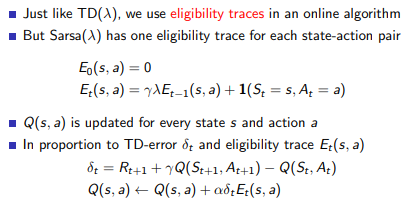

      3. Algorithm

         原始的更新算法中，只会更新离结果最近的状态，但是 Sarsa($$\lambda$$) 可以综合考虑，按照 $$E$$ 更新有关的每一步，是 Sarsa 的加速收敛的算法。**执行的对应动作的资格 $$E(s,a)$$ 提升，其他的都指数降低**。

         

## 4. Off-Policy Learning

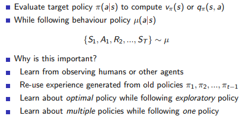

* 参考其他的策略但是又不想陷入这样的策略中，站在巨人的肩膀上
* 评估一个策略，优化实际的策略(on-policy是 off-policy 的特例)，其中 $$\pi$$ 是先验的经验，$$\mu$$ 是为了折中探索和平衡采取的实际策略

---

### 重要性采样

$$
\mathbb{E}_{x\backsim P}[f(x)]=\sum P(x)f(x)=\sum Q(x)\frac{P(x)}{Q(x)}f(x)=\mathbb{E}_{x\backsim Q}[\frac{P(x)}{Q(x)}f(x)]
$$

[参考资料](https://xffxff.github.io/2018/05/20/off-policy%E5%92%8Con-policy%E7%9A%84%E5%8C%BA%E5%88%AB/)

简而言之，因为实际中的行为是服从 behavior policy 的分布 $\mu$，但是我们想要估计的是 $\pi$ 策略，这时候需要进行修正，所以采用了 $\frac{\pi}{\mu}$ 的形式

---

1. Off-Policy MC

   实际的行为是从 $$\mu$$ 策略中采样出来的，现在要提升策略 $$\pi$$

   因为实际上 $$G_t$$ 应该是关于 $$\mu$$ 的累计奖励和，但是使用的是 $$\pi$$ 的经验做的估计，这时候初始的 $$G_t$$ 是关于 $$\pi$$ 的分布，需要转化成 $$\mu$$ 的分布。

   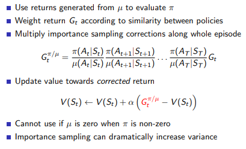

2. Off-Policy TD

   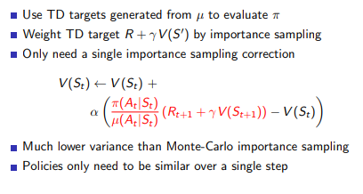

   Off-Policy 很适合 TD 不适合 MC

   离线 TD 策略的方法就是，在状态 $$S_t$$ 时分别依据另一个策略 $$\pi$$ 和当前遵循的策略 $$\mu$$ 产生行为 $$A_t$$ 的概率大小，如果策略 $$\pi $$ 得到的概率值与遵循当前策略 $$\mu$$ 得到的概率值接近，说明根据状态 $$S_{t+1}$$ 价值来更新的价值 $$S_t$$ 同时得到两个策略的支持，这一更新操作比较有说服力。同时也说明在状态 $$S_t$$ 时，两个策略有接近的概率选择行为 $$A_t$$。假如这一概率比值很小，则表明如果依照被评估的策略，选择 $$A_t$$ 的机会很小，这时候我们在更新价值 $$S_t$$ 的时候就不能过多的考虑基于当前遵循的策略得到的状态的价值。同样概率比值大于1时的道理也类似。这就相当于借鉴被评估策略的经验来更新我们自己的策略。

3. Q-learning

   Sarsa 的特例，最适合 Off-Policy 的算法，利用其他已知的策略经验选择 $$A'$$ ，不需要重要性采样

   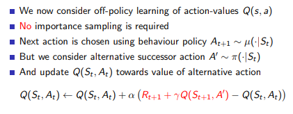

   Q-learning policy improve

   目标和执行的策略都可以优化, $$w.r.t$$ 是在基础上的意思

   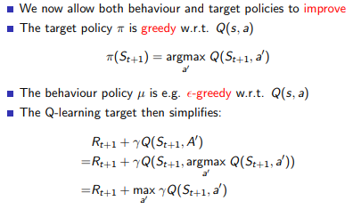

   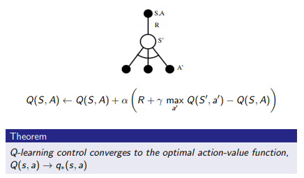

4. Q-learning 算法

   这样在状态 $$S_t$$ 依据 $$\epsilon$$-greedy 遵循策略得到的行为 $$A_t$$ 的 $$Q$$ 价值将朝着 $$S_{t+1}$$ 状态所具有的最大价值的方向 $$Q$$ 做一定比例的更新。这种算法能够使 greedy 策略 $$\pi$$ 最终收敛到最佳策略。由于个体实际与环境交互的时候遵循的是  $$\epsilon$$ -greedy 策略，它能保证经历足够丰富的新状态。

   

   可以理解 q-learning 是特殊的 sarsa 算法，这时候的第二次策略行动取值是贪心策略的选择结果