# Value Function Approximation

---

>实用性极强的一节课，本节的理论重点在于理解不同强化学习方法在应用不同类型的近似函数时的收敛性，能否获得全局最优解
>
>预测算法是针对 $$V$$ 函数的优化，控制算法是针对 $$Q$$ 函数的优化

## 1. Introduction

1. 常见的强化学习任务空间极大，表格法不适用，需要使用函数近似的方法减少状态空间对表格大小的影响程度，使用函数归纳近似的方法实现。对之前的免模型预测和控制算法进行规模的扩充

2. 目前使用表格的方法记录值函数

   * 每一个状态 $$s$$ 都存在对应的值 $$V(s)$$
   * 每一个状态动作对 $$(s,a)$$ 存在对应的值 $$Q(s,a)$$

3. 对于巨大的 MDP

   1. 存在太多的状态或者状态动作对以至于不能存储
   2. 独立的学习每一个表格的值过于缓慢

4. 解决思路

   使用函数近似估计值函数
   $$
   v(s,w)\approx v_{\pi}(s) \\
   q(s,a,w)\approx q_{\pi}(s,a)
   $$
   使用 TD / MC 更新参数 $$w$$ ，参数可能代表的是神经网络或者其他的线性函数近似

5. 新的思路的好处

   * 压缩存储状态或者动作对应信息的大小
   * 将学习的内容归纳化，可以对未出现的状态或者状态动作进行概括预测
   * 使用 MC / TD 的方法优化参数 $$w$$

6. 函数近似的方式

   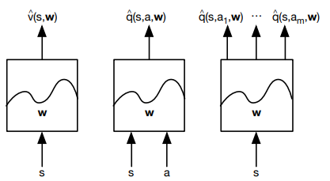

   * 估计状态值函数 $$V(s)$$
   * 估计状态动作函数 $$Q(s,a)$$
   * 估计对应状态下的所有行为的动作价值函数 $$\{Q(s,a_1), Q(s,a_2),...,Q(s,a_m)\}$$

7. 值函数近似的方式，在本节课中主要考虑可微分函数的近似

   * **Neural Networks**
   * 线性回归

8. 近似的方法

   1. 递增法

      一类是“递增方法”，针对每一步，近似函数得到一些信息，立即优化近似函数，主要用于在线学习

   2. 批方法

      另一类是“批方法”，针对一批历史数据集中进行近似。两类方法没有明显的界限，相互借鉴

## 2. Incremental Methods - Neural Network

>梯度下降法主导的增值函数逼近

1. Gradient Descent

   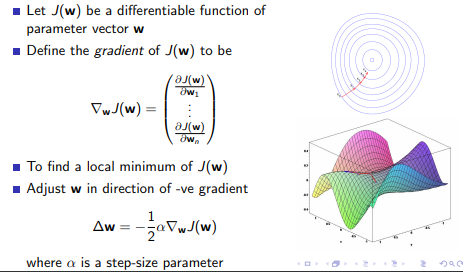

2. 使用梯度下降的 $$V$$ 函数近似

   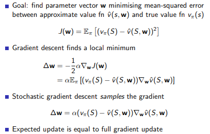

   这里的目标函数是期望但是使用 SGD 进行采样实现训练

3. Feature Vector

   特征向量是状态的 embedding，表达了 MDP 的所有历史信息
   $$
   x(S) = (x_1(S),x_2(S),x_3(S),...,x_n(S))^T
   $$
   每一个特征是状态的某一种属性，可以作为 NN 的输入，可以使用 NN 或者其他的方法获得对应的特征向量，部分问题中特征向量可以手动设置一些具体的维度特征(具有实际的意义)

4. Linear Value Function Approximation 对 $$V$$ 函数近似

   * 线性拟合值函数，线性拟合特征向量
     $$
     v(s,w)=x(S)^Tw =\sum_{j=1}^nx_j(S)w_j
     $$

   * 目标函数
     $$
     J(w)=\mathbb{E}_{\pi}[(v_{\pi}(S)-x(S)^Tw)^2]
     $$

   * 使用随机梯度下降求解并拟合到局部最小
     $$
     \nabla_wv(S,w)=x(S)\\
     \delta w=\alpha(v_{\pi}(S)-v(S,w))x(S)
     $$

   *  本质上，查表法是特殊的线性函数近似，实际上等同于 one-hot 的特征向量(每一个元素表示状态)乘以一个表格元素(状态对应的数值)组成的参数向量，只不过这种方式太过低效率
     $$
     v(s,w)=x_{one-hot}^Tw
     $$

5. 增量**预测**算法估计 $$V$$

   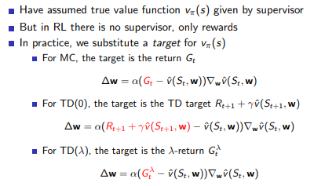

   和原先的计算框架一致，只不过这里我们使用对应的近似函数替代查表操作，上述的 $$\nabla_wv(S_t, w)$$ 在线性函数近似中就是 $$x(S)$$，模拟实验的时候，收集到对应的 $$(S_t,G_t)$$ 的训练对，然后执行梯度下降

   1. MC算法倾向于收敛到局部最优，即使使用非线性函数

   2. **线性** TD(0) 倾向收敛到全局最优 

   3. TD($$\lambda$$)

      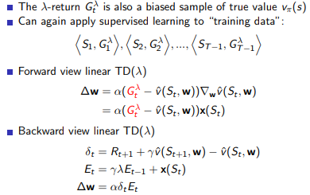

      **TD 算法没有计算对应的 $$G_t^{\lambda}$$ 的梯度的主要原因在于，主要目的是为了缩小误差值并不是为了修正估计。**

      **TD($$\lambda$$) 这里的效用记录中记录不再是 scalar 的数值 1 而是对应的 $$x(S_t)$$ 目的是为了更加明确梯度的方向**

6. 增量**控制**算法估计 $$Q$$

   修正的 GPI 策略迭代框架，针对 $$Q$$ 的近似

   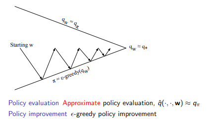

   不一次评估到头的主要原因，不需要浪费大量数据在评估上并且也并一定会优化到对应的精确的评估值。这种方法无法收敛，总是震荡

   对 $$Q$$ 函数的近似对和 $$V$$ 的操作是类似的

   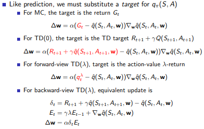

   基本思想都是一致的。**这里的 TD($$\lambda$$) 中效用追踪中使用的是 $$Q$$ 函数的梯度，目的是一样的，为了明确修正的方向(梯度)**

   预测学习的 TD 和 MC 的适用条件

   TD 算法因为不能保证一定会收敛(特殊的问题)，所以需要明确 TD 算法的使用边界

   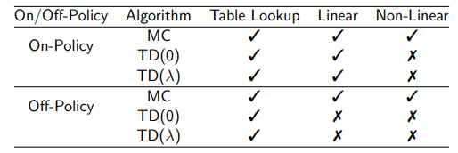

   叉号表示算法存在不收敛的可能性，但是也存在大量成功的案例。从表中可以看出，没有函数近似时，各种算法都收敛；线性函数近似时现时策略学习可以收敛，但离线策略时仅有MC收敛；非线性函数近似时无论采用现时策略还是离线策略只有MC收敛。而MC算法在实际中是很少使用的。这给强化学习的实际应用带来的挑战。好在我们有一些改善TD算法的办法。

   TD 算法在收敛性方面的改进(梯度时序差分方法)

   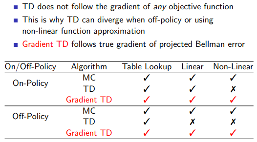

   TD算法在更新参数时不遵循任何目标函数的梯度是导致它在离线策略或使用非线性近似函数**可能**会发散的原因，我们可以通过修改TD算法使得它遵循Projected Bellman Error的梯度进而收敛。视频及讲义没有具体讲解Gradient TD。

   控制学习的收敛性

   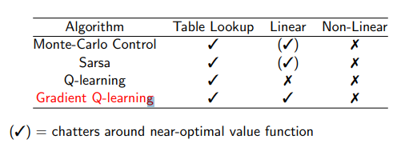

   其中 $$()$$ 代表的含义是震荡在最优函数附近，叉号代表永远都是不收敛的

   针对控制学习算法，大多数都能得到较好的策略，但是理论上只要存在函数近似，就都不是严格收敛的，比较常见的是在最优策略上下震荡，逐渐逼近然后突然来一次发散，再逐渐逼近等。使用非线性函数近似的效果要比近似函数要差很多，实际也是如此。

## 3. Batch Methods

前面所说的递增算法都是基于数据流的，经历一步，更新算法后，我们就不再使用这步的数据了，这种算法简单，但有时候不够高效。与之相反，批方法则是把一段时期内的数据集中起来，通过学习来使得参数能较好地符合这段时期内所有的数据。这里的训练数据集“块”相当于个体的一段经验。

梯度下降算法是简单的，但是没有有效的 sample 出有用的经验，batch 方法可以找出更合适的值函数近似

1. 最小平方差预测 $$V$$

   * 目的: $$v(s,w)\approx v_{\pi}(s)$$

   * 已存在的经验记录(state, value) $$D=\{(s_1,v_1^{\pi}),...,(s_T,v_T^{\pi})\}$$

   * 目的: 找到最合适的 $$w$$ 参数

   * 最小平方差可以寻找到一个参数 $$w$$ 最小化 $$v(s_t,w)$$ 和实际的值函数之间的误差
     $$
     LS(w)=\sum_{t=1}^T(v^{\pi}_t-v(s_t,w))^2=\mathbb{E}_D[(v^{\pi}-v(s,w))^2]
     $$

2. 这就相当于经历重现（Experience Replay），把一段时期内的经历重新过一遍，更新参数。这种算法实现起来不是很难，只要重复经验回放:

   1. sample $$(s,v^{\pi})\backsim D$$
   2. $$\delta w=\alpha (v^{\pi}-v(s,w))\nabla_wv(s,w)$$
   3. 直到收敛 $$w^{\pi}=\arg\min_w LS(w)$$

3. DQN 解决预测问题的收敛性

   先前说过 TD 方法结合非线性的神经网络函数近似可能不会收敛，但 DQN(Deep Q-Networks) 使用 **经历重现**和**固定的Q目标值 **能做到收敛而且保持很好的鲁棒性。在解释其收敛之前先要介绍DQN算法要点

   在 David Silver 的课里，他根据每次更新所参与样本量的不同把更新方法分为增量法（Incremental Methods）和批处理法（Batch Methods）。前者是来一个数据就更新一次，后者是先攒一堆样本，再从中采样一部分拿来更新Q网络，称之为“**经验回放**”，实际上DeepMind提出的DQN就是采用了经验回放的方法。为什么要采用经验回放的方法？因为对神经网络进行训练时，**假设样本是独立同分布的**。而通过强化学习采集到的数据之间存在着关联性，利用这些数据进行顺序训练，神经网络当然不稳定。经验回放可以打破数据间的关联。

   

   1. $$\epsilon$$-greedy 产生行为
   2. 存储大量数据，历史信息
   3. 从大量数据中抽取 minibatch
   4. 维护两个神经网络DQN1，DQN2,一个网络固定参数专门用来产生目标值，目标值相当于标签数据。另一个网络专门用来评估策略，更新参数。

   Q 不适用于神经网络，但是 DQN 却可以保证有效的收敛

   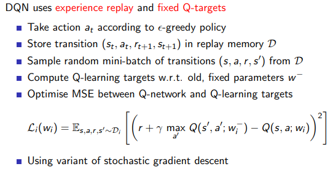

   两套神经网络。$$w'$$ 是之前几轮的一个固定的 $$w$$ 参数向量，不使用新的 $$w $$ 的原因在于使用新的参数很容易导致震荡不收敛。$$w_i$$ 是动态更新的参数。

   首先，随机采样打破了状态之间的联系；第二个神经网络会暂时冻结参数，我们从冻结参数的网络而不是从正在更新参数的网络中获取目标值，这样增加了算法的稳定性。经过一次批计算后，把冻结参数的网络换成更新的参数再次冻结产生新一次迭代时要用的目标值。

   LS 最小平方差预测

   通过比较发现使用批方法能够找到最小平方差的解决方案，提高算法的稳定性，但是它需要多次迭代。我们可以设计一个价值函数的线性近似函数。然后直接求解参数。求解思路是逆向思维，假设已经找到这个参数，那么他应该满足最小LS(w)，通过把LS展开，可以直接得到w。这种方法直接求解的时间复杂度是 $$O(n^3)$$，使用Shermann-Morrison法求解复杂度是 $$O(n^2)$$，n是特征数量，这意味着求解该问题的难度与设计的特征数量多少有关，而与状态空间大小无关，因此适合应用与那些特征较少的问题。

   1. 经验回放寻找最小二分的方法，但是可能需要很多的迭代

   2. 使用线性的值函数近似可以提供更直接的方法 $$v(s,w)=x(s)^Tw$$

   3. 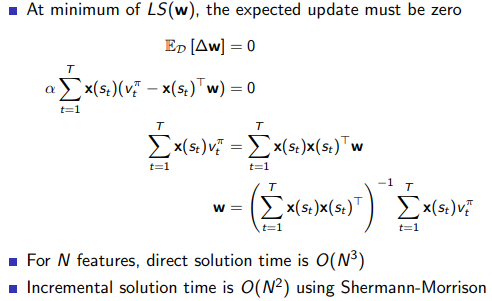

      可以用直接的解但是复杂度太高

      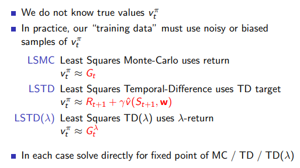

      将这种方法分别应用于MC, TD, 和TD()学习方法，就分别得到LSMC, LSTD, 和LSTD($$\lambda$$)。结合之前的各种价值函数的近似这里直接贴上w求解公式

      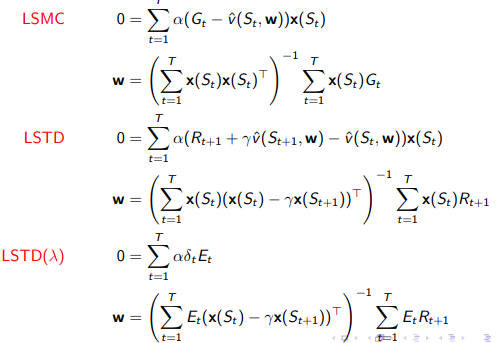

      下图展示了各种方法的收敛性比较

      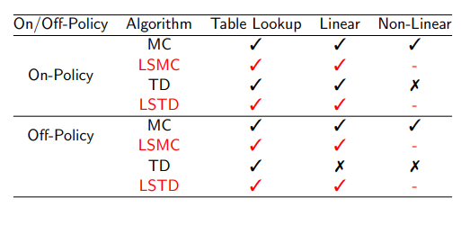

4. 最小平方差控制

   1. GPI 通用策略迭代，使用 Q-Learning 进行评估 $$Q$$ 贪心策略提升

   2. 在批处理方式中，因为经验是不同的策略产生的，所以必须学习 off-policy 去估计 $$Q$$ 函数

   3. LSPI 迭代算法

      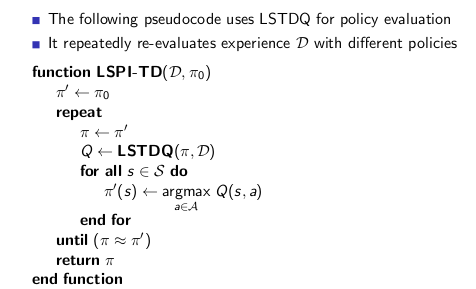

      LSTDQ 是离线策略评估过程

      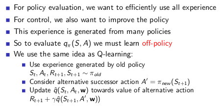

      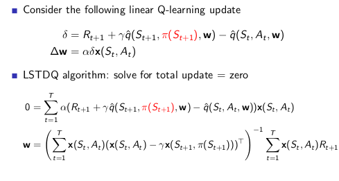

      LSTDQ值函数是是线性函数，是离线学习的

   ---

## 4. Extension

### 4.1 Double DQN

DQN, Q-Learning 存在有一个固有的缺点，过估计。过估计是指估计的值函数比真实值函数要大。一般来说，Q-Learning之所以存在过估计的问题，根源在于Q-Learning中的最大化操作。

> 假设当前状态下，对于所有动作，它们实际的return value都应当是0。但是因为估计必定存在误差，所以一些动作可能返回正值，而另一些动作可能返回负值 (这里不妨假设为+0.5及-0.5)。Q-learning中用Q function返回估计值，为当前状态下的所有动作计算估计值，并选择拥有最大Q值的动作。那么问题就来了，这个最大值是+0.5，而不是0，并且每一步(在每个状态下)都会出现这个问题。这也就是Q-learning中的overestimation。随着迭代的进行，这种overestimation可能会导致策略逐渐变为一个次优解。

对于 table lookup 的 Q-Learning
$$
Q(s_t,a_t)\leftarrow Q(s_t,a_t) +\alpha[r_t + \gamma\max_aQ(s_{t+1},a)-Q(s_t,a_t)]
$$
对于 value function approximation 的 DQN
$$
\theta_{t+1}=\theta_t + \alpha (R_{t+1} + \gamma\max_a Q(S_{t+1},a;\theta_t)-Q(S_t,A;\theta_t))\nabla_{\theta_t}Q(S,A;\theta_t)
$$
对于上述的两种做法中，更新操作中都存在有 $\max$ 操作，这意味着有可能估计的值函数比真实的值函数要大。如果值函数每一点的值都被过估计了相同的幅度，即过估计量是均匀的，那么由于最优策略是贪婪策略，即找到最大的值函数所对应的动作，这时候最优策略是保持不变的。这时候，即使过估计也不会影响最终的最优策略，强化学习的目标是找到最优的策略，而不是要得到值函数，所以这时候就算是值函数被过估计了，最终也不影响我们解决问题。**然而，在实际情况中，过估计量并非是均匀的，因此值函数的过估计会影响最终的策略决策，从而导致最终的策略并非最优，而只是次优。**

**核心方法:**

>目的是减少因为 $\max Q$ 值计算带来的计算偏差，或者称为过度估计问题，用当前的 $Q$ 网络来选择动作，用目标 $Q$ 网络来计算目标 $Q$

Double DQN: Remove upward bias caused by $\max_aQ(s,a,w)$

1. Current Q-Network $w$ is used to select the action

2. Older fixed Q-Network $w^-$ is used to evaluate actions

3. $loss=(r + \gamma Q(s',\arg\max_aQ(s',a',w),w^-)-Q(s,a,w))^2$

   通过使用另一个网络的估计动作，可以去除掉之前的 $\max$ 操作，从而保证一定程度上缓解过估计的问题，这时候的估计值可正可负(想对于上面的均值是0的小例子)

因为nature DQN引入了单独的 target q-network，等于已经是 double q 了，所以 double dqn 在原有的架构上，基本不需要做什么改动。 

至于 $\theta^-$ 的更新，文中说 This second set of weights can be updated symmetrically by switching the roles of $\theta$ and $\theta^-$这里应该仍旧指每D步从 current Q 更新一次。

为了解决过估计的问题，提出了 Double DQN 的方法，意思是动作的选择和动作的估计使用不同的值函数实现。Double DQN 训练两个 Q 网络，一个负责选择动作，另一个负责计算。两个 Q 网络交替进行更新，具体算法如下所示。

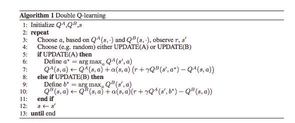

实验效果显示， Double DQN 的效果要好与 DQN 。但是可能会引入一些欠估计的问题，这都是后话了。

### 4.2 Prioritized replay

>为了应对奖励稀疏的情况，优先学习高价值的记忆和经验

[参考资料](https://www.cnblogs.com/pinard/p/9797695.html)

* TD error 作为优先级 $p_j$
* 使用 SumTree 算法进行均匀分布的重要性采样
  * SumTree 中的数字表示的是优先级或者优先级的和
  * 等分并递归的寻找对应的记忆单元
  * 每一次更新之后，叶子节点和非叶节点都会统一变化更新
* 上述的算法是整合了 Double DQN 的框架

这一套算法重点就在我们 batch 抽样的时候并不是随机抽样, 而是按照 Memory 中的样本优先级来抽. 所以这能更有效地找到我们需要学习的样本。使用 Prioritized replay, 就会重视这种少量的, 但值得学习的样本。

在Prioritized Replay DQN之前，我们已经讨论了很多种DQN，比如Nature DQN， DDQN等，他们都是通过经验回放来采样，进而做目标Q值的计算的。在采样的时候，我们是一视同仁，在经验回放池里面的所有的样本都有相同的被采样到的概率。但是注意到在经验回放池里面的不同的样本由于TD误差的不同，对我们反向传播的作用是不一样的。TD误差越大，那么对我们反向传播的作用越大。而TD误差小的样本，由于TD误差小，对反向梯度的计算影响不大。在Q网络中，TD误差就是目标Q网络计算的目标Q值和当前Q网络计算的Q值之间的差距。

**这样如果TD误差的绝对值 $|\delta(t)|$较大的样本更容易被采样，则我们的算法会比较容易收敛。下面我们看看Prioritized Replay DQN的算法思路。**

算法建模

Prioritized Replay DQN根据每个样本的TD误差绝对值 $|\delta(t)|$，给定该样本的优先级正比于$|\delta(t)|$，将这个优先级的值存入经验回放池。回忆下之前的DQN算法，我们仅仅只保存和环境交互得到的样本状态，动作，奖励等数据，没有优先级这个说法。

由于引入了经验回放的优先级，那么Prioritized Replay DQN的经验回放池和之前的其他DQN算法的经验回放池就不一样了。因为这个优先级大小会影响它被采样的概率。在实际使用中，我们通常使用SumTree 这样的二叉树结构来做我们的带优先级的经验回放池样本的存储。

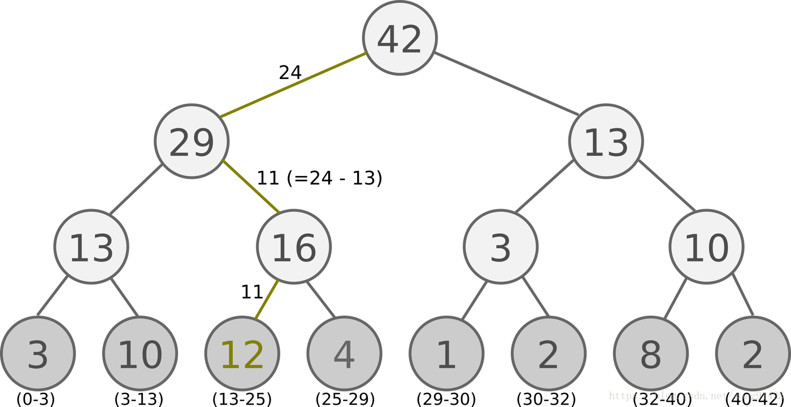

所有的经验回放样本只保存在最下面的叶子节点上面，一个节点一个样本。内部节点不保存样本数据。而叶子节点除了保存数据以外，还要保存该样本的优先级，就是图中的显示的数字。对于内部节点每个节点只保存自己的儿子节点的优先级值之和，如图中内部节点上显示的数字。

这样保存有什么好处呢？主要是方便采样。以上面的树结构为例，根节点是42，如果要采样一个样本，那么我们可以在[0,42]之间做均匀采样，采样到哪个区间，就是哪个样本。比如我们采样到了26， 在（25-29）这个区间，那么就是第四个叶子节点被采样到。而注意到第三个叶子节点优先级最高，是12，它的区间13-25也是最长的，会比其他节点更容易被采样到。如果要采样两个样本，我们可以在[0,21],[21,42]两个区间做均匀采样，方法和上面采样一个样本类似。

除此之外， loss 函数也需要该变成带有优先级的形式
$$
\frac{1}{m}\sum_{j=1}^mw_j(y_j-Q(\phi(S_j),A_j,w))^2
$$
其中 $w_j$ 是优先级权重，通过对 TD error 的 $|\theta(t)|$ 归一化得到
$$
w_j=\frac{(N\cdot P(j))^{-\beta}}{max_i(w_i)}=\frac{(N\cdot P(j))^{-\beta}}{max_i((N\cdot P(j))^{-\beta})}=\frac{P(j)^{-\beta}}{max_i(P(i)^{-\beta})}=(\frac{p_j}{max_i p_i})^{-\beta}
$$
最后，第三个要注意的点就是当我们对Q网络参数进行了梯度更新后，需要重新计算TD误差，并将TD误差更新到SunTree上面。

### 4.3 Dueling DQN

>只要稍稍修改 DQN 中神经网络的结构, 就能大幅提升学习效果, 加速收敛. 这种新方法叫做 Dueling DQN. 用一句话来概括 Dueling DQN 就是. 它将每个动作的 Q 拆分成了 state 的 Value 加上 每个动作的 Advantage.

自从DQN的论文在nature发布之后，对DQN的研究的热潮一直在持续发酵，就其原因一方面在于它是把deep learning和reinforcement learning结合起来，开了从感知到决策的end to end的先河。另外一方面，DQN还是有很多问题有待解决，比如在复杂的游戏中的表现、解决连续的动作空间等问题。这篇论文也是DQN算法的一个延续。

图的第一部分就是传统的DQN算法的网络图。下面的图就是Dueling DQN的图。DQN的输出就是Q函数的值（当然是动作空间的维度），它的前一层是全联接层。而DuelingDQN改变主要是这里，把全联接改成两条流，一条输出标量的关于状态的价值，另外一条输出关于动作的Advantage价值函数的值，就是绿色部分前面的两条流。最后通过绿色部分合成Q价值函数。

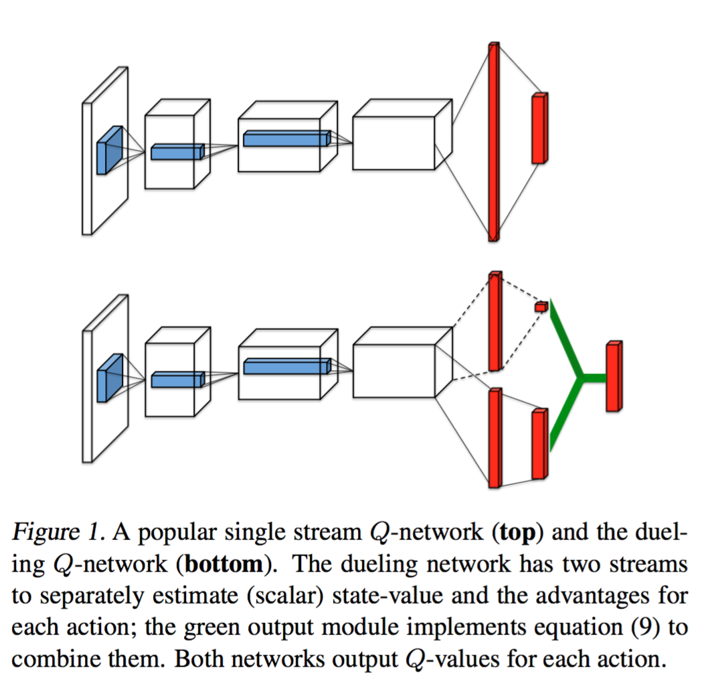

$A^{\pi}(s,a)=Q^{\pi}(s,a)-V^{\pi}(s)$

* $V(s)$ 的意义在于表示状态的好坏
* $A(s,a)$ 的意义在于在当前状态下不同的动作的相对好坏程度

那么为什么这样设计网络架构，论文给出的解释是在游戏中，存在很多状态，不管你采用什么样的action对下一步的状态转变是没什么影响的。这些情况下计算动作的价值函数的意义没有状态函数的价值意义大。

合并 $A,V$ 的过程
$$
Q(s,a;\theta,\alpha,\beta)=V(s;\theta,\beta) + (A(s,a;\theta,\alpha)-\frac{1}{|A|}\sum_{a'}A(s,a';\theta,\alpha))
$$
上面减去均值的主要原因是为了减少 $Q$ 的偏差，通过均值更准确的表示 $A$ 函数的意义在于表示不同动作的相对好坏程度