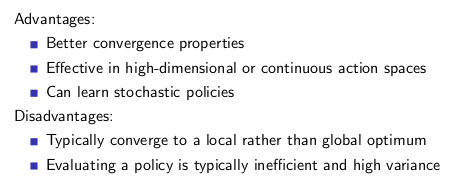
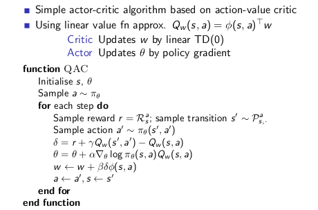
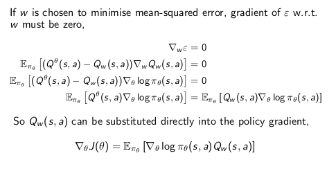
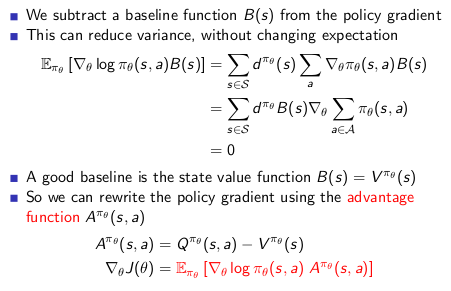
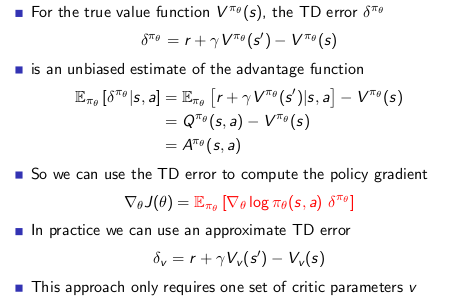
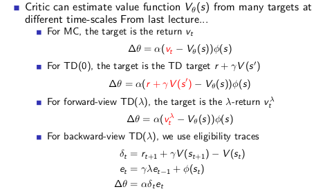
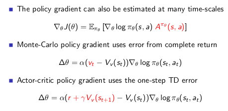
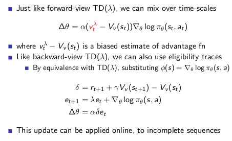
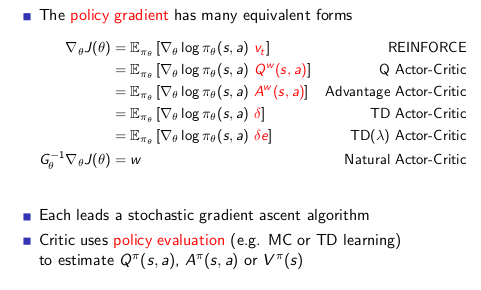

# Policy Gradient

---

>上一节课使用的是 Value-Based RL 通过计算值函数 $$Q,V$$ 再利用 $$Q,\epsilon-greedy$$ 生成对应的策略，这次讲解 Policy-Based 的算法，不学习值函数直接获取策略。以及二者的综合。
>
>针对于 Q 学习的话，有一个比较大的好处是可以学习连续环境

## 1. Introduction

* 值函数估计的方法可以通过预测值函数等其他的方式改进策略 (GPI 通用迭代策略就是这样的东西)，通过已知的值函数对策略进行选择

* 本节课考虑直接参数化策略 $$\pi_{\theta}(s,a)=\mathbb{P}[a|s,\theta]$$ 通过输入状态得到对应的合适的动作的映射

* 同样面对免模型学习

* 基于价值的强化学习，基于策略的强化学习，Actor-Critic 学习

  

  1. 策略基础的强化学习收敛性更好

      基于策略的学习可能会具有更好的收敛性，这是因为基于策略的学习虽然每次只改善一点点，但总是朝着好的方向在改善；但是上讲提到有些价值函数在后期会一直围绕最优价值函数持续小的震荡而不收敛

  2. 在对于那些拥有高维度或连续状态空间来说，使用基于价值函数的学习在得到价值函数后，制定策略时，需要比较各种行为对应的价值大小，**这样如果行为空间维度较高或者是连续的**，则从中比较得出一个有最大价值函数的行为这个过程就比较难了，这时候使用基于策略的学习就高效的多。

  3. 能够学到一些随机策略，下文举了一个很好的例子。但是基于价值函数的学习通常是学不到随机策略的，有时候随机策略是最优策略(剪刀石头布)。并且有时候状态和动作空间不好描述(会出现状态同名的情况):

     

     在上述情况中，发生了格子重名的（Aliased）情况，如果采用**确定性**的策略话，在个体处于无论哪个灰色格子时，都只能选取**相同**的行为。假设个体现在学到了一个价值函数，在这个价值函数里状态就是基于上述特征的参数化表示，此时当个体处在灰色格子中，如果采取的是greedy执行的方式，价值函数给出的策略要么都是向东，要么都是向西。如果是向西，那么当个体处在左侧灰色格子时，它将一直（对于greedy执行）或很长时间（对于$$\epsilon$$-greedy执行）徘徊在长廊左侧两个格子之间而无法到达有钱袋子的格子，因而很长时间得不到奖励。

     **当发生状态重名情况时，随机策略将会优于确定性的策略。之前的理论告诉我们对于任何 MDP 总有一个确定性的最优策略。不过那是针对状态可完美观测、或者使用的特征可以完美描述状态的情况下的**。当发生状态重名无法区分或者使用的近似函数里描述状态的特征限制了对状态的完美描述时，个体得到的状态信息等效于部分观测的环境信息，问题将不具备 Markov 性(**需要其他的特征区分不同的重名状态，这时候每一个状态的 Markov 性质不存在，需要引入其他的信息，每一个状态不是对历史的有效概括**)。此时最优策略将不再是确定性的。而直接基于策略的学习将能学习到最优策略，这就是我们为什么要直接基于策略进行强化学习的原因。

  4. 有时候计算价值函数非常复杂。比如当小球从从空中某个位置落下你需要左右移动接住时，计算小球在某一个位置时采取什么行为的价值是很难得；但是基于策略就简单许多，你只需要朝着小球落地的方向移动修改策略就行

  ---

  原始的，未经改善（Naive）的基于策略的学习有时候效率不够高，有时候还有较高的变异性（方差，Variance）。因为基于价值函数的策略决定每次都是推促个体去选择一个最大价值的行为；但是基于策略的，更多的时候策略的选择时仅会在策略某一参数梯度上移动一点点，使得整个的学习比较平滑，因此不够高效。有时候计算朝着梯度方向改变的增量也会有较高的变异性（方差），以至于拖累了整个算法速度，但是通过一些修饰，可以改进。

  ---

  在具体解决问题时，需要评估问题的特点来决定是主要使用基于价值的学习还是基于策略的学习

* 策略函数确定了在给定的状态和一定的参数设置下，采取任何可能行为的概率，因此事实上它是一个概率密度函数，在实际应用策略产生行为时，是按照这个概率分布进行行为采样的。策略函数里的参数决定了概率分布的形态。

* 我们要做的是利用参数化的策略函数，通过调整这些参数来得到一个较优策略，遵循这个策略产生的行为将得到较多的奖励。具体的机制是设计一个目标函数，对其使用**梯度上升（Gradient Ascent）算法优化参数以最大化奖励**

* 策略目标函数

  给定策略 $$\pi_{\theta}(s,a)$$ 寻找最优的参数 $$\theta$$，衡量策略的好坏的方式的三种方式

  1. start value

     **在能够产生完整Episode的环境下**，也就是在个体可以到达终止状态时，我们可以用这样一个值来衡量整个策略的优劣：从某初始状态s1算起直到终止状态个体获得的累计奖励。这个值称为start value. 这个数值的意思是说：如果个体总是从某个状态s1开始，或者以一定的概率分布从s1开始，那么从该状态开始到Episode结束个体将会得到怎样的最终奖励。这个时候算法真正关心的是：找到一个策略，当把个体放在这个状态s1让它执行当前的策略，能够获得start value的奖励。这样我们的目标就变成最大化这个start value
     $$
     J_1(\theta)=V^{\pi_{\theta}}(s_1)=\mathbb{E}_{\pi_{\theta}}[v_1]
     $$

  2. average value

     对于连续环境条件，不存在一个开始状态，这个时候可以使用 average value。意思是考虑我们个体在某时刻处在某状态下的概率，也就是个体在该时刻的状态分布，针对每个可能的状态计算从该时刻开始一直持续与环境交互下去能够得到的奖励，按该时刻各状态的概率分布求和
     $$
     J_{avV}(\theta)=\sum_sd^{\pi_{\theta}}(s)V^{\pi_{\theta}}(s)
     $$
     对于持续状态，此时要确定个体在某一时刻某个状态开始持续与环境交互能够得到的奖励已经无法得到一个真实确切的结果了，因为要持续交互下去。这里已经用到了状态的价值，而不是收获，并且必须要考虑衰减系数。**$$d^{\pi_{\theta}}$$ 表示在当前策略下马尔科夫链的关于状态的一个静态分布(用来描述初始状态的概率分布)。**

     上述的含义在于，最大化 $J$ 的方法就是最大化那些状态价值高的状态的概率分布

  3. average reward per time-step

     又或者我们可以使用每一个时间步长在各种情况下所能得到的平均奖励，也就是说在一个确定的时间步长里，查看个体出于所有状态的可能性，然后每一种状态下采取所有行为能够得到的即时奖励，所有奖励按照概率求和得到

     也就是说在一个确定的时间步长里，查看个体出于所有状态的可能性，然后每一种状态下采取所有行为能够得到的即时奖励，所有奖励安概率求和得到
     $$
     J_{avR}(\theta)=\sum_sd^{\pi_{\theta}}(s)\sum_a\pi_{\theta}(s,a)R_s^a
     $$
     这里的time-step不是说一定长度的时间平均，而是指一个确定的时刻。其实这三个式子的目标都是同一个目标，都是试图描述（衡量）个体在某一时刻的价值

* 优化目标函数

  找到目标函数，下一步的工作是优化策略参数然后使得目标函数值最大化。因此可以说基于策略的强化学习实际上是一个优化问题，找到参数 $$\theta$$ 来最大化目标函数。有些算法使用梯度，有些则不使用梯度(遗传算法等等)。如果有机会得到梯度，那么使用梯度上升的算法通常更加优秀一些。理解了使用梯度的算法的使用，那么也将很容易将不基于梯度的算法应用到策略优化中。

  本讲内容将主要聚焦于使用梯度的策略优化，同时使用基于序列结构片段（equential structure）的方法。怎么理解基于序列结构呢？打个比方，我们不会去让个体持续与环境交互直至耗光其整个生命周期，然后得到一个结果，根据这个结果来优化策略，这类似与遗传算法。这样做对于个体来说就没有意义了。我们选取个体与环境交互中的一个序列结构片段，通过这种序列结构片段来学习，优化策略进而知道个体后续与环境的交互。

  以上就是本讲的简介，下面将介绍目标函数、梯度上升等。

## 2. Finite Difference Policy Gradient

>有限差分策略梯度

$$
\delta \theta = \alpha\nabla_{\theta}J(\theta)\\
\nabla_{\theta}J(\theta)=(\frac{\partial{J(\theta)}}{\partial{\theta_1}},...,\frac{\partial{J(\theta)}}{\partial{\theta_n}})
$$

其中 $$\nabla_{\theta}J(\theta)$$ 是策略梯度，$$\alpha$$ 是学习步长

有限差分法计算策略梯度

这是非常常用的数值计算方法，特别是当梯度函数本身很难得到的时候。具体做法是，针对参数 $$\theta$$ 的每一个分量 $$\theta_k$$，使用如下的公式粗略计算梯度。
$$
\frac{\partial{J(\theta)}}{\partial{\theta_k}}\approx \frac{J(\theta + \epsilon)-J(\theta)}{\epsilon}
$$
有限差分法简单，不要求策略函数可微分，适用于任意策略；但有噪声，且大多数时候不高效。使用数值方法近似得到梯度。这种数值方法常常用来检验梯度计算是否正确，在 PRML chapt5 中也有提及。

## 3. Monte-Carlo Policy Gradient

现在我们将理论分析并计算策略梯度。这要求策略在执行行为时刻是可微分的，并且其梯度是能计算出来的。函数在某个变量 $$\theta$$ 处的梯度等于该处函数值与该函数的对数函数在此处梯度的乘积

**$$\theta$$ 是矩阵参数，针对的是每一个状态行为对**
$$
\nabla_{\theta}\pi_{\theta}(s,a)=\pi_{\theta}(s,a)\frac{\nabla_{\theta}\pi_{\theta}(s,a)}{\pi_{\theta}(s,a)}=\pi_{\theta}(s,a)\nabla_{\theta}\log\pi_{\theta}(s,a)\\
\partial{\log(y)}=\frac{\partial{y}}{y}
$$
定义 score function 为 $$\nabla_{\theta}\log\pi_{\theta}(s,a)$$ 解释 score function 函数

1. softmax policy

   **针对离散的强化学习环境**

   Softmax策略是针对一些具有离散的行为常用的一个策略。我们希望有平滑的参数化的策略来决策，针对每一个离散的行为，应该以什么样的概率来执行它。为此，我们把行为看成是多个特征在一定权重下的线性代数和，将状态行为看作是特征向量 $$\phi(s,a)$$
   $$
   \pi_{\theta}(s,a)\varpropto e^{\phi(s,a)^T\theta}
   $$
   对行为的 softmax 多分类预测。

   先为个体能够观测到的状态信息选定一些特征假设现在有f1-f5共5个特征，这些特征可以是人为选取的，也可以是算法计算得到的（例如可以是把观测状态信息作为输入送入神经网络得到的隐藏层数据）。向左走与其中的某些特征联系比较紧，向右走与另外一些特征关系比较紧，图中两个行为与每个特征都有联系，这种联系的紧密程度就用参数 $$\theta$$ 表示，参数 $$\theta$$ 不是一个值，而是针对每一个特征行为对都有一个具体的数值，因此它可以看成是一个矩阵，现在当环境以每个特征不同强度的形式展现在个体面前时，个体会针对向左、向右两个行为同时计算其带权重的线性代数和，假设算得向左的值为5，向右的为6。

   对应的 softmax 决策的 score function 公式如下
   $$
   \nabla_{\theta}\log\pi_{\theta}(s,a)=\phi(s,a)-\mathbb{E}_{\theta}[\phi(s,\cdot)]
   $$
   推导如下
   $$
   \begin{equation*}
   \begin{split}
   \nabla_{\theta}\log\pi_{\theta}(s,a)&=\nabla_{\theta}\log \frac{e^{\phi(s,a)^T\theta}}{\sum_{a'}e^{\phi(s,a')^T\theta}}\\
   &=\phi(s,a)-\nabla_{\theta}\log(\sum_{a'}e^{\phi(s,a')^T\theta})\\
   &=\phi(s,a)-\frac{\phi(s,a^1)e^{\phi(s,a^1)^T\theta}+ ... + \phi(s,a^n)e^{\phi(s,a^n)^T\theta}}{\sum_{a'}e^{\phi(s,a')^T\theta}}\\
   &=\phi(s,a)-\mathbb{E}_{\theta}[\phi(s,\cdot)]
   \end{split}
   \end{equation*}
   $$

2. Guassian policy

   与Softmax策略不同的是，高斯策略常应用于连续行为空间，打个比方：如果控制机器人行走，要调整流经控制某个电机的电流值，而这是一个连续的取值。

   使用高斯策略时，我们通常对于均值有一个参数化的表示，同样可以是一些特征的线性代数和

   **参数 $$\theta$$ 是要学习的高斯分布的均值参数**
   $$
   \mu(s)=\phi(s)^T\theta
   $$
   方差可以是固定值，也可以用参数化表示。**行为概率的选择对应于一个具体的数值**，该数值从以$$\mu(s)$$为均值，$$\sigma$$为标准差的高斯分布中随机采样产生。
   $$
   a \backsim \mathbb{N}(\mu(s),\sigma^2)
   $$
   对应的 score function
   $$
   \pi_{\theta}(s,a)=\frac{1}{\sigma\sqrt{2\pi}}e^{-\frac{(a-\phi(s)^T\theta)^2}{2\sigma^2}}
   $$
   其中动作 $$a$$ 是标量实数值，策略使用的标准差是 $$\sigma$$ 的高斯分布
   $$
   \nabla_{\theta}\log\pi_{\theta}(s,a)=\frac{(a-\mu(s))\phi(s)}{\sigma^2}
   $$

**策略梯度定理 Policy Gradient Theorem**

首先考虑单步的 MDP 问题

1. 初始状态 $$s_1\backsim d(s)$$

2. 执行一步动作之后到达终止状态 $$r=R_s^a$$

3. 得到对应的策略目标函数
   $$
   J(\theta)=\mathbb{E}_{\pi_{\theta}}[r]=\sum_{s\in S}d(s)\sum_{a\in A}\pi_{\theta}(s,a)R_s^a
   $$
   对应的策略梯度，使用上面的推导转化
   $$
   \nabla_{\theta}J(\theta)=\sum_{s\in S}d(s)\sum_{a\in A}\pi_{\theta}(s,a)\nabla_{\theta}\log\pi_{\theta}(s,a)R_s^a=\mathbb{E}_{\pi_{\theta}}[\nabla_{\theta}\log\pi_{\theta}(s,a)r]
   $$
   对上式 $$\mathbb{E}_{\pi_{\theta}}[\nabla_{\theta}\log\pi_{\theta}(s,a)r]$$ 的理解

   1. $$\nabla_{\theta}\log\pi_{\theta}(s,a)$$ 表示的是在状态 $$s$$ 执行动作 $$a$$ 之后得到的修正梯度

   2. $$r$$ 表示奖励有多好，如果奖励很大，沿着梯度方向的修正很大，反正同理

   3. **一般在实际训练中，需要最大化$J(\theta)$但是，都是采用最小化 $-\log\pi_{\theta}(s,a)r$ 的方式实现**

      loss 是 $-\log \pi_{\theta}(s,a)r$

4. 策略梯度定理

   上述的单步 MDP 策略梯度是可以完全适用于多步 MDP，只要使用 $$Q^{\pi}(s,a)$$ 替换对应的 $$r$$ 即可，并且

   **对任意的策略函数(上述的 softmax / guassion distribution)对所有的策略目标函数(上述的3种)，策略梯度是一样的**
   $$
   \nabla_{\theta}J(\theta)=\mathbb{E}_{\pi_{\theta}}[\nabla_{\theta}\log\pi_{\theta}(s,a)Q^{\pi_{\theta}}(s,a)]
   $$
   **`上述的梯度是针对策略的，是一个归一化的概率分布`**

**MC 策略梯度算法**

针对具有完整Episode的情况，我们应用策略梯度理论，使用随机梯度上升来更新参数，对于公式里的期望，我们通过采样的形式来替代，即使用t时刻的收获（return）$$v_t$$ 作为当前策略下行为价值的无偏估计。

使用蒙特卡洛策略梯度算法收敛速度慢，需要的迭代次数长，还存在较高的变异性

## 4. Actor-Critic Policy Gradient

使用蒙特卡洛策略梯度方法使用了收获作为状态价值的估计，它虽然是无偏的，但是噪声却比较大，也就是方差较高。如果我们能够相对准确地估计状态价值，**使用预测的行为价值函数降低预测的方差**，用它来指导策略更新，那么是不是会有更好的学习效果呢？这就是Actor-Critic策略梯度的主要思想。**使用 Critic 估计行为价值**。
$$
Q_w(s,a)\approx Q^{\pi_{\theta}}(s,a)
$$

1. Critic: 参数化行为价值函数 $$Q_w(s,a)$$，策略评估过程，确定参数 $$\theta$$ 对应的策略 $$\pi_{\theta}$$ 的表现如何，代表的是策略估计的过程，可以使用之前的策略评估的方法得到解决(MC, TD, TD($$\lambda$$), DQN, LS , ....)
2. Actor: 按照 Critic 部分得到的价值引导策略函数参数 $$\theta$$ 的更新，策略改善过程

这样，Actor-Critic算法遵循的是一个近似的策略梯度
$$
\nabla_{\theta}J(\theta)\approx \mathbb{E}_{\pi_{\theta}}[\nabla_{\theta}\log\pi_{\theta}(s,a)Q_w(s,a)]\\
\delta \theta=\alpha\nabla_{\theta}\log\pi_{\theta}(s,a)Q_w(s,a)
$$
一个简单的 Actor-Critic 算法可以使用基于行为价值的 Critic，它使用一个线性价值函数来近似状态行为价值函数
$$
Q_w(s,a)=\phi(s,a)^Tw
$$
基于线性价值函数近似的 Actor-Critic 算法

* Critic 更新 $$w$$ 参数使用 TD(0)
* Actor 更新 $$\theta$$ 使用策略梯度

1. 用特征的线性组合来近似 $$Q$$ 的策略梯度引入了偏差

2. **有偏的策略梯度有可能偏离正确的结果，因为 Critic 的评价也是存在误差的，影响梯度下降过程**

3. 但是如果合适的选择价值函数近似的话，可以避免引入偏差(换句话说，可以跟随着正确的梯度寻找策略)

   这需要满足以下两点

   * 价值函数的估计值没有和策略相违背(最好是只和状态的价值有关，和动作的价值没有关系)
   * 价值函数的参数 $$w$$ 能够最小化误差

   

   证明如下

   

在这个理论的基础上，我们对Actor-Critic方法做一些改进。通过将策略梯度减去一个基线函数B(s)，可以在**不改变期望**的情况下，降低方差。证明不改变期望，就是证明相加和为0。 

其基本思想是从策略梯度里**减去**一个基准函数B(s)，**要求**这一函数仅与状态有关，与行为无关，因而不改变梯度本身。B(s)的特点是能在不改变行为价值期望的同时降低其 Variance(比起之前的TD(0)改变了方差但是改动了行为价值)。由于B(s)与行为无关，可以将其从针对行为a的求和中提出来，同时我们也可以把梯度从求和符号中提出来（梯度的和等于和的梯度）。原则上，和行为无关的函数都可以作为B(s)。一个很好的B(s)就是基于当前状态的状态价值函数。**这个函数 $$A$$ 的现实意义在于，当个体采取行为 a 离开 s 状态时，究竟比该状态s总体平均价值要好多少。现在目标函数梯度的意义就改变成为了得到那个“好多少”，我应该怎么做（改变策略参数）**

1. Advantage 函数可以明显减少状态价值的方差	

2. 因此算法的 Critic 部分可以去估计advantage函数而不是仅仅估计行为价值函数。在这种情况下，我们需要两个近似函数也就是两套参数，一套用来近似状态价值函数，一套用来近似行为价值函数，以便计算advantage函数，并且通过 TD 学习来更新这两个价值函数。
   $$
   V_v(s)\approx V^{\pi_{\theta}}(s)\\
   Q_w(s,a)\approx Q^{\pi_{\theta}}(s,a)\\
   A(s,a)=Q_w(s,a)-V_v(s)
   $$

继续改进，上述的改进需要维护两个 Critic 参数，改动后只需要一个参数即可

Critic 按照不同的时间区段可以分为

Actor 按照不同的时间区段可以划分

对于 Actor 来说如果Critic 使用了 $$\lambda$$ 系数的话

## Conclusion

## Extension - DDPG

DQN 可以接受高维输入，但是只能输出离散和低维动作空间，但是大多数的物理控制任务都是连续的高维动作空间，虽然离散化连续空间使用 DQN 是一种可行的方式，但是因为指数爆炸的问题，这并不实用。DQN 是对传统的 Q-Learning 在非线性函数近似上的一种稳定收敛算法。

DDPG = DQN + DPG

我们常说的部分可观测的 MDP (POMDP) 是指 $s_t=(x_1,a_1,...,a_{t-1},x_t)$ 状态需要使用之前的描述的状态表示，但是 MDP 是满足马尔可夫性质的 $s_t=x_t$

算法如下

* 首先对于 Actor 的梯度方面，具体的数学推到在 DPG 的论文中，这里就不在多余赘述了
* 这里并不是采用直接 copy 参数到 target network 的方式，而是采用缓慢更新
* Actor, Critic 都是双网络结构