# Integrating Learning and Planning

---

>Planning 的含义 RL 的含义，以及二者结合的方法
>
>之前的课程重点是免模型学习，这里介绍有模型学习
>
>通过个体的思考以及联合其与环境的实际交互经验，个体在解决大规模MDP问题时可以取得更好的结果
>
>依赖于模型，个体可以通过模拟产生一系列虚拟的Episodes，通过使用基于模拟的搜索方法，特别是蒙特卡罗树搜索方法，找到了一条解决诸如围棋等大规模 MDP 问题的有效可行的算法

## 1. Introduction

1. 之前的方法是从经验中学习策略和值函数

2. 本节内容展示从经验中**学习模型**，以及使用 planning 的方式构建策略和值函数

   学习模型的内容

   1. 转换奖励
   2. 状态转换概率

3. 将 RL 和 planning 整合成一个单一的框架

4. RL 分类

   * model-free

     agent 不会去表示环境中的状态转换和奖励函数，只从经验中学习策略和值函数

   * model-based

     agent 从经验中学习模型，然后使用 planning 的方法从学习的模型中回复值函数和策略

## 2. Model-Based RL

1. 周期

   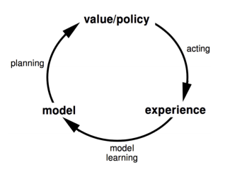

   可以从上述周期的任意一处开始

   1. 学习 MDP
   2. 解 MDP
   3. 不断的更新对 MDP 的估算得以优化

2. 优劣

   1. 优点

      * 可以使用监督学习的方法高效学习模型，模型相对于值函数来说是一种直接的表达

        经验作为监督信息有效的训练学习的模型准确度(转换概率和奖励)当学习价值函数或策略变得很困难的时候，学习模型可能是一条不错的途径

      * 模型不确定性可以良好的得知

      * 还能在一定程度上了解采取的动作为什么是好的或者不好，也就是具备一定的推理能力

   2. 缺点

      * 学习模型以及构建值函数，两次误差累计可能存在较大偏差

   学习到的模型的好坏是一切的基础

3. 模型

   1. 模型是参数 $$\eta$$ 表示的 MDP $$(S,A,P,R)$$

   2. 假设 $$S,A$$ 是已知的，模型表示的是参数化的状态转移和奖励 $$M=(P_\eta,R_\eta)$$
      $$
      P_\eta \approx P\\
      R_\eta \approx R\\
      S_{t+1}\backsim P_\eta(S_{t+1}|S_t,A_t)\\
      R_{t+1}=R_\eta(R_{t+1}|S_t,A_t)
      $$

      * 上式中的 $$R$$ 表示的是确定性的
      * 上式中的 $$S$$ 是概率性的 

   3. 一般假设状态转移和奖励是条件独立的
      $$
      \mathbb{P}[S_{t+1},R_{t+1}|S_t,A_t]=\mathbb{P}[S_{t+1}|S_t,A_t]\mathbb{P}[R_{t+1}|S_t,A_t]
      $$

   4. 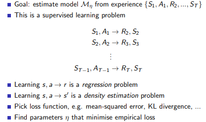

      * 回归问题 MSE
      * 密度估计问题(估计概率分布，这里是估计状态转移的概率) KL

      需要注意的是上述的监督学习过程是 one-step 的，就是说我们不考虑了强化学习中的序列之间的关系，之考虑上一布和下一步之间的映射。

4. 模型的类型

   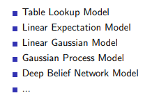

   1. 查表法预测模型

      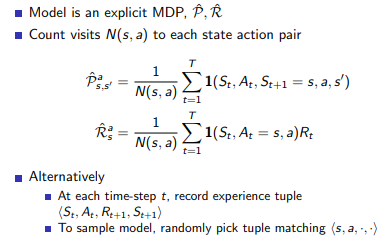

      无参数均值代替实际的模型。从模型采样构建虚拟经历时，从tuples中**随机选择**符合 $$(s,a,\cdot,\cdot)$$的一个tuple，提供给个体进行价值或策略函数的更新。这里的随机选择就体现了状态 s 的各种后续状态的概率分布。

   2. Planning 生成值函数和策略

      * 提供模型 $$M=(P_\eta,R_\eta)$$

      * 解决 MDP 问题 (Value Iteration, Policy Iteration, **Tree Search**, Sample-Based Planning...)

        Sample-Based Planning 新的方法

        使用学习的模型进行采样，然后使用免模型的强化学习算法(MC, Sarsa, Q-Learning, ...) 学习这种样本经验，有了模型就有了生成数据的能力(可以大量的生成数据为免模型强化学习算法提供支持)

        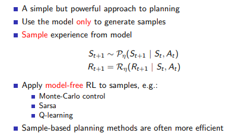

5. 模型存在误差的话，planning 的影响

   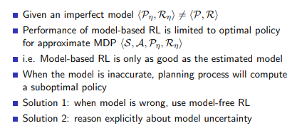

   planning 只能逼近目前学习的模型的效果，也就是说基于模型的强化学习最好的结果是受到学习到的模型限制，如果模型本身是不准确的，那么“规划”过程可能会得到一个次优的策略

## 3. Integrated Architectures

>结合 Model-Based 和 Model-Free 方法，意图克服 Model-Based 的二次误差累计的问题，使得计算的结果更加精确

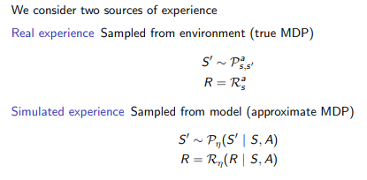

---

Dyna 方法整合

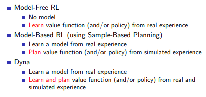

Dyna Architecture

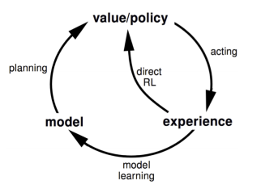

Dyna-Q Algorithm

* 真实环境优化模型建立的过程
* 真实环境优化一次 Q 表
* 假想 n 次采样经验优化 Q 表

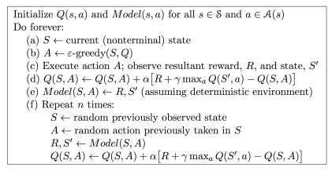

都使用 Q-Learning 的方法对 Q 进行改善

(e) 使用监督学习的方式对模型进行学习

(f) 对思考的轮数需要进行控制

Dyn-Q算法赋予了个体一定的应对环境变化的能力，当环境发生一定改变时，个体一方面可以利用模型，一方面也可以通过与实际环境的交互来重新构建模型

## 4. Simulation-Based Search

>如何更有效率的 Planning
>
>到目前为止，我们尝试构建一个模型，然后联合实际经历与模拟经历来解决 MDP 问题。下文要讲的内容则是从一个不同的角度来思考“规划”：我们将专注于规划本身，如何高效地进行规划，把这些想法应用到基于模拟的搜索算法中，从模拟的经历中进行采样，进行较深层次的采样规划，来看看是否能够得到一些艺术级表现的搜索规划类算法。我们使用的关键思想是：通过采样来进行一定步数的前向搜索，也就是“基于模拟的搜索”。
>
>是 Model-Based 的学习，只不过在 planning 阶段采用更加有效的方式解决大规模的 MDP 问题

1. Forward Search

   只关注当前的 MDP 的一部分并进行求解

   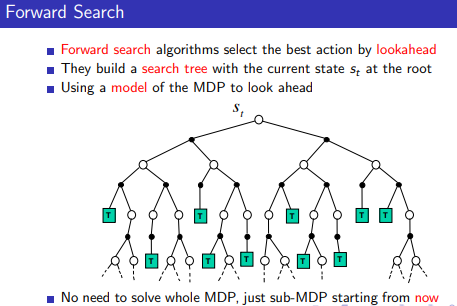

2. Simulation-Based Search

   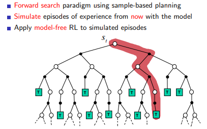

   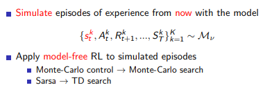

   从当前的状态开始不断的进行模型并对模拟采样的结果使用免模型的强化学习算法进行预测和控制。将常用的免模型学习算法应用到模拟的经验中就会得到对应的搜素算法

   把这个搜索树作为一个学习资源，然后使用Model Free的强化学习来寻找最优策略。

3. Simple MC Search

   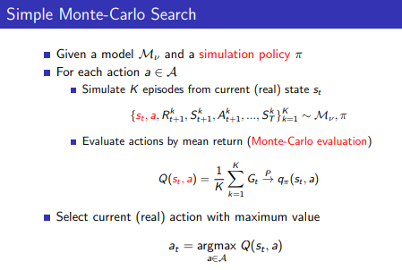

   1. Evaluation

      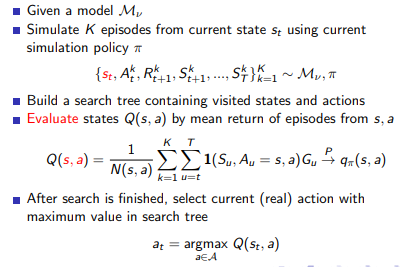

   2. Simulation

      上面的 evaluation 后树中已经存储了足够更新策略的信息

      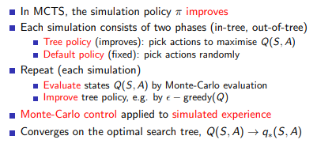

4. MCTS 

   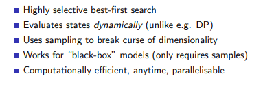

5. TD Search

   使用 TD 而不是 MC 对 Q 进行预测，也是针对部分的 MDP

   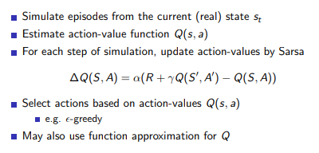

   ​