# Reference
1. [`David Silver UCL course`](http://www0.cs.ucl.ac.uk/staff/D.Silver/web/Teaching_files)
2. [`My notebook for RL`](https://github.com/gmftbyGMFTBY/Study/tree/master/MachineLearning/COURSE/David_Silver)
3. [`One standard repo for RL agent in PyTorch`](https://github.com/ShangtongZhang/DeepRL)
4. [Alibaba Reinforcement Learning Application](https://102.alibaba.com/downloadFile.do?file=1517812754285/reinforcement_learning.pdf)
5. Lots of repos can be found on `GitHub`

# Outline
1. Introduction and MDP
2. Planning by DP
3. Model-Free Value-Based
4. Value function approximation
    1. FA and its limiation
    2. DQN and extensions
5. Model-Free Policy-Based
    1. Policy Gradient
    2. Algorithms
6. Model-Based
    1. Integrating Learning
    2. Dyna-Q
7. Application
    1. RL in NLP
    2. Alibaba StarCraft

# 1. Introduction

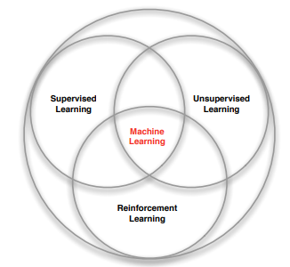

# 1. Introduction and MDP
 
**Reinforcement Learning**: 

Dynamic decision process with delay reward

1. no supervisor, only `reward` signal from environment
2. Feedback is delayed
3. Time really matters
4. Agent's action affect subsequent data it receives

**Reward hypothesis**: 

All goals can be described by `Maximisation of expected cumulative rewards`

**RL Task**

Prediction and Control
 
# 1. Introduction and MDP
What is MDP and why we need it?

1. `Markov decision processes` formally describe the Environment for RL
        
    In RL, we only care about `Agent` and `Environment`

2. Current state is known, the history can be thrown away
    
    $$S_t = F(h_{<t})$$

3. Almost all RL problems can be formalised as MDPs

# 1. Introduction and MDP
1. MDP definition
    $$(S,A,R,P,\gamma)$$
    $$P_{ss'}^a=\mathbb{P}[S_{t+1}=s'|S_t=s]$$
    $$R_s^a=\mathbb{E}[R_{t+1}|S_t=s,A_t=a]$$
    $$\gamma \in [0,1]$$
2. Policy definition
    
    Define the distribution of the action condition on state
    $$\pi(a|s)=\mathbb{P}[A_t=a|S_t=s]$$
3. Return Reward
    
    Cumulative reward from current state
    $$G_t=R_{t+1} + \gamma R_{t+2} + ...=\sum_{k=0}^{\infty}\gamma^k R_{t+1+k}$$
    
# 1. Introduction and MDP
1. Value function
    * State Value function
        $$v_{\pi}(s)=\mathbb{E}[G_t|S_t=s]$$
    * Action Value function
        $$q_{\pi}(s,a)=\mathbb{E}_{\pi}[G_t|S_t=s,A_t=a]$$
2. Bellman Equation
    * State Value Bellman function
        $$v_{\pi}(s)=\mathbb{E}_{\pi}[R_{t+1}+\gamma v_{\pi}(S_{t+1})|S_t=s]$$
    * Action Value Bellman function
        $$q_{\pi}(s,a)=\mathbb{E}_{\pi}[R_{t+1}+\gamma q_{\pi}(S_{t+1},A_{t+1})|S_t=a,A_t=a]$$

# 1. Introduction and MDP
Optimal Bellman Equation
$$v_{*}(s)=max_a q_{*}(s,a)$$
$$q_{*}(s,a)=R_s^a + \gamma \sum_{s'\in S}P_{ss'}^av_{*}(s')$$
$$q_{*}(s,a)=R_s^a + \gamma \sum_{s'\in S}P_{ss'}^amax_{a'}q_{*}(s',a')$$

Find stable $v_{*}(s)$, prediction problem solved

Find stable $p_{*}(s,a)$, control problem solved

Need to use iterate the equation, because the Optimal Bellman Equation is nonlinear.

# 2. Planning by DP
**Dynamic Programming**: 
Optimal method for decision process

* Optimal substructure
    
    Optimal solution can be decomposed into subproblems
* Overlapping subproblems

    Solutions can be cached and reused
* Markov Decision Process satisfy the properties
    * Bellman equation gives the way to decompose solution
    * Value function store solution

# 2. Planning by DP
## Prediction 
- Problem: MDP and policy $\pi$ given, solve $v_{\pi}$, evaluate policy $\pi$
- Solution: iterative application of Bellman equation

    $$v_1\rightarrow v_2 \rightarrow ... \rightarrow v_{\pi}$$
- Convergence of $v_{\pi}$ can be proven
    $$v_{k+1}(s)=\sum_{a\in A}\pi(a|s)(R_s^a + \gamma\sum_{s'\in S}P_{ss'}^av_k(s'))$$
    $$v^{k+1}=R^{\pi} + \gamma P^{\pi}v^k$$

# 2. Planning by DP
## Control 
- Problem: MDP and initial policy $\pi$ given, return best $\pi$
- Solution: Policy Iteration
    
    - Evaluation 

        $$v_{\pi}(s)=\mathbb{E}[R_{t+1} + \gamma R_{t+2} + ...|S_t=s]$$
    - Improve policy

        $$\pi'=greedy(v_{\pi})$$

# 2. Planning by DP
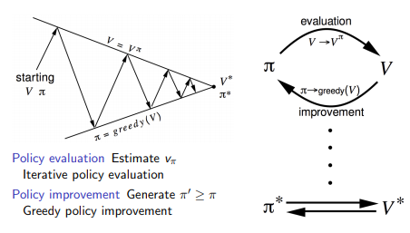

# 2. Planning by DP
- Convergence
    $$v_{\pi}(s)=max_{a\in A}q_{\pi}(s,a)=v_{*}(s)$$
    $$q_{*}(s,a)=R_s^a+\gamma \sum_{s'\in S'}P_{ss'}^av_{*}(s')$$
    $$v_{\pi}(s)=q_{\pi}(s,\pi'(s))=max_{a\in A}q_{\pi}(s,a)\geq q_{\pi}(s,\pi(s))=v_{\pi}(s)$$
    
- Optimal Bellman equation satisfy, solve the MDP control problem

# 2. Planning by DP
* Value Iteration for control problem
    
    Iterative application of this equation
    
    $$v_{*}(s)\leftarrow max_{a\in A} R_s^a + \gamma \sum_{s'\in S}P_{ss'}^av_{*}(s')$$
    Value Iteration is another way to solve the control and prediction problem

* Constraint for Planning by DP

    MDP must be given, which means that $P_{ss'}^a$ and $R_s^a$ can be accssed.

# 3. Model-Free Value-Based
## Definition
1. MDP is unknow, but we still want to solve it. $P_{ss'}^a$ and $R_s^a$ is unkown to us.
2. We can only learn the `value` or `policy` from the experience.
3. Find the optimal $V$ value function, prediction solved.
4. Find the optimal $Q$ value function, control solved.

# 3. Model-Free Prediction
## Monte-Carlo Learning
1. Learn from the episode experience with environment
2. MC is `model-free`: no knowledge of MDP ($P$, $R$)
3. MC learns from complete expisode without bootstrapping
4. MC's idea: $value= \mathbb{E}[G]$
5. Constraint: All epsiodes must terminate

# 3. Model-Free Prediction
## Monte-Carlo Learning
1. Goal: learn $v_{\pi}$ from episodes of experience under policy $\pi$
    $$S_1,A_1,R_2, ..., S_k \backsim \pi$$

2. Discounted reward of episode
    $$G_t=R_{t+1} + \gamma R_{t+2} + ... + \gamma^{T-1}R_T$$

3. Update $v(s)$ after episode
    $$N(S_t)\leftarrow N(S_t) + 1$$
    $$V(S_t)\leftarrow V(S_t) + \frac{1}{N(S_t)}(G_t - V(S_t))$$
    $$V(S_t)\leftarrow V(S_t) + \alpha (G_t - V(S_t))$$

# 3. Model-Free Prediction
## Temporal-Difference Learning
1. TD methods learn directly from episodes of experience
2. TD is `model-free`: no knowledge of MDP ($P$,$R$)
3. TD learns from `incomplete` episode with bootstrapping
4. TD update the value function with the guess from previous iteration

# 3. Model-Free Prediction
## Temporal-Difference Learning
1. Goal: learn $v_{\pi}$ online from experience under policy $\pi$
2. MC update
    $$V(S_t)\leftarrow V(S_t) + \alpha(G_t - V(S_t))$$
3. TD(0)
    $$V(S_t)\leftarrow V(S_t) + \alpha(R_{t+1} + \gamma V(S_{t+1})-V(S_t))$$
    * $R_{t+1}+\gamma V(S_{t+1})$ is called `TD target`
    * $\delta_t=R_{t+1}+\gamma V(S_{t+1}) - V(S_t)$ is called `TD error`

# 3. Model-Free Prediction
## Comparison
1. TD learns online but MC wait until end of episode
2. MC has high variance and zero bias, TD has low variance and some bias
3. Convergence:
    
    1. MC converges to solution with `MSE`
        $$\sum_{k=1}^K\sum_{t=1}^{T_k}(G_t^k-V(s_t^k))^2$$
    2. TD converges to max likelihood Markov model
        
        TD is better suited to the Markov environment.

# 3. Model-Free Prediction
## TD($\lambda$)
$$E_0(s)=0$$
$$E_t(s)=\gamma \lambda E_{t-1}(s) + 1(if\ S_t=s)$$
$$\delta_t = R_{t+1}+\gamma V(S_{t+1})-V(S_t)$$
$$V(s)\leftarrow V(s) + \alpha\delta_t E_t(s)$$
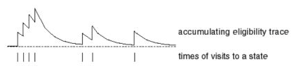

* TD($\lambda$) converges faster than TD(0)
* $\delta_t$ define the result of fixing
* $E_t$ define the degree of fixing

# 3. Model-Free Control
## Generalised Policy Iteration
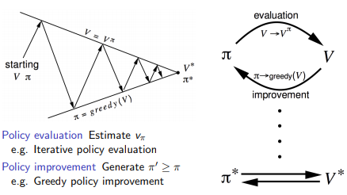

# 3. Model-Free Control
## Sarsa
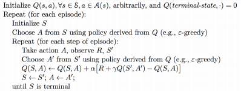

# 3. Model-Free Control
## Sarsa($\lambda$)

# 3. Model-Free Control
## Off-Policy and On-Policy
1. On-Policy
    * learn about policy $\pi$ from experience sampled from $\pi$
    * The special case of the Off-Policy
2. Off-Policy
    * learn about policy $\pi$ from experience sampled from $\mu$
    * Re-use experience generated from other policy (other agent or even human)
    * Balance between Explotition and Exploration though Q-Learning

# 3. Model-Free Control
## Q-Leanring
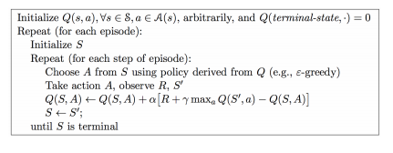

# 4. Value Function Approximation
1. Reinforcement Learning can be used to solve `large` problem
    * Backgammon: $10^{20}$ states
    * Game of Go: $10^{170}$ states
    * Some environment: continuous state space 
2. Problem:
    * Tabular method need lots of memory to store Value Function
    * Learn value individually slowly
3. Solution - **Value Function Approximation**
    * Save the memory with approximation parameters $w$
        $$v(s,w)\approx v_{\pi}(s)$$
        $$q(s,a,w)\approx q_{\pi}(s,a)$$
    * Extension to unseen states

# 4. Value Function Approximation
1. Approximate model
    * Nonlinear model: Nerual Networks
    * Linear regression
    * Other regression model ...
2. Optimal parameters
    * Gradient descent
    * Batch training

# 4. Value Function Approximation
## Gradient Descent
1. Goal: Find the parameter vector $w$ minimising `MSE` betweeen approximate value function $v(s,w)$ and true value function $v_{\pi}(s)$
    $$J(w)=\mathbb{E}_{\pi}[(v_{\pi}(s)-v(s,w))^2]$$
2. Gradient descent
    $$\delta w = -\frac{1}{2}\alpha \nabla_wJ(w)=\alpha \mathbb{E}_{\pi}[(v_{\pi}(s)-v(s,w))\nabla_wv(s,w)]$$
    $$\delta w = \alpha (v_{\pi}(s)-v(s,w))\nabla_w v(s,w)$$
3. SGD $\rightarrow$ Expectation

# 4. Value Function Approximation
## Gradient Descent
1. Linear function, $x(S)$ is the feature vector
    $$v(s,w)=x(S)^T w$$
2. Object function
    $$J(w)=\mathbb{E}_{\pi}[(v_{\pi}(s)-x(s)^Tw)^2]$$
3. Gradient Descent
    $$\delta w = \alpha(v_{\pi}(s)-v(s,w))x(s)$$
4. Lookup table is the special case of Linear function
    $$v(s,w) = x_{one-hot}^Tw$$

# 4. Value Function Approximation
## Gradient Descent
1. MC 
    $$\delta w = \alpha (G_t-v(s_t,w))\nabla_w v(s_t,w)$$
2. TD(0)
    $$\delta w = \alpha(R_{t+1}+\gamma v(s_{t+1},w)-v(s_t,w))\nabla_w v(s_t, w)$$
3. TD($\lambda$)
    $$\delta w = \alpha (G_t^{\lambda} - v(s,w))\nabla_w v(s_t,w)$$
    $$\delta_t = R_{t+1} + \gamma v(s_{t+1}, w) - v(s_t, w)$$
    $$E_t = \gamma \lambda E_{t-1} + x(s_t)$$
    $$\delta w = \alpha \delta_t E_t$$

# 4. Value Function Approximation
## Limiation
![Neural Networks don't work[^1]](../photo/ppt2.png)

[^1]: An analysis of temporal-difference learning with function approximation. `IEEE` 1997

# 4. Value Function Approximation
## Batch Methods - DQN
1. DeepMind Nature 2015
    * [DRL of DQN](https://www.nature.com/articles/nature14236)
    * integrate the `CNN` and `Q-Learning` to master the games
    * Solve the divergence of nonlinear function approximation `Q-Learning`
2. Idea
    * Experience replay: avoid relevance
    * Fixed Q target Network: Off-Policy

# 4. Value Function Approximation

# 4. Value Function Approximation
## Extension of DQN
1. Double DQN
    * fix the `overestimation` problem of Q-Learning
    * avoid suboptimal result
    $$loss=(r + \gamma Q(s',\arg \max_a Q(s',a',w),w^-)-Q(s,a,w))^2$$
2. Prioritized Replay DQN
    
    * When reward is sparse, DQN is hard to train
    * TD error is the weight
3. Dueling DQN
    * For some states, $V$ function is more important
    * spee up

    $$A^{\pi}(s,a)=Q^{\pi}(s,a)-V^{\pi}(s)$$

# 5. Policy Gradient
## Value-Based and Policy-Based RL
* Value Based
    * Learn value function
    * implicit policy (such as $\epsilon$-greedy)
* Policy Based
    * No valuse function
    * Learn policy directly
* Actor-Critic
    * `Critic`: Learn Value Function
    * `Actor`: Learn policy with the guidance of `Critic`

# 5. Policy Gradient
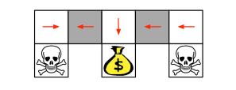

# 5. Policy Gradient
## Advantage
* Learn policy with probability
* Learn for continous state space, better than Value-Based

# 5. Policy Gradient
1. Parameterise the **policy**
    $$\pi_{\theta}(s,a)=\mathbb{P}[a|s,\theta]$$
2. Evaluate the policy with object function
    $$J(\theta)=\sum \pi_{\theta}(a|s)Q(s,a;\theta)$$
    $$J(\theta)=\mathbb{E}_{\pi_{\theta},s\backsim \rho^{\pi}}[Q(s,a;\theta)]$$
3. Optimize
    1. Gradient Ascent
    2. No Gradient Ascent

# 5. Policy Gradient
## Compute the score function for gradient
1. Discrete environment - **Softmax Policy**
    $$\pi_{\theta}(s,a)\varpropto e^{\phi(s,a)^T\theta}$$
    $$\nabla_{\theta}\log\pi_{\theta}(s,a)=\phi(s,a)-\mathbb{E}_{\theta}[\phi(s,\cdot)]$$
    $$\nabla_{\theta}\pi_{\theta}(s,a)=\pi_{\theta}(s,a)\frac{\nabla_{\theta}\pi_{\theta}(s,a)}{\pi_{\theta}(s,a)}=\pi_{\theta}(s,a)\nabla_{\theta}\log\pi_{\theta}(s,a)$$
2. Continuing environment - **Gaussian Policy**
    $$\nabla_{\theta}\log\pi_{\theta}(s,a)=\frac{(a-\mu(s))\phi(s)}{\sigma^2}$$

# 5. Policy Gradient
## Policy Gradient Theorem
For any policy object function, the **Policy Gradient** is the same[^n]
$$\nabla_{\theta}J(\theta)=\mathbb{E}_{\pi_{\theta}}[\nabla_{\theta}\log\pi_{\theta}(s,a)Q^{\pi_{\theta}}(s,a)]$$

1. $\nabla_{\theta}\log\pi_{\theta}(s,a)$ means the gradient 
2. $Q$ means the degree of fixing
3. Used to minimize the $-\log\pi_{\theta}(s,a)Q^{\pi_{\theta}}(s,a)$

[^n]: https://lilianweng.github.io/lil-log/2018/04/08/policy-gradient-algorithms.html

# 5. Policy Gradient Algorithms
## MC Policy Gradient
function REINFORCE
    
\ \ \ \ Initalise $\theta$ arbitrarily\    
\ \ \ \ for each spisode $\{s_1,a_1,r_2,...,\} \backsim \pi_{\theta}$ do\
\ \ \ \ \ \ \ \ for t = 1 to T - 1 do\
\ \ \ \ \ \ \ \ \ \ \ \ $\theta \leftarrow \theta + \alpha \nabla_{\theta}\log \pi_{\theta}(s_t,a_t)v_t$\
\ \ \ \ \ \ \ \ end for\
\ \ \ \ end for\
\ \ \ \ return $\theta$\
end function

# 5. Policy Gradient Algorithms
## TD Policy Gradient
function TD Policy Gradient
    
\ \ \ \ Initalise $\theta$ arbitrarily\    
\ \ \ \ for each episode do\
\ \ \ \ \ \ \ \ for t = 1 to T - 1 do\
\ \ \ \ \ \ \ \ \ \ \ \ $\theta \leftarrow \theta + \alpha \nabla_{\theta}\log \pi_{\theta}(s_t,a_t)v_t$\
\ \ \ \ \ \ \ \ end for\
\ \ \ \ end for\
\ \ \ \ return $\theta$\
end function

# 5. Policy Gradient
## Actor-Critic Policy Gradient
1. MC has variance and need to be improved
2. **Actor-Critic**
    1. Critic: parametries $Q_w(s,a)$ for policy evaluation
    2. Acotr: Policy Gradient with the guidance of Critic
    3. Result
        $$\nabla_{\theta}J(\theta)\approx \mathbb{E}_{\pi_{\theta}}[\nabla_{\theta}\log\pi_{\theta}(s,a)Q_w(s,a)]$$
        $$\delta \theta=\alpha\nabla_{\theta}\log\pi_{\theta}(s,a)Q_w(s,a)$$

# 5. Policy Gradient
## Actor-Critic Policy Gradient with Linear function approximation
function QAC

\ \ \ \ Initialise s, $\theta$\
\ \ \ \ Sample $a\backsim \pi_{\theta}$\
\ \ \ \ for each step do\
\ \ \ \ \ \ \ \ Sample reward $r=R_s^a$ and $s'\backsim P_s^a$\
\ \ \ \ \ \ \ \ Sample action $a'\backsim \pi_{\theta}(s',a')$\
\ \ \ \ \ \ \ \ $\delta = r + \gamma Q_w(s',a')-Q_w(s,a)$\
\ \ \ \ \ \ \ \ $\theta=\theta + \alpha\nabla_{\theta}\log\pi_{\theta}(s,a)Q_w(s,a)$\
\ \ \ \ \ \ \ \ $w\leftarrow w + \beta\delta\phi(,sa)$\
\ \ \ \ \ \ \ \ $a\leftarrow a',s\leftarrow s'$\
\ \ \ \ end for\
end function

# 5. Policy Gradient
DDPG (Deep Deterministic Policy Gradient)

* DQN can't handle with high-dimension or continous space
* Inspired by DQN, DeepMind propose DDPG
    * Actor-Critic: DQN is Critic and DPG[^2] is Actor
    * Fixed Q target Network for policy and value
    * Target Network update slowly

[^2]: http://proceedings.mlr.press/v32/silver14.pdf

# 5. Policy Gradient
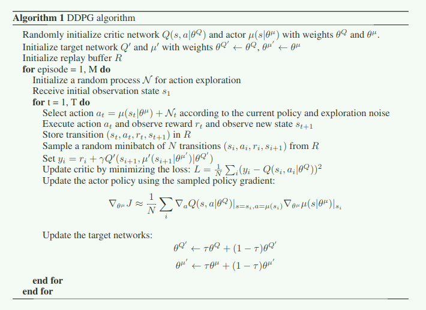

# 6. Model-Based
## Comparation
1. Model-Free

    Learn value function and policy from the experience
2. Model-Based
    
    Learn MDP from the experience and get the policy and value function by planning.

# 6. Model-Based
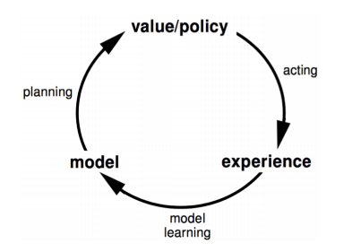

# 6. Model-Based
1. Use any `supervised Learning model` to learn the MDP 
2. Anything we know now can be used to solve MDP
3. A direct way to solve the MDP but the bias is a disadvantage
4. Model is the agent's impression of environment

# 6. Model-Based
1. Parameter $\eta$ represente the MDP
    $$P_{\eta}\approx P$$
    $$R_{\eta}\approx R$$
2. Goal: estimate model MDP from experience $\{s_1,a_1,r_2,...,s_T\}$
3. Supervised learning problem
    $$S_t,A_t \rightarrow R_{t+1},S_{t+1}$$
4. After learning the MDP, solved by
    * Planning (Policy Iteration, Value Iteration)
    * Model-Free (DQN, Policy Gradient)

# 6. Model-Based
## Dyna
1. Thinking: Use the model to generate infinite samples
    
    This property is very useful for time-cost environment
2. Simulation: Apply **model-free** RL to evalution the samples and fix the policy

# 6. Model-Based
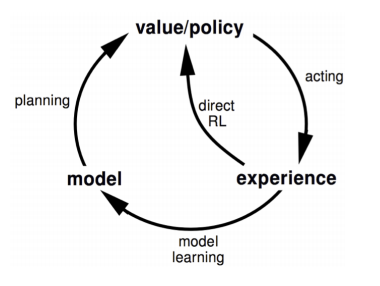

# 6. Model-Based
## Intergrated Architexture for `Dyna-Q`

# 7. Application
## Conclusion
1. `Reward` is the core for Reinforcenment Learning
2. If the problem can be thought as the MDP / POMDP, RL can be used
3. If the reward is clear, RL can be used
3. Sample data is important, no experience no RL
4. RL is difficult to train, be careful about parameters

# 7. Application
## RL in NLP
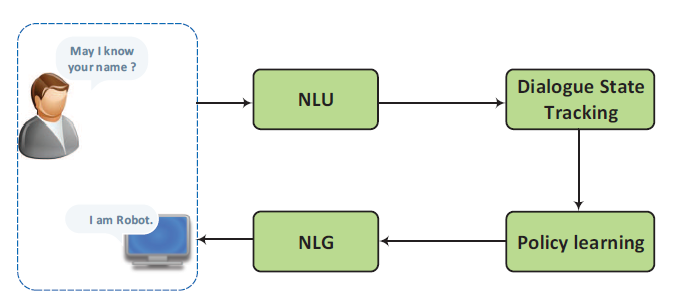

# 7. Application
## RL in NLP
For task-oriented dialogue, reward is clear

1. `DQN` for Policy Learning
2. `Deep Dyna-Q` (Dyna-Q + DQN) for Policy Learning
3. `REINFORCE` for Policy Learning

# 7. Application

# 7. Application
## SeqGAN
* Model the sequence generation as MDP
* The first work: integrate GANs with RL to generate discrete elemenets
* Generator is LSTM Policy (RL Agent)
    
    REINFORCE Algorithm is used for updating $G$
* Discriminator is CNN with MC Search

# 7. Application 
## Alibaba StarCraft

# 7. Application
## Alibaba StarCraft
1. Alibaba choose the `StarCraft` as the platform for RL research
    * Game is the wonderful platform for RL
    * Experience data is infinite
    * Reward is clear
2. Difficulies
    * `Real-Time strategy`
    * Huge state and action space
    * Incomplete nformation games
    * Inference for spatial and sequential
    * Multi Agent

# 7. Application
## Alibaba StarCraft
Why `GAMES`?

1. Advertisement in Alimama
2. Search in TaoBao
3. Intelligent agent for task-oriented dialogue (AliMeChat)
4. Alibaba RL sort strategy decision model for 11.11

# End
Question and Answer
