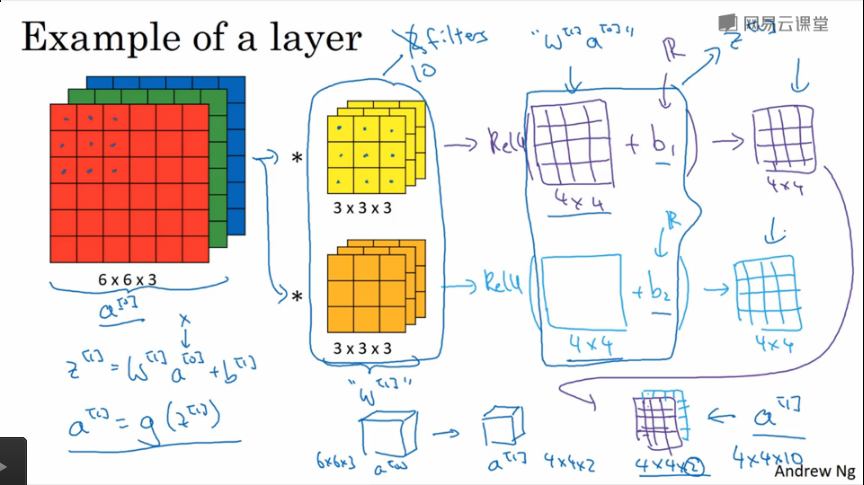
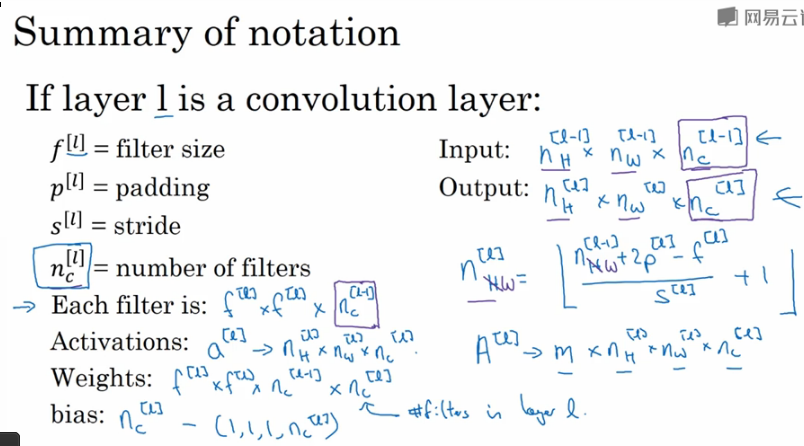
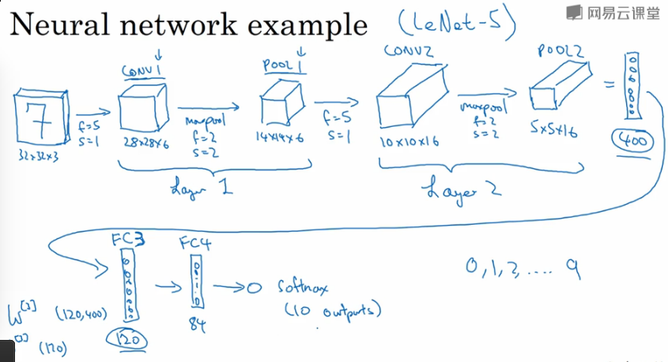

## Deeplearning.ai - CNN 

---

### Before

1. 引入CNN的必要性
   1. 如果我们使用传统的全连接神经网络来实现对图像的识别的话，我们会发现连接参数会变的异常巨大，并且这样子我们几乎不可能防止网络发生过拟合的情况，因为可以使用的数据量可能并没有参数那么多
   2. 训练网络需要保存的参数导致内存几乎不可用

---

### 卷积层

1. 过滤器(核)

   过滤器中的参数是需要去学习的(反向传播算法)，而不是使用固定的参数，**这是最核心的思想**

2. `Padding` 填充

   * $$n \times n$$ 的图片, $$f\times f$$ 的过滤器，可以得到特征图(`Feature Map`) $$(n-f+1)\times (n-f+1)$$

     这样做的缺点就是

     1. 输出缩小 : 每一次过滤之后的图像会变小,深层网络之后就没有办法从小图像上学到东西
     2. 边缘信息丢失 : 图像边缘的像素没有图像中间的像素影响的窗口多，导致存在部分的信息丢失

   * 填充方式 : 0填充

   * 确定填充的参数

     1. `Valid` 填充 : 不填充，$$p = 0$$

     2. `Same` 填充 : 填充之后的输出结果和输入的图像大小规模一致
        $$
        n+2p-f+1=n\\
        p=\frac{f-1}{2}
        $$

        * $$f$$ :最好是奇数，过滤器的大小最好是奇数，奇数的过滤器都有一个中心点用来指明当前的过滤器的位置
        * $$f$$ : 如果是偶数，只能使用非对称填充，填充不自然

3. 步长
   $$
   n\times n\ \ \ast\ \ f \times f \rightarrow \lfloor \frac{n+2p-f}{s}+1\rfloor
   $$

   * n : 图像的大小
   * f : 过滤器的大小
   * p : padding
   * s : 步长
   * 向下取整的思想在于 : 忽略边缘的凑不齐的一个窗口的像素，这是一个惯例

4. 三维卷积

   * **输入的深度是多少(图像是3,RGB),过滤器的深度就是多少**
   * 卷积层输出之后不存在深度的概念(因为图像的深度和过滤器的深度是一样的，导致最后的输出的图像的深度是1)
   * **多个过滤器抽取特征合并成多通道的输出** : 然而，我们通常学习的特征不止一种，这就意味着我们选用的过滤器也不止一种，得到的输出结果已不止一个，但是规模都相同，我们可以将这些特征得到的结果集合并成另一个三维的输入图像送入下一个卷积层中去继续抽取特征
   * **一个卷积核一个偏置**

5. 单层卷积网络

   

   其中的卷积核的卷积操作类似于 $$W^{[1]} * X^{[0]}$$
   $$
   Z^{[1]} = W^{[1]} \ast X^{[0]}+b^{[1]}\\
   X^{[1]}=ReLU(Z^{[1]})
   $$

   * 优点 : 参数个数不随着图像的大小改变而改变，只随着**特征数目**和**过滤器的规模**的改变而改变，可以减少参数避免过拟合

   * 符号标记

     

     1. $$f^{[l]}$$ : 第 $$l$$ 层中的过滤器的大小
     2. $$p^{[l]}$$ : 第 $$l$$ 层中的 padding 的大小
     3. $$s^{[l]}$$ : 第 $$l$$ 层中的步长
     4. $$n_h^{[l-1]} \times n_w^{[l-1]} \times n_c$$ : 上一个卷积层的激活值，当前卷积层的输入
        * $$n_c$$ : 表示输入图像的颜色通道或者是上一个卷积层的特征数
        * $$n_w$$ : 输入图像的宽或者是上一个卷积层的卷积结果的宽
        * $$n_h$$ : ...

6. 多层卷积

   1. 维度在深度网络中逐渐减少
   2. 通道(深度)在深度网络中逐渐增加
   3. 虽然只有卷积层和最后的输出层网络也可以工作的很好，但是通常还需要加入其他的两种层次来提升效果

---

### 池化层

1. 目的
   1. 缩减模型大小
   2. 提高计算速度
   3. 提高网络的鲁棒性
   4. 提高模型的平移不变性，池化降采样可以保证我们依旧可以提取出局部明显的特征
2. 池化类型
   1. 最大池化 : 从过滤器中提取某一个特征并且保留最大值，效果很好
   2. 平均池化 : 不太常用，用在非常深的深度网络中有效
3. 池化
   1. 可以再次使用窗口的概念去展示池化的过程

   2. 超参数(没有需要**学习**的参数)
      1. 过滤器的大小 $$f$$
      2. 步长 $$s$$
      3. 如果采用最大池化，每个窗口中采用最大的值作为一个输出的值

   3. **池化不改变输出的通道数(深度)，每一个通道上都作用一个池化操作**
      $$
      \lfloor \frac{n+2p-f}{s}+1\rfloor
      $$

---

### 全连接层

大量的参数存在于全连接层中

---

### 忠告和总结

1. 超参数的调整参照别的文献，不要轻易的自己设计超参数

2. CNN的优点(相对于全连接神经网络来说)

   1. 减少参数，避免过拟合

      1. 参数共享

         使用卷积核(过滤器)可以大幅度减少连接的权重参数，权重共享

         一个过滤器可能适用于图上的很多区域，这些区域都共享卷积核中的参数

      2. 稀疏连接

         局部感受野中是一个区域的参数对应一个神经元，并不是全连接的

   2. 图像的各种变换，只要特征类似，CNN都可以识别出来(池化保证)

#### 

