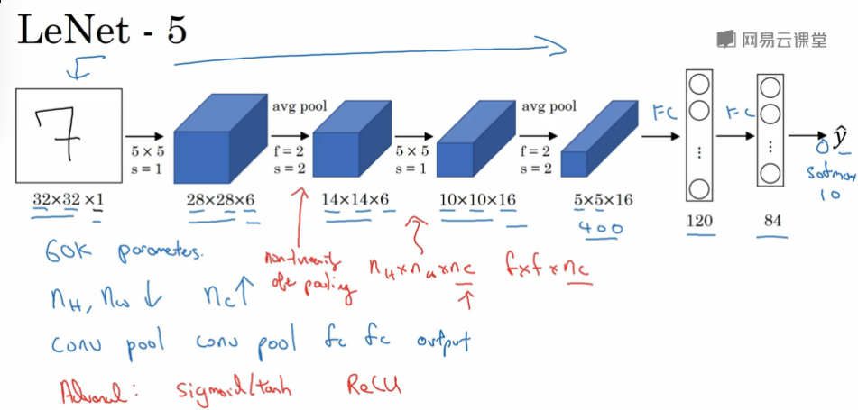
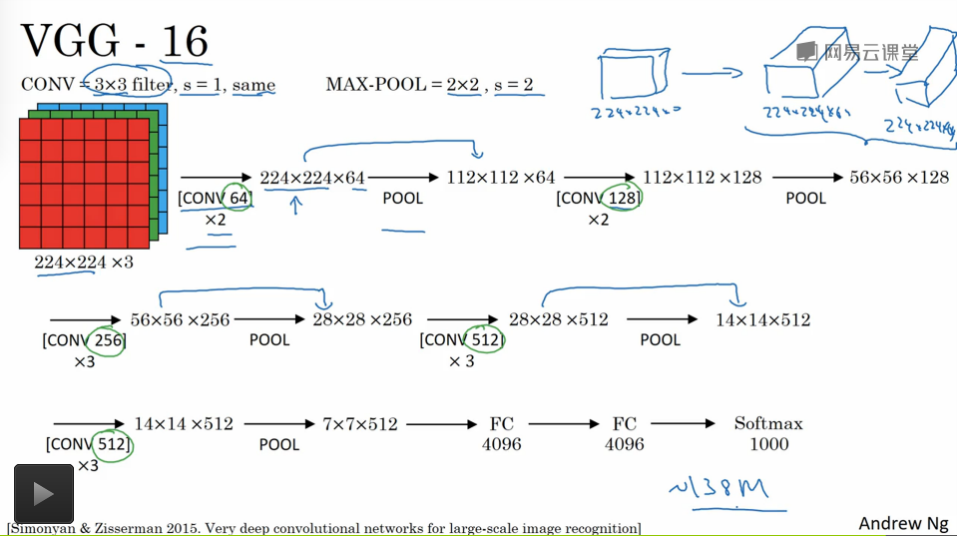
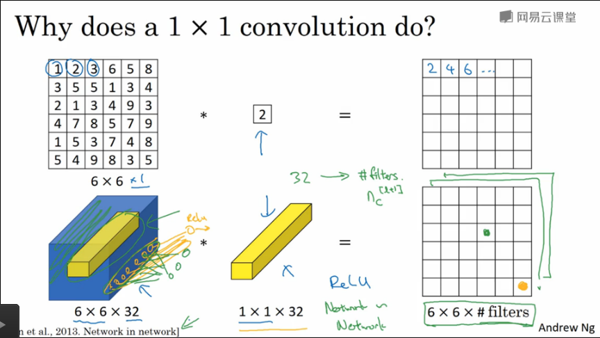
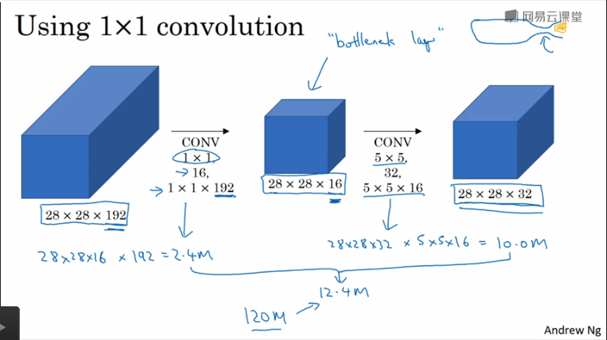
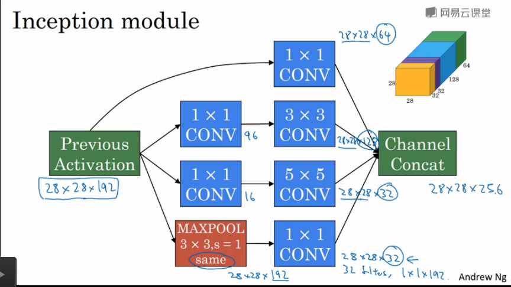

## 深度网络设计-CNN

---

### 实例探究CNN

1. 利用他人的参数设定经验用于自己的工作任务中
2. 常用的网络结构
   1. LeNet-5
   2. AlexNet
   3. VGG
   4. ResNet : 残差网络
   5. Inception

#### LeNet-5

手写数字识别

#### AlexNet

#### VGG

1. 简化了神经网络的结构，网络非常规整
2. 但是因为网络层数非常巨大，导致网络的参数过多(超过1亿)

#### 残差网络

跳远连接避免深度网络的梯度消失和梯度爆炸的现象

残差网络使用**残差块**构建

将一层的激活信息传递给一层甚至是几层之后的网络(在激活函数之前进行线性加和)
$$
a^{[l+k]}=g(z^{[l+k]}+a^{[l]})
$$

1. 上式中，$$l$$ 层的激活结果**跳远连接**到第 $$l + k$$ 层中去一起激活

2. 可以看出 $$z^{[l+k]}$$ 和参数 $$a^{[l]}$$ 是有同样的维度的，说明，网络中存在有很多的相同卷积维持维度的不变

   如果出现了维度不同的卷积，我们可以考虑使用矩阵 $$W_s$$ 当做学习参数修正参数 $$a^{[l]}$$ 的形状
   $$
   a^{[l+k]}=g(z^{[l+k]}+W_sa^{[l]})
   $$

使用残差块可以训练更深的神经网络

1. 深度网络有较好的模型表现能力，但是深度网络训练困难
2. 残差网络可以帮助深度网络在维持模型表现能力的同时，解决训练困难的问题
3. 保证网络的一致性和网络结构的简单性

#### 1 × 1 卷积核 (Network in Network)

多个 1 × 1 的卷积核的卷积操作可以理解成是**对信道的**，全连接神经网络

可以用来**压缩或者扩增**输入层的信道数目，使用 1 × 1 的卷积核

1. 池化层只能用来压缩图像的高度和宽度
2. 但是使用 1 × 1 的卷积核可以用来**压缩或者扩增**通道数目，并引入了非线性变化
3. 在 `Inceprion` 网络中节约计算成本(**瓶颈层**，缩小网络然后放大)

#### Inception网络

代替人工方式确定卷积层中的过滤器类型，并且决定是否需要创建卷积层和池化层,**使用不同类型的卷积核从不同大小的局部感受野中抽取特征，自动决定使用什么样的卷积核**

---

1. `Inception` 层

   使用 1 × 1 的瓶颈层减少计算量，在运行卷积之前首先使用 1 × 1 卷积构建的瓶颈层压缩通道数从而减少计算量，先压缩通道数，在扩正增通道数

   

   之前的 5 × 5 的卷积层从 28 * 28 * 192 -> 28 * 28 * 32,计算量在 1.2 亿

   使用了瓶颈层之后，28 * 28 * 192 -> 28 * 28 * 32,计算量在 0.12 亿

   ---

   为了可以将之后的多个感受野的特征组合，这里使用的池化层使用 **same padding** 填充，保证维数大小

   并且池化层之后需要使用 1 × 1 的卷积层用来压缩通道数目，避免池化层占据过多输出的通道

2. `Inception` 网络

   1. `Inception` 层

      

   2. `Inception` 网络 - `GoogLeNet`

      将 `Inception` 层组合起来构建网络

#### 计算机视觉系统

数据增强

1. 垂直镜像对称数据
2. 随机裁剪
3. 旋转图片
4. 噪声
5. 色彩转换

