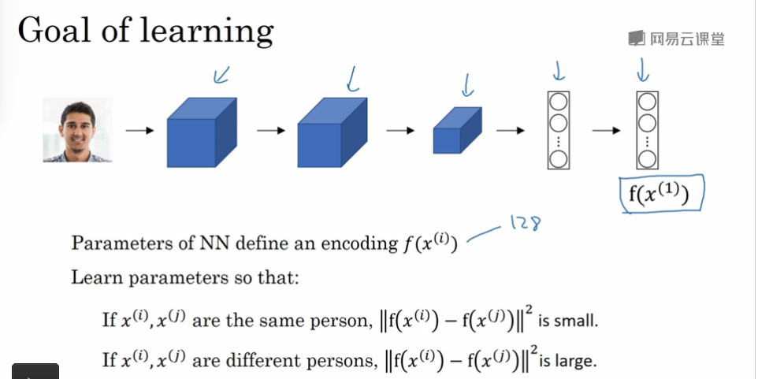
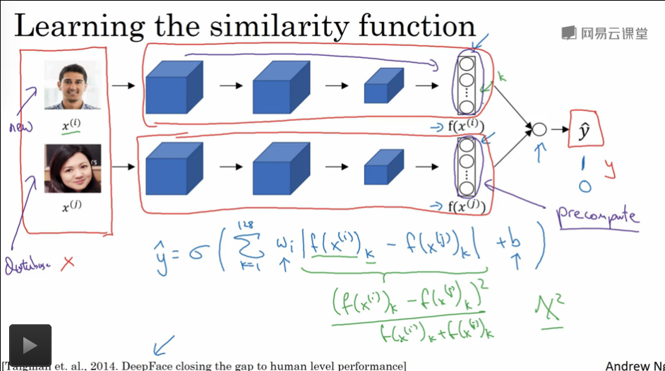

## 人脸识别和神经风格迁移

---

### 人脸识别

---

1. 人脸验证
2. 活体检测

---

`One-Shot` 学习问题

训练样例只有一个，只能通过一个样例去学习

1. 训练样例过少导致网络结果的鲁棒性不强
2. 如果照片集是不断的变动的，意味着我们需要不断的更新重新训练网络

解决方案 - 学习 `similarity` 函数 : 学习相似度函数
$$
d(img1,img2)=degree\ of\ difference\ between\ images\\
if\ d(img1,img2) \le \tau:\ \ \ \ the\ same\ person\ \ \ \ \ \ \ \ \ \ \ \ \ \ \ \ \ \ \ \ \ \ \ \\
else:\ \ \ \ the\ different\ person\ \ \ \ \ \ \ \ \ \ \ \ \ \ \ \ \ \ \ \ \ \ \ \ \ \ \ \ \ \ \ \ \ \ \ \ \ \ \ \ \ \ \ \ \
$$

* 神经网络学习差异度(相似度)函数 $$d$$ 
* 设定超参数 $$\tau$$ 用来表示差异度阈值

---

`Siamese` 网络

网络得到的结果是对图片的**特征编码**,计算编码的相似度

**损失函数** : `Triplet` 三元组损失函数

1. 同时观察三张图片 : 固定(anchor)图片 $$A$$，正例图片 $$P$$，反例图片 $$N$$
   $$
   ||f(A)-f(P)||^2+\alpha\le||f(A)-f(N)||^2
   $$

   * $$\alpha$$ : 是一个超参数，代表间隔，表示了图片特征之间的差异程度
   * $$\alpha$$ 参数避免网络学习 $$0\le0$$ 的特殊情况
   * **$$||f(A)-f(P)||^2$$ 可以预训练**

2. 损失函数定义
   $$
   L(A,P,N)=\max(||f(A)-f(P)||^2-||f(A)-f(N)||^2+\alpha,0)
   $$
   $$d(A,P)=||f(A)-f(P)||^2$$ **可以理解成是编码的差异性**

   最大化的含义就是

   1. 如果 $$||f(A)-f(P)||^2-||f(A)-f(N)||^2+\alpha > 0$$ 

      表示 $$||f(A)-f(P)||^2+\alpha > ||f(A)-f(N)||^2$$, 说明差异学习的不是很成功

   2. 如果 $$||f(A)-f(P)||^2-||f(A)-f(N)||^2+\alpha <0$$

      表示 $$||f(A)-f(P)||^2+\alpha <||f(A)-f(N)||^2$$,说明差异学习的比较成功，可以考虑成损失函数是0

3. 成本函数
   $$
   J=\sum_{i=1}^m L(A^{(i)},P^{(i)},N^{(i)})
   $$

   * 意味着系统中需要一个人的多张图片，不能只有一张，不然凑不齐三元组中的 $$A,P$$
   * 构建三元组的训练集

4. 训练集构建的技巧

   随机构建的三元组很容易判断差异性，我们为了提高网络的性能，需要精心构建难以训练的三元组给网络去学习，保证学习质量
   $$
   d(A,P)+\alpha \le d(A,N)
   $$
   要保证训练集中的质量中，两个距离函数的差异性比较小

---

logistic 回归 + `Siamess `网络

1. 训练集是一对图片，转换问题为使用监督学习的二分类问题
2. 可以预训练数据库中的图片的编码，加快计算的结果
3. 使用一个 `Siamess` 网络
4. 最后使用一个`logistic` 回归单元实现我们的人脸验证的二分类问题

---

### 神经风格迁移

利用层特征(**隐含层表示不同的通道表示抽取的不同的特征**)

符号定义

1. $$C$$ : 原始图片
2. $$S$$ : 风格图片
3. $$G$$ : 合成图片

---

1. 代价函数
   $$
   J(G)=\alpha J_{content}(C,G)+\beta J_{style}(S,G)
   $$

   * $$\alpha,\beta$$ : 两个超参数控制相似度权重

   * $$J_{conten}(C,G)$$ : 表示原始图片和生成图片的相似度

   * $$J_{style}(S,G)$$ : 表示风格图片和生成图片的相似度

   * 两个相似度函数 $$J_{contnet}(C,G),J_{style}(S,G)$$ 的计算

     1. 关于选取的层数 $$l$$

        $$l$$ 层如果是选取计算相似度的中间层的层数的话，如果 $$l$$ 层选的很小，生成的图片的会更有 **像素** 相似度，否则会有 **图像** 相似度，一般选择是中间的一个层数，**也是一个可以手动调节的超参数**

     2. $$a^{[l](C)},a^{[l](G)}$$ 内容相似度

        分别表示原始图片和生成图片在 $$l$$ 层数上的激活输出，如果这个激活输出相似，认为图片是相似的

        **使用差值平方和计算向量相似度**
        $$
        J_{conten}(C,G)=\frac{1}{2}||a^{[l](C)}-a^{[l](G)}||^2
        $$

     3. $$a^{[l](S)},a^{[l](G)}$$ 风格相似度

        1. 定义风格 : 在通道间的激活项 $$a$$ 之间的**相关性系数**

        2. 定义符号 : 第 $$l$$ 等的激活块的规模是 $$n_H\times n_W \times n_C$$

        3. 计算风格矩阵

           1. $$a^{[l]}_{i,j,k}$$ 是第 $$l$$ 层的激活块的某一个激活单元

           2. $$G^{[l](S)}$$ 是第 $$l$$ 层风格和图片 $$S$$ 很像的风格矩阵，规模 $$(n_c^{[l]}\times n_c^{[l]})$$

              **用来描述隐藏层 $$l$$ 不同的通道的特征的相关性**

              图片 $$S$$ 通道 $$k,k'$$ 的相关性计算
              $$
              G^{[l](S)}_{kk'}=\sum_{i=1}^{n_H^{[l]}}\sum_{j=1}^{n_W^{[l]}}a^{[l]}_{i,j,k}a^{[l]}_{i,j,k'}
              $$
              图片 $$G$$ 通道 $$k,k'$$ 的相关性计算
              $$
              G^{[l](G)}_{kk'}=\sum_{i=1}^{n_H^{[l]}}\sum_{j=1}^{n_W^{[l]}}a^{[l]}_{i,j,k}a^{[l]}_{i,j,k'}
              $$
              **对所有的 $$k,k'$$ 的组合都按上式可以计算出整体的风格矩阵**

           3. 如果风格矩阵中数字很大，代表相关性大

              否则代表相关性比较小

           4. 风格相似度计算
              $$
              J_{style}(S,G)=\frac{1}{(2\times n_H\times n_W \times n_C)^2}||G^{[l](S)}-G^{[l](G)}||^2_F
              $$
              当然如果可以对 $$l$$ 层之前的所有隐含层都计算风格矩阵的相似程度，效果会更好
              $$
              J_{style}(S,G)=\sum_l\lambda^{[l]}J_{style}^{[l]}(S,G)
              $$

              * $$\lambda$$ : 是每一层的超参数权重

2. 算法

   1. 随机生成图片 $$G'(n\times n\times 3)$$

   2. 使用梯度下降算法优化图片像素
      $$
      G=G-\alpha\frac{\partial J(G)}{\partial G}
      $$

   3. **生成一张图片需要训练一次**

---

### 卷积的其他应用 (NLP)

不同维度的卷积(图像处理是2D卷积)

---

1. 一维卷积

   使用一维卷积核

   对于自然语言处理任务，CNN可以认为是对特征的抽取，CNN类似是于巨大的 $$N-grams$$ 模型用来抽取**序列特征**

2. 三维卷积

   使用三维卷积核

   比如 CT 图像 / 视频是三维的数据，对他的特征抽取可以使用 CNN 抽取人体的特征和预测人物的动作