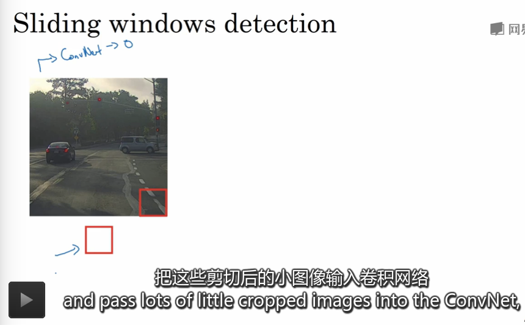
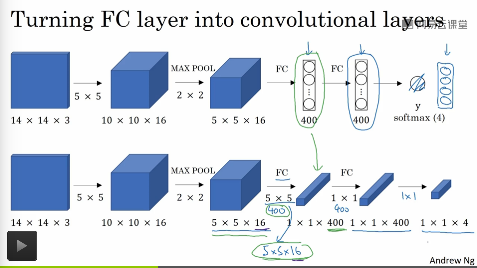
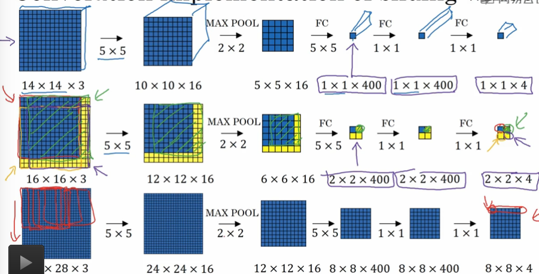

## 目标检测

---

1. 对象定位

   1. 检测的图片的坐标表示 : 

      * 左上角 : (0, 0)
      * 右下角 : (1, 1)
      * 边界框中心 : (bx, by)
      * 边界框的长度和高度 : (bw, bh)

   2. 训练集表示 :

      * 图片的类别
      * 图片的边界框属性 : (bx, by, bw, bh)

   3. 神经网络的输出数据 

      * 图片的分类类别 : **概率**的形式输出(目标1, 目标2, 目标3, ..., 背景)

      * 图片的边界框属性

      * 向量化输出

        $$ y = [P_c, b_x,b_y,b_h,b_w,c_1,c_2,c_3,...,c_n]$$

        * $$P_c$$ : 图像中存在有目标集合中的其中一个或者多个目标时为 1, 否则为0,可以概率化表示(如果为0，表示背景图片没有目标,其他的所有标量没有任何意义)
        * $$b_x,b_y,b_h,b_w$$
        * $$c_1,c_2,c_3,...,c_n$$ : softmax 结构表示的如果 $$P_c$$ 不是 0 的情况下图像中的目标的分类情况

   4. 损失函数
      $$
      L(y',y)=\left\{\begin{array}{rcl}
      (P_c'-P_c)^2 + (b_x'-b_x)^2+(b_y'-b_y)^2 + ... + (c_n'-c_n)^2,P_c = 1\\
      (P_c'-P_c)^2,P_c = 0
      \end{array}\right.
      $$

2. 特征点检测

   1. 特征点 : 图像中可以用来表示我们需要标记的图像的特征的具体位置

   2. 神经网络的输出
      $$
      y=[P,c_{1x},c_{1y},c_{2x},c_{2y}...,c_{nx},c_{ny}]
      $$

      * $$P$$ : 代表图像中是否存在有我们要找的特征
      * 之后的都表示图像中的特征点的坐标，所有的训练集中的特征点表示的含义必须是匹配的

   3. 特征点检测可以用来做 : 动作捕捉和预测等等有趣的实验

3. 基于滑动窗口的目标检测算法

   

   1. 首先构建一个目标几乎占据了所有的图像的一个训练集，并按照 0, 1 进行标注
   2. 利用上述的训练集构建一个卷积神经网络输出 0, 1 并训练
   3. 之后对于一个给定的图片我们采用不同粒度大小的**滑动窗口**以固定的**步长**扫描图像将扫描到的小块图像送入网络进行判断，从而定位目标的位置
   4. 缺点
      * 选用粒度小的滑动窗口可以准确的定位目标位置，但是计算量非常巨大
      * 选用粒度大的滑动窗口可以快速计算但是准确度有所下降

4. 卷积滑动窗口

   1. 

   2. 卷积层代替全连接层 :

      * 输出的维度增加但是表示的内容是类似的
      * 全连接层转变成卷积层的过程中使用的计算和全连接层的计算是一样的(**都是一种加权整合和激活的结果**)

   3. 卷积滑动窗口检测算法

      * 不用将整个图片使用滑动窗口多次计算，可以将整个图片计算一次便得到所有的滑动窗口的计算结果，加快运行速度，因为卷及操作共享了很多的计算结果，所以没必要都重新计算一遍，只需要一次计算即可

      * 定义 : 

        1. ​$$b_x$$ : 滑动窗口的大小
        2. $$w_x$$ : 图片的总大小
        3. 只采用一层池化，多层池化指数级 ????

      * 

      * 最后一个例子中， 28 * 28 * 3 -> 8 * 8 * 4

        $$\frac{(w_x - b_x + 2)}{2}$$ 

        因为有一层池化层，可以理解滑动窗口是在以步长为2在扫描图片

        输出的 8 * 8 * 4 的就是 64 个滑动窗口的总共卷积效果

      * 上面图片的三个粒子都是用相同的卷积核大小和池化大小，保证了每一个滑动窗口的计算都是一样的

      * 缺点 : 滑动窗口的位置不会很精确，并且窗口大小并不一定都是正方形

5. $$Bounding\ Box$$ 边界框确定

   1. YOLO算法 : 只看一次
      * 图片按照确定的网格大小分成大小相等的几块
      * 训练集 : 图片中的所有的对象按照**中点归属**在不同的图片的小块中
      * 每一个小块都有一个 和之前的对象检测一样的关于输出 $$y$$ 的向量标识小块中是否存在有目标的检测
      * 存在有 3 * 3 的小格的话，输出的向量就是 3 * 3 * k, k 是上述的对象检测的输出向量 $$y$$ 的维度
      * 优点 :
        1. 计算一次，和之前的卷积窗口滑动一样的作用，共享计算过程
        2. 速度快，可以实时检测
        3. 因为使用的是 $$b_x,b_y,b_h,b_w$$ 的表示方式，可以表示更精确的边界框
      * 缺点 : 很多的小块都确定一个目标，确定出很多的边界框，容易出现混淆，非极大抑制解决

6. 交并比函数 IoU

   **评价**对象检测算法,计算 **计算边界框** 和 **真实边界框** 的交集和并集的比，一般来说如果IoU大于0.5即可认为是正确，如果更大的话，边界框的精确度越高

7. 非极大抑制

   1. 清理多个可能的边界框从而精准的确定正确的边界框
   2. 找到图中的最大的概率输出边界框，利用IoU抑制那些交并比和最大输出边界框很大的边界框之后，不断循环这个步骤直到结束算法

8. Anchor Boxes and YOLO

   解决一个格子可以检测出多种对象的方式

   1. Anchor Box 的数目和形状是手工指定或者算法生成的
   2. Anchor Box 的数目决定了输出的向量的 $$y$$ 的规模大小
   3. 在对象检测中我们选择将数据填入交并比最大的Anchor Box 所在的维度上

9. RCN候选区域算法

   R-CNN算法，带区域的卷积网络

   算法选择出可能存在目标的候选区域执行卷及网络，不必跑所有的小图像

   使用分割算法找到候选区域

   too slow

   ​