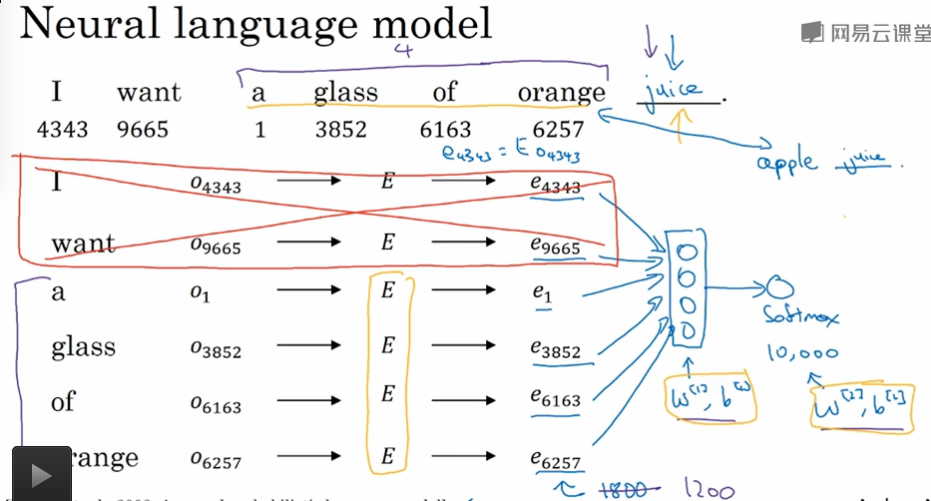

## NLP与词嵌入

词嵌入 - `Word Embedding` : 

语言表示的一种方式，帮助算法自动理解类似的词

---

1. One-hot 表示方式的缺点

   * 将词孤立分开，**相关词(相似词)**的泛化能力不强

     比如 : 橘子汁，苹果汁的相关性非常大，但是如果使用 One-hot 向量的话，我们很难学习到这样的相关特征(相似特征)

   * 稀疏存储浪费空间

2. 将词的**特征**具体化，数值化(性别，种类，颜色等等)并归纳成词的表征向量

   1. 相对于 One-hot 来说可以更好的表示词汇的特征，这种表征方式需要学习得到

   2. 词汇的高维特征实际上可能并不是很好的理解，但是算法可以有效的区分出词汇的相关性

   3. 相似的词具有相似的特征表示向量

   4. 可视化 `word embedding` 可以使用 Hinton 的算法 `t-SNE` 在二维空间可视的表示嵌入的相关性特点 [参考链接](http://www.datakit.cn/blog/2017/02/05/t_sne_full.html)

      `t-SNE` 算法利用非线性映射将高维空间的嵌入特征映射到低维空间可视化(2维空间)表示

3. 使用词嵌入 - 迁移学习

   1. 从巨大的训练集中学习词嵌入，或者迁移使用已经训练好的词嵌入模型
   2. 将词嵌入模型应用到训练集很小的任务中去实践
   3. 可以考虑是否在任务训练过程中微调词嵌入模型的内容，但是通常不需要对词嵌入模型过多的调整
   4. 类似于CNN中学习到的对图片的编码学习到的图片的特征一样，在NLP领域我们对与词汇表的嵌入过程和图片的编码过程是类似的，词汇表会嵌入到一个固定的编码中去(词嵌入的本质)表示词表征向量之间的相似程度

4. 词嵌入的特征

   1. 词的良好表征

   2. 类比推理 : 词汇 $$e_1$$ 相对于词汇 $$e_2$$ ,相当于词汇 $$e_3$$ 相对于什么词汇 ?

      扫描词汇表，最大化 
      $$
      e_1-e_2 \approx e_3 -e_w\\
      \arg \max_w (e_3 - e_1 + e_2)
      $$

      1. 找到这样的词汇 $$e_w$$ 即可

      2. 引入相似度计算公式，优秀的相似度计算公式

         **余弦相似度计算** : 计算向量夹角的**余弦相似度**计算向量的距离或者相似度

5. 词嵌入矩阵

   1. ​学习 `word embedding` 的本质上实在学习一个**嵌入矩阵**

   2. 常说的 **嵌入层** : 将嵌入矩阵中的对应的单词的嵌入向量提取出来

   3. 在下面的计算中，我们虽然使用的是矩阵乘法的思路，但是实际上我们为了避免过多的计算，通常采用从矩阵中提取列的方式抽取嵌入的词向量

   4. 符号定义

      * $$E$$ : 嵌入矩阵，规模 $$(n,m)$$, n是嵌入向量的大小，一般不大，m是词汇表中的单词的个数

      * $$O_j$$ : 词汇表中的单词 $$j$$ 的 One-hot 向量

      * $$e_j$$ : 词汇表中的单词 $$j$$ 的嵌入向量

      * 计算方式 : $$e_j = E\cdot O_j$$

        本质上这样的计算方式就是抽取嵌入矩阵中的对应的词的嵌入向量(一列)

6. 学习词嵌入

   1. 算法超参数
      * 历史窗口的大小 $$l$$ : 考虑之前的几个单词用来预测下一个单词
   2. 
      * 学习参数  : $$E, W^{[1]},b^{[1]},W^{[2]},b^{[2]}$$
      * 这里的历史窗口的大小是 4
      * 一般也会选用左边的 4 个词和右边的 4 个词作为输入用于预测下一个单词，一般来说这有点像是构建语言模型，但是我们也可以用来训练嵌入矩阵
   3. 训练结果良好的原因在于 :为了更好的拟合训练集，学习到的 **嵌入矩阵** 必须可以很好的表达词之间的相似关系

7. `Word2Vec` - 更加高效的学习词嵌入

   `Skip-grams` 模型

   * 目标 : 在训练集中抽取上下文和目标词进行配对的一个无监督学习问题

   * 训练方式

     1. 随机的找到一个词当做是上下文单词(但是我们需要考虑到停用词和不同的词出现的频率的影响，这里可能会采用不同的启发式方法用来对上下文单词进采样)
     2. 然后在上下文单词的一定的区间范围内随机的找一个词当做是目标词

   * 算法

     1. 找到了上下文单词之后，从嵌入矩阵中抽取出对应的嵌入向量

     2. 将嵌入向量输入 softmax 层中输出对应的所有的词汇表中的单词对应的预测概率向量 $$y', (m,1), m = 词汇表的规模,假设是10000$$
        $$
        y'_t=P(t|c)=\frac{e^{\theta_t^T e_c}}{\sum_{j=1}^{10000}e^{\theta_j^T e_c}}
        $$

     3. 损失函数
        $$
        L(y',y)=-\sum_{i=1}^{10000}y_i\log(y'_i)
        $$

   * 学习参数

     1. $$E$$ : 嵌入矩阵，主要的学习对象
     2. $$\theta_t$$ : 对于目标词的预测参数(总共有10000个目标词说明存在有10000个对应的这个向量,然后对字典中存在的数据进行 softmax 分类预测概率)

   * 计算速度问题

     softmax 的分母计算的代价过于昂贵，尤其是在词汇表变得非常巨大的时候
     $$
     P(t|c)=\frac{e^{\theta_t^T e_c}}{\sum_{j=1}^{10000}e^{\theta_j^T e_c}}
     $$
     在这里可以采用的优化方式，是采用树状的 softmax 结构(每个节点是一个 logistic) 来加速计算，这样我们可以将频繁使用的词放在接近树根的位置，不常见的次放在树叶的位置，算法的速度是 $$\log$$ 等级增长的，可以部分的解决这个计算量过大的问题

     ---

     ### Skip-Gram 模型抽取词嵌入

     [参考资料1](https://www.leiphone.com/news/201706/PamWKpfRFEI42McI.html)

     [参考资料2](https://www.leiphone.com/news/201706/QprrvzsrZCl4S2lw.html)

     [参考资料3](https://www.leiphone.com/news/201706/eV8j3Nu8SMqGBnQB.html)

     `Word2Vec` 模型实际上主要分为两种，主要是 `Skip-Gram` 和 `CBOW` 两种模型，从直观上理解，从直观上理解，`Skip-Gram` 是给定 `input word` 来预测上下文，而 `CBOW` 是给定上下文，来预测 `input word`

     

     在 `Skip-gram` 模型中分成了两部分，**第一部分建立模型，第二部分是通过模型嵌入词向量**

     建模解决问题并不是我们需要的，实际上我们需要了解的是建模训练之后得到的权重矩阵

     1. 首先确定一个上下文单词 `input word` 然后确定一个 `skip window` 视窗的大小，表示我们从上下文单词的左边或者右边选取一个范围，在这个范围中选取 `output words` 个单词构成一个由上下文单词和 抽取的单词构成的元组的列表

     2. 构建一个神经网络输出一个概率分布，训练使得概率分布和我们上面的构造的训练接十分的贴合,神经网络的输出其实表示了在词典中最有可能和我们预定的上下文单词附近出现的单词

        

        * 蓝色的单词是上下文单词
        * 方框是视窗
        * 因为我们可以获得大量的相关词的成对的训练集，所以在训练之后我们获得的和上下文单词相对应的单词概率就很高

     3. 我们通过给上述的神经网络输入大量成对的单词完成上述的概率计算的训练

        但是神经网络的输入必须是数值类型，这是后我们可以考虑将次根据在词汇表中的出现表示成 One-hot 编码输入到神经网络中

        

        * 输出层是一个 Softmax 单元用来表示我们的上下文单词附近的单词出现的概率
        * 对于 (input word, output word) 的训练对我们可以采用监督的方式进行梯度下降算法进行训练，模型的输出是一个概率分布(可以转化成 One-hot 向量)

     4. 计算效率的问题

        因为 One-hot 向量是极度稀疏的向量，用这样的极度稀疏的高维向量去做矩阵乘法是非常的消耗计算资源的，但是我们可以发现隐层的输出其实就是词嵌入矩阵的(隐含层参数矩阵的)行索引，所以使用索引运算可以大幅度的加快我们的计算速度(**这样也就意味着我们的隐含层输出其实是输入单词对应的嵌入向量**)

     5. 重点说一下隐含层，这是我们获取词向量的目的

        

        * `google` 使用的词向量的模型的大小是 300(隐含层的神经元的个数就是 300), 足够表示词嵌入向量的内部隐层特征

        * **上图中假定 One-hot 向量是 10000 维，词向量是 300 维，上图的矩阵是隐含层的输入参数矩阵，完全可以将训练得到的矩阵看作是一个得到的嵌入矩阵**

        * 本质上

          

          * 输入一个单词的 One-hot 向量，经过隐含层输出这个单词对应的词向量表示
          * 词向量经过 Softmax 输出对应的概率分布结果

     6. 直觉上的理解

        如果两个不同的单词都有相似的上下文单词的话，经过上述的训练，得到的词向量应该是非常的相似的，从而实现了词嵌入的目的。

        比如一个上下文单词是 `climbed` , 两个单词是 `cat, kitty	` 这两个单词都经常的出现在 `climbed` 这个单词的附近，那么我们输入 `cat, kitty` 作为网络的输入的话，都可以得到很相似的词嵌入向量，否则在输出层计算之后得到 `climbed` 的概率并不是一样(实际上应该是一样的)

     7. 计算效率的问题

        Word2Vec 模型本质上是一个非常大的神经网络(NLP问题中的词汇表非常的巨大)，并且需要大量的参数和训练集进行梯度下降，梯度下降还一定非常的缓慢，论文的作者采用了很多的方法解决这个问题，其中非常著名的就是负采样

     #### 优化 `Skip-Gram` 模型

     1. 优化点
        * 常见的单词或者短语，在模型中将其视为单个的单词
        * 对常见的高频单词进行二次采样减少在训练样本中的出现次数
        * 使用负采样改进，小比例更新优化算法的训练过程

     2. 将常见的单词或者短语构建成向量

        将一整个词组当做是一个单词来看待，拥有自己的词向量

        使用的效果，`google` 的词汇表通过这样的构建方式将模型的单词尺寸压缩很大的比例

     3. 高频词的处理方式

        使用**二次采样技术**来应对高频词汇的问题，高频词汇比如 `the, and` 等等并没有我们需要学习的实际含义，按照概率的方式将训练预料中的高频词汇删除，这样的话，对于高频词对训练预料的规模的贡献将会减小(并且我们并不需要很多的有关高频词的训练语料来对这样的高频词汇进行词向量嵌入的学习)

     4. 抽样率

        我们将计算在词汇表中保留某一个词的概率，这个概率越小越容易被删除(并且设置一个参数阈值)
        $$
        P(w_i)=(\sqrt{\frac{Z(w_i)}{0.001}}+1) \times \frac{0.001}{Z(w_i)}
        $$
        

        * $$P(w_i)$$ : 表示单词 $$w_i$$ 被保留的概率
        * $$Z(w_i)$$ : 代表单词在语料库中出现的频率,一个单词出现的频率不会很大(即使是常用词汇)，一个单词的在语料库中出现的频率越高越不容易被采样
          * 当 Z(ωi) <= 0.0026 时，P(ωi) = 1.0 。当单词在语料中出现的频率小于 0.0026 时，它是 100% 被保留的，这意味着只有那些在语料中出现频率超过 0.26% 的单词才会被采样。
          * 当时 Z(ωi) = 0.00746 时，P(ωi) = 0.5，意味着这一部分的单词有 50% 的概率被保留。
          * 当 Z(ωi) = 1.0 时，P(ωi) = 0.033，意味着这部分单词以 3.3% 的概率被保留。

     5. 负采样

        一个训练样本都可以改动整个巨大的模型参数矩阵，并且训练的语料也消耗非常巨大，这样带来的训练的复杂性是我们没有办法承受的。**负采样（negative sampling）**解决了这个问题，它是用来提高训练速度并且改善所得到词向量的质量的一种方法

        1. 如果采用之前的方式的话，神经网络的输出层应该是一个 softmax 生成的 One-hot 向量，这样对输出层训练的参数很庞大

        2. 但是如果采用负采样的话，神经网络的输出层仅仅只是一个 logisitic 回归(输出 0,1 的情况)，输出层的网络修正的权值数目就会变得很少，训练速度可以加快

        3. 负采样的 negative word 的选择方式

           * 一个单词在语料库中的出现的频率越高，越有可能作为一个 negative word 出现在负采样的样本中

           * 频次概率计算公式
             $$
             P(w_i) = \frac{f(w_i)^{\frac{3}{4}}}{\sum_{j=0}^n(f(w_j)^{\frac{3}{4}})}
             $$
             上述的 $$\frac{3}{4}$$ 是经验公式

   ---

8. 负采样 - 降低训练负担，提高训练词向量的质量

   1. 什么是正采样和什么是负采样

      正采样是类似与上述的采样方式，首先选取出对应的一个上下文单词，然后选取出对应的附近的一个随机选出的单词，标记是1

      负采样是选出上下文单词之后，我们在字典中随机的找到一个单词作为预测对象，标记是0

   2. 训练集构建

      * 数据集越小，训练集越大
      * 数据集越大，训练集越小
      * 选择一个正采样之后，可以选择一个 $$k$$ 个负采样进行训练集的构建

   3. 算法

      1. 符号定义

         * $$c$$ : 上下文单词
         * $$t$$  : 目标单词，上下文单词的上下文单词
         * $$y$$ : 预测的标记，0 / 1
         * $$e_c$$ : 对应的上下文单词的嵌入向量
         * $$\theta_t$$ : 对应的检验的目标单词的参数，logistic 模型的参数

      2. 计算 logistic
         $$
         P(y=1|c,t)=\sigma(\theta_t^Te_c)
         $$

   4. 好处

      * 对于训练一个很大的 softmax 来说，训练很多的小的 logistic 单元的计算量更小，只需要训练集少于 10000 词汇表数目大小的训练集样本即可

      * 数据集很大的情况下效果不错

9. 词嵌入应用 - 情感分类

   给出一段文本，分析文本中讨论的实物是否是文本作者喜欢或者讨厌的

   1. 困难 : 标记的训练集的数目不够多

   2. 算法1

      使用一个训练好的词向量模型的嵌入矩阵，将一个评价文本的每一个单词计算的到对应的嵌入向量然后对所有的嵌入向量求平均，送入 softmax 中进行分类

      这样做简单，但是对于有些句子来说，如果没有考虑**词序**的话，很可能会出现错误的情况(比如出现了很多的有利的词但是实际上是以一个负面评价)

   3. 算法2 - RNN (考虑词序)

      1. 使用 `many-to-one` 架构的 RNN 网络
      2. 只不过输入的不是 One-hot 或者其他的形式，变成了有用的词向量的形式

10. 词嵌入除偏

  1. 词向量有可能会包含性别歧视，种族歧视等等不良的信息
  2. 也就是说算法学习到了训练文本中的偏见内容