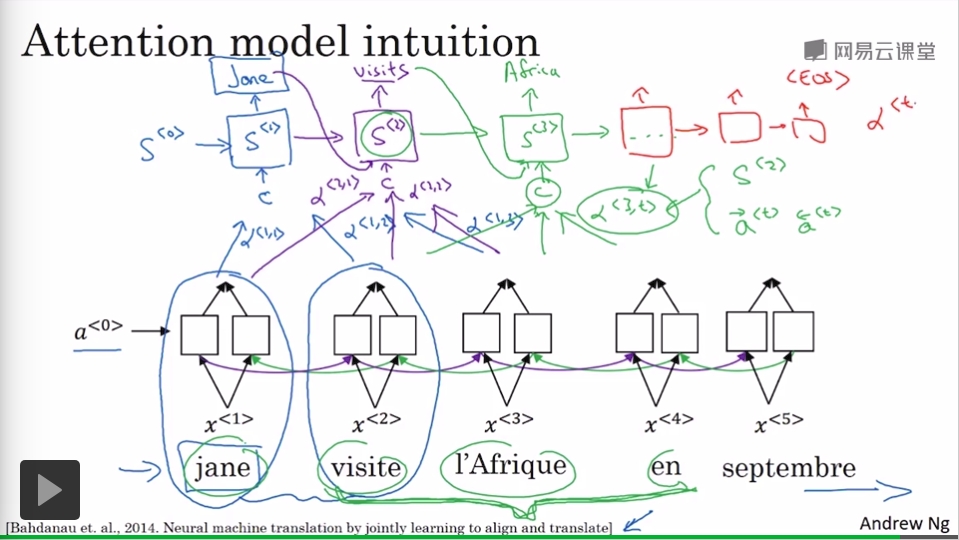

## 序列模型和注意力机制

---

### 1. Seq2Seq

>机器翻译，自动摘要，图像描述(看图说话) 等等领域

1. 编码网络 : 将输入的序列编码成一个向量
2. 解码网络 : 将输出的向量解码生成序列(统计语言模型，采样生成解码序列，统计语言模型本质上是以 0 向量作为输入进行序列生成，但是解码网络的输入是编码网络对输入序列的编码向量)

---

1. `Image2Seq` : 编码网络是 CNN, 解码网络是 RNN
2. `Seq2Seq`: 编码和解码网络都是 RNN

---

1. 本质上，循环神经网络的作用在于构建一个语言模型甚至可以用来生成文本序列(采样实现)，但是在序列采样的过程中，我们需要的不是最可能的输出，而是最好的输出，这时候需要对 `Seq2Seq`  进行加强

2. 因此编码解码网络本质上是一个 **条件语言模型(不是传统的统计语言模型)**
   $$
   P(y^{<1>},...,y^{<T_y>}|x)
   $$

   * $$x$$: 输入序列
   * $$y^{<i>}$$: 输出序列

   本质上编码解码网络计算的是针对输入序列 $$x$$ 的输出序列的条件概率，我们如果在解码网络采样输出的话必定会结果时好时坏，但是我们需要每次都输出最好，概率最大的输出序列(使条件概率最大化的输出序列)

3. 条件概率最大化的搜索算法

   >搜索空间过于巨大(词典太大并且序列很长的时候)，需要一种有效的搜索算法

   * 贪心搜索  (Greedy Search)

     采样输出的时候，每一次都采样概率最大的单词作为当前时间步的输出

     当然这样的结果可能不一定是最优的

   * 集束搜索 (Beam Search) - 启发式搜索算法

     1. 集束宽 $$B$$: 集束搜索的宽度，考虑多个可能的结果，考虑 $$B$$ 个概率最大的输出结果，并同时跟踪

     2. $$P(y^{<1>},y^{<2>}|x) = P(y^{<1>}|x)P(y^{<2>}|x,y^{<1>})$$

        利用解码模型计算出集束搜索的所有一个目标的对应的下一个对应的条件概率再选择 $$B$$ 个作为输出并跟踪

        如果词汇表大小是 10000, B = 3, 第一个时间步找 3 个跟踪，第二个时间步从 30000(3 * 10000) 找 3 个跟踪，第三个时间步 30000 找 3 个跟踪 (找概率最大的3个跟踪)

        **在这一步，我们会复制 3 个等价的解码网络用来评估概率**

     3. $$B=1$$, 退化成贪心搜索，集束宽越大，考虑的范围越多，越有可能找到近似解

   * 改进集束搜索

     1. 数值精度

        因为概率乘积会影响我们的计算结果，容易导致数值下溢，我们痛处并不是最大化 $$P$$ ,而是最大化 $$\log P$$

     2. 长度归一化

        因为我们的是要最大化条件概率，所以解码网络会倾向于生成短句子(概率值都是小于 1 的)

        $$\arg \max_y (\frac{1}{T_y^{\alpha}}\sum_{t=1}^{T_y}\log P(y^{<t>}|y^{<1>},y^{<2>},...,y^{<t-1>}))$$

        求取平均值归一化,除以 $$T_y^{\alpha} (\alpha = 0.7)$$ ，或者 $$\alpha = 1$$ 也可以本质上是一个超参数

        用在对集束搜索结束的时候作为评估

     3. 集束宽选择

        1. 大: 考虑的可能多，结果可能更好，内存占用大，计算速度慢
        2. 小: 考虑的可能少，结果不一定好，内存占用少，计算速度快
        3. 产品一般常用大小是 10，科研一般常用大小是 1000 ~ 3000

     4. 吊的话，去跑 $$BFS / DFS$$ 吧

   * 误差分析集束搜索

     >明确问题来自于集束搜索的误差还是模型本身的误差

     如果存在有对应的输入序列 $$x$$, 人工翻译结果 $$y^*$$, 算法翻译结果 $$y'$$ (RNN + Beam Search + 长度归一化等等)

     1. $$P(y^*|x) > P(y'|x)$$: Beam Search 算法精度不够，可以考虑加大集束宽
     2. $$P(y^*|x) \le P(y'|x)$$: RNN 模型可能有问题

     之后我们测试集上遍历所有的结果，计算 RNN / Beam Search 的出错的比例，确定哪一个算法存在问题需要改进

4. Belu(双语评估替补) 得分 - 评估翻译系统的性能

   >翻译结果如果合一人工翻译的结果相近得分很高

   1. 这是一种在 n 元语法模型下度量召回率的方法

   2. 截取计数 (Count_clip): 在机器翻译中 n 元词组出现的次数需要在所有人工参考翻译中进行最大上限的截取(选人工翻译中对某一个词组的最大计数作为对该词组的截取计数)

      $$Count_{clip} = \max(Count_{RNN}(y),\max(Count_{reference}(y)))$$

      对 n 元词组 $$y$$ 的截取计数

   3. Belu on n-gram (单一实数评估指标)

      1. 衡量和参考翻译文本的相似程度
      2. 如果和某一个人工翻译的文本十分近似，该值会近似 1
      3. 长度惩罚非常重要，需要引入 BP 长度惩罚因子

      ​
      $$
      P_n = \frac{\sum_{n-gram \in y'}Count_{clip}(n-gram)}{\sum_{n-gram\in y'} Count(n-gram)}\\
      Belu = BP*e^{\frac{1}{n}\sum_{t=1}^nP_t}
      $$

      * BP: 用来惩罚短翻译文本

### 2. 注意力机制

1. 问题引入

   对于短句子的翻译，Seq2Seq模型的Belu得分可能会很高，但是在长句子中的效果可能并不是很好，因为网络可能并不擅长记住长信息并进行输出，这时候需要注意力机制让神经网络只注意一部分的输入序列而不是记住全部的输入序列，训练模型的注意力(关注对翻译更有用的一些信息)

2. 注意力机制示意图

   

   * $$\alpha^{<t,t'>}$$: 代表生成第 $$t$$ 个单词的时候对第  $$t'$$ 单词的注意力权重

3. 注意力模型

   [参考链接1](https://blog.csdn.net/tg229dvt5i93mxaq5a6u/article/details/78422216)
   [参考链接2](http://www.cnblogs.com/robert-dlut/p/5952032.html)

   1. 符号定义

      * $$a^{<t>}=(\rightarrow a^{<t>},\leftarrow a^{<t>})$$

        双向网络的隐藏层的输出结果的合并

      * $$y^{<t>}$$: 第 $$t$$ 个时间步的输出

      * $$S^{t}$$: 第 $$t$$ 个时间步的隐藏层输出

      * $$C^{<t>}$$: 注意力权重表示的上下文

        所有的注意力权重都是非负的，取值范围在 $$[0,1]$$，所有的注意力权重之和是 1
        $$
        \# 小心 a^{<t'>} 是向量，得到的C也是向量的形式，并且规模和 a^{<t'>} 完全一致\\
        C^{<t>} = \sum_{t'=1}\alpha^{<t,t'>}a^{<t'>}
        $$

      * $$\alpha^{<t,t'>}$$:

        在预测第 $$t$$ 个单词的时候需要话费到 $$t'$$ 个输入词上的注意力的权重

        当前时间步 $$t$$ 的输出 $$y^{<t>}$$ 应该花 $$\alpha^{<t,t'>}$$ 的注意力在 $$a^{<t'>}$$ 上

        ​

