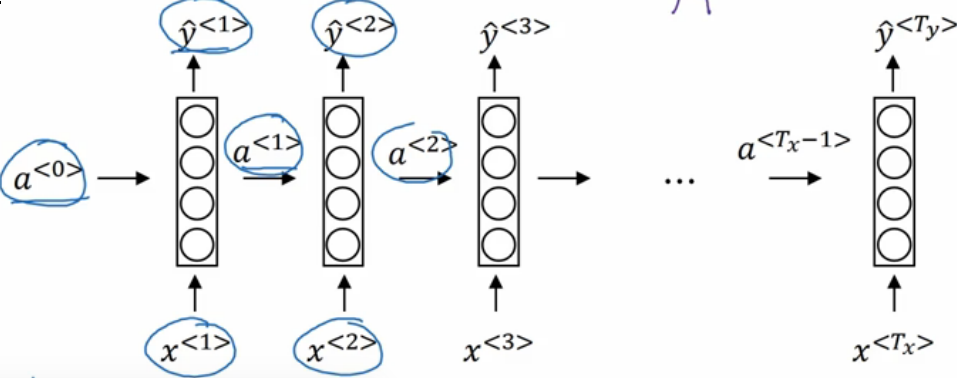
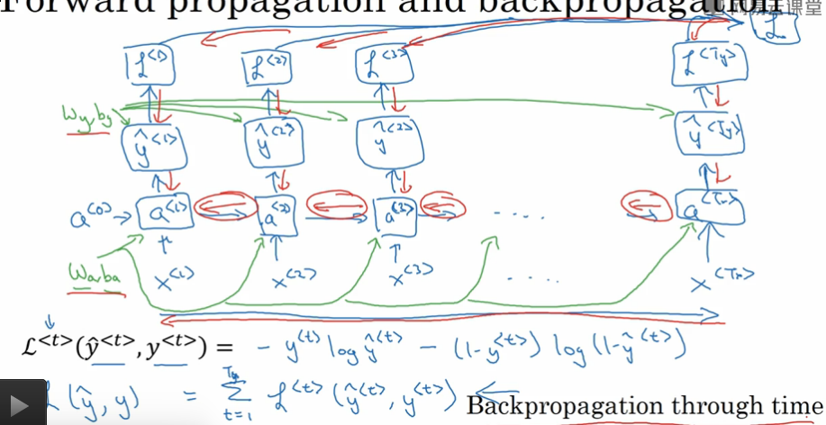
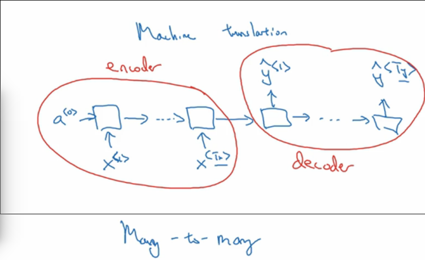
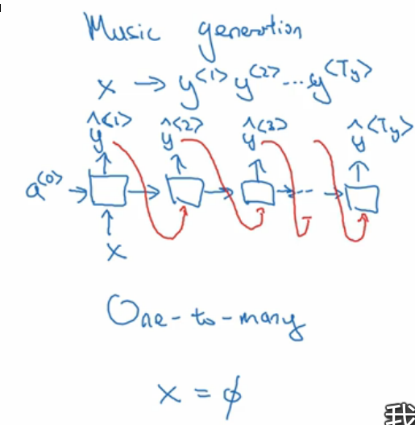
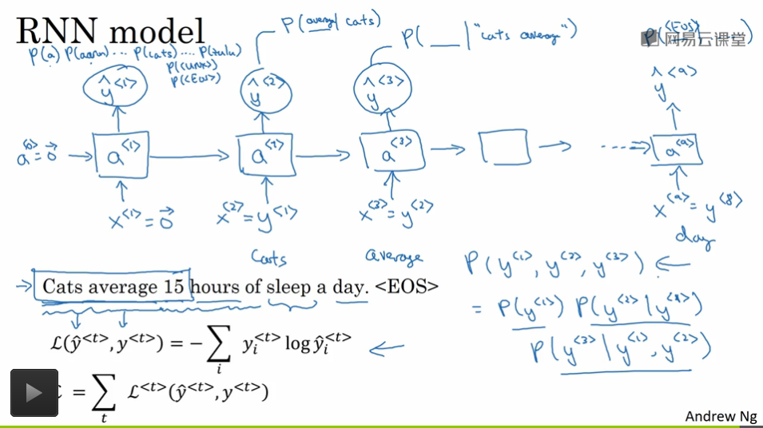
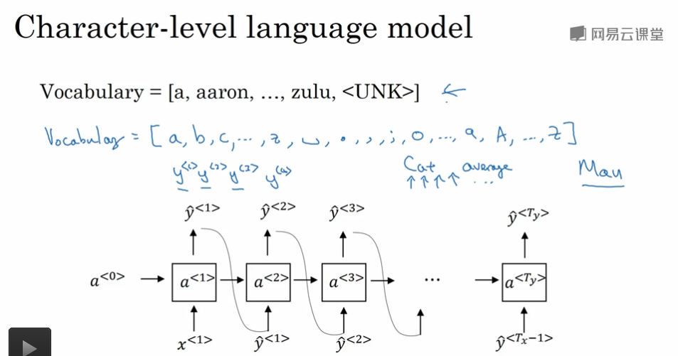
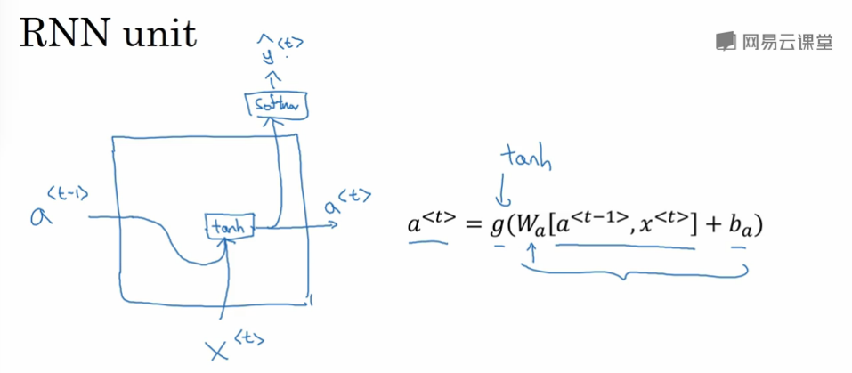
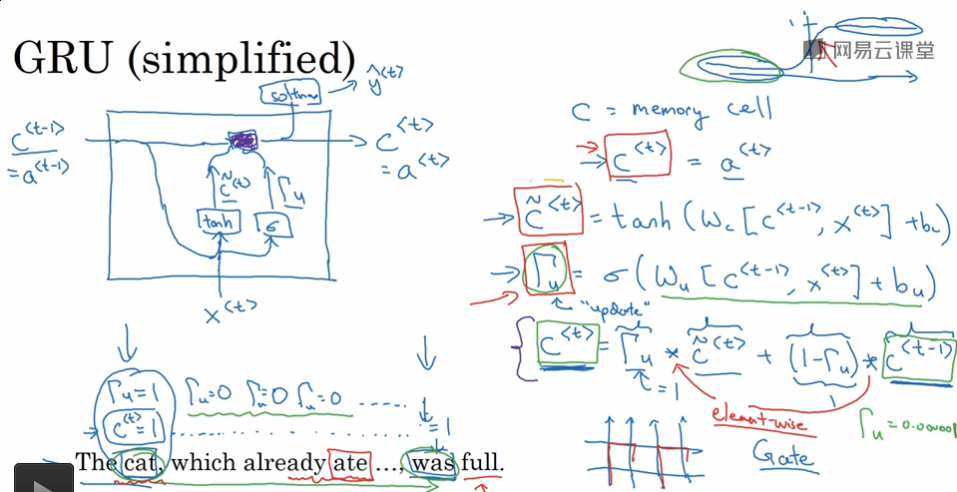
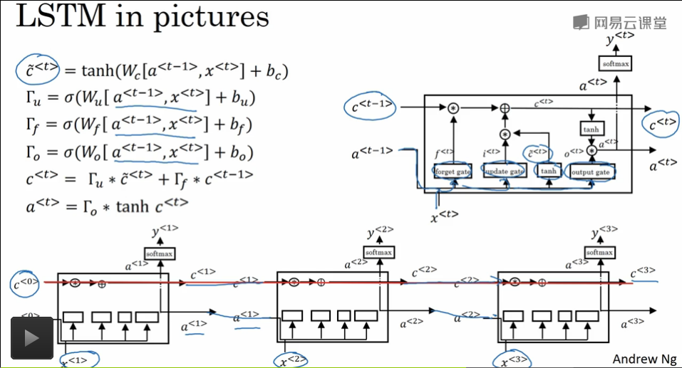
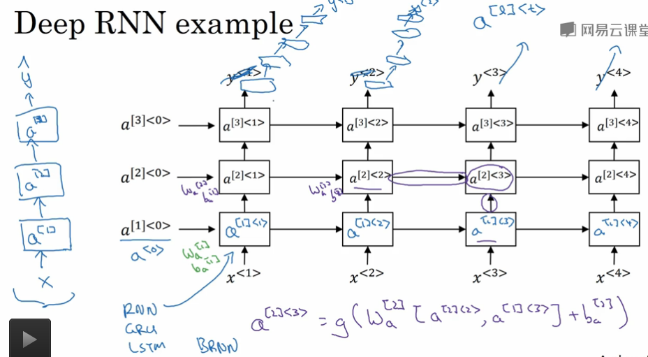

## 循环序列模型

---

1. 符号定义

   1. $$T_x,T_y$$ : 代表输入序列和输出序列的长度
   2. $$x^{<t>},x^{(i)<t>},y^{<t>},y^{(i)<t>}$$ : 第 $$i$$ 个样本的第 $$t$$ 个元素
   3. 对于NLP问题来说，每一个 $$x^{<t>}$$ 的内容可以是一个词典或者字典中的 one-hot 向量
   4. $$a^{<t>}$$ : 第 $$t$$ 层时间步上的神经网络的激活值,特殊的 $$a^{<0>}$$ 代表第0次的激活值
   5. $$W_{aa}$$ : 对 $$a^{<t>}$$ 作用的参数并将计算结果传递到 $$t + 1$$ 层时间步上的神经网络上
   6. $$W_{ax}$$ : $$a^{<t>}=g(W_{aa}a^{<t-1>} + W_{ax} X^{<t>}+b)$$
   7. $$W_{ya}$$ : $$y^{<t>}=g(W_{ya} a^{<t>}+b)$$

   

2. RNN

   1. 传统网络的缺陷

      * 类似于 one-hot 输入的向量叠加在输入层的时候导致输入层神经元数据过于巨大
      * 样本的输入层和输出层的数目不确定，不能很好的表示和组织网络结构
      * 难以学习到序列之间的有用信息

   2. 两个最重要的计算公式

      1. 某一步神经元的隐藏层的激活值 $$a^{<t>}$$
         $$
         a^{<t>}=g(W_{aa}a^{<t-1>}+W_{ax}X^{<t>}+b_a)
         $$
         上式中的维度说明:

         * $$W_{aa}$$ : $$(n,n)$$, $$n$$ 是隐藏层神经元的个数，计算后结果维度保持不变
         * $$W_{ax}$$ : $$(n,m)$$, $$n$$ 是隐藏层神经元的个数，$$m$$ 是样本中的第 $$t$$ 个元素的 one-hot 编码维度，计算结果同隐藏层的神经元的个数(类似于全连接层的输入层到隐藏层的计算结果)
         * $$b_a$$ : 偏置

         ---

         简化修正公式
         $$
         a^{<t>}=g(W_a[a^{<t-1>},X^{<t>}]+b_a)
         $$
         上式说明

         * $$W_a$$ : $$[W_{aa}\ |\ W_{ax}]$$, 维度是 $$(n,n+m)$$
         * $$[a^{<t-1>},X^{<t>}]$$ : 维度是 $$(n+m,1)$$
         * 需要说明的是，在第一时间步的时候需要 $$a^{<0>},X^{<1>}$$ 来作为计算输入， $$a^{<0>}$$ 一般都需要初始化

      2. 某一步神经元的输出层的激活值 $$y^{<t>}$$
         $$
         y^{<t>}=g(W_ya^{<t>}+b_y)
         $$

   3. 随时间反向传播

      1. 损失函数 : 交叉熵损失函数

         * 某一个时间步上的损失函数
           $$
           L^{<t>}(y'^{<t>},y^{<t>})=-(y^{<t>}\log(y'^{<t>})+(1-y^{<t>})\log(1-y'^{<t>}))
           $$

         * 序列的损失函数
           $$
           L(y'^{<t>},y^{<t>})=\sum_{i=1}^{T_y}L^{<t>}(y'^{<t>},y^{<t>})
           $$

      2. 

         框架可以帮助我们反向求导，大致理解

   4. 其他的RNN架构

      1. `many-to-many` 结构 : 输入和输出都是序列，**序列可能长度相同也可能不同**

         编码解码模型(输入序列长度和输出序列长度不同的情况)

         

      2. `many-to-one` 结构 : 输入是序列，输出不是序列，**只在最后的时间步上输出结果**

      3. `one-to-many` 结构 : 输入不是序列或者是空集，输出是序列的网络结构，**之后的时间步上不存在输入，但是通常将前一个时间步的输出送给下一步当做输入**

         

   5. 语言模型和序列生成 `one-to-many` 结构

      1. 好的语音识别系统具有一个好的优点

         首先生成不同的候选的语音识别的句子，对其中的每一个句子利用**语言模型**计算不同的可能性，选出可能性最大的句子作为输出
         $$
         P(y^{<1>},y^{<2>},y^{<3>},...,y^{<n>})
         $$

      2. 语言模型的建立 - RNN 建立

         * 使用RNN构建语言的概率模型,使用前一个的输出作为后一个时间步的输入从而考虑到之前的文本序列的信息

         * 模拟了任意的特定的**单词序列**的存在概率(可能性)

         * 用NLP问题来进行举例

           1. 定义

              * 对输入的语句序列按照词转换成对应的 one-hot 向量 $$y^{<t>}$$

              * 可能需要定义 \<EOS\>, \<UNK> 代表句尾标志和未登录词的标志

              * **训练得到的输出 $$y^{<t>}$$ 是softmax计算的结果，代表我们选择的概率**，如下图所示

                

                可以看到

                1. $$y^{<1>}$$ : 是一个softmax的输出，表示的是训练得到的第一个词出现是哪一个词的概率
                2. 之后的 $$y^{<t>}$$ 都是条件概率

           2. 正如上图所示，我们通过利用语料库对句子进行训练，如果这时候需要计算输入语句 $$\{y^{<1>},y^{<2>},y^{<3>}\}$$ 的概率的话，可以将利用计算公式
              $$
              P(y^{<1>},y^{<2>},y^{<1>})=P(y^{<1>})P(y^{<2>}|y^{<1>})P(y^{<3>}|y^{<1>},y^{<2>})
              $$

              * 其中利用零向量 $$x^{<1>}=0$$ 计算得到 $$y^{<1>}$$ 的softmax预测概率，然后输入之后的 $$y^{<1>}, y^{<2>}$$ 继续计算皆可以计算出三个概率，完成对语言模型的概率统计计算，判断句子的可能性

      3. 语言模型的作用

         **输出不同的候选语言序列的可能性，选择较大可能性的语句作为我们的选择结果**

      4. RNN学习的是什么

         RNN学习的是一种针对语料库的概率分布,统计语言模型

   6. 新序列采样

      1. 训练一个模型之后，了解模型的学习到的内容，我们需要一次新序列的采样操作

      2. 训练结束后可以得到一个新的单词序列语言模型，采样生成一个新的单词序列

      3. 采样方式 

         * 基于词的采样
         * 基于字符的采样 : 可以保证采样过程中不会出现 \<UNK> 但是对于捕捉远距离的影响效果不是很好，计算成本比较昂贵

      4. 

         如上所示，在采样的过程中，我们第一次的输出 $$y^{<1>}$$ 计算的是词典中的每一个词在第一个位置出现的概率，我们只需要随机的采样出一个候选单词就可以(按照概率的随机采样)

         之后的以此类推进行采样

         ```python
         import numpy as np
         np.random.choice(y, p = {0.1, 0.2, 0.3, ...})
         ```

   7. 梯度消失和梯度爆炸

      1. 同样拥有类似的梯度小时的现象，类似的全连接结构导致的
      2. 一个时间步的输出基本上只受到附近的输入影响
      3. 梯度爆炸
         * 很容易发现，参数会出现奔溃，参数会有很多的数值溢出
         * 可以考虑采用阈值的方式，进行**梯度裁剪**，缩放梯度变化的尺寸，避免出现参数崩溃的情况
         * 梯度爆炸并不是常见的
      4. 梯度消失 - GRU

   8. GRU(Gated Recurrent Unit) - 门控循环单元，简化版的 LSTM

      1. 特点

         * 改变了 RNN 隐藏层结构
         * 帮助捕捉深层连接
         * 改善梯度消失

      2. RNN 隐藏层单元

         

      3. GRU

         * 记忆细胞变量 $$c$$ : 提供记忆的能力

           在 GRU 中，下式成立，但是 LSTM 中不成立，在 LSTM 中 $$c^{<t>},a^{<t>}$$ 是两种数据

           $$c^{<t>}=a^{<t>}$$

         * 门 $$\Gamma$$ 是一个值域在 $$(0,1)$$ 之间的数值一般使用 sigmoid 函数来进行激活(保证大多数的情况下都是 0, 1 对应的是记忆或者遗忘)

           * $$\Gamma_u$$ : 更新门
           * $$\Gamma_r$$ : 重置门，是否重置之前的细胞的记忆

         * 候选重写值 $$\ddot{c}^{<t>}$$ 代表对记忆细胞的值的重写的值，但是是否重写是由门 $$\Gamma$$ 决定的

         * 计算图

           
           $$
           \ddot{c}^{<t>}=\tanh(W_c[\Gamma_r \ast c^{<t-1>},X^{<t>}] + b_c)\\
           \Gamma_u = \sigma(W_u[c^{<t-1>},X^{<t>}]+b_u)\\
           \Gamma_r = \sigma(W_r[c^{<t-1>},X^{<t>}]+b_r)\\
           c^{<t>}=\Gamma_u \ast \ddot{c}^{<t>}+(1-\Gamma_u) \ast c^{<t-1>}\\
           a^{<t>}=c^{<t>}
           $$

           * $$\Gamma_r$$ : 表示重置门，如果该门的值被确定为0强制忽略之前的记忆，用当前的新的记忆去重置过去的记忆
           * $$\Gamma_u$$ : 表示选择是否更新记忆细胞，1 更改,0不更改，但是实际上因为是 sigmoid 函数的激活结果，$$\Gamma_u$$ 并不是一定会等于0,1 但是他可以表示一种对记忆细胞的修正
           * $$a^{<t>}$$ 在 GRU 中和记忆细胞的计算结果是一致的
           * 注意其中的计算结果 $$c^{<t>},a^{<t>},\ddot{c}^{<t>},\Gamma$$ 都是向量的结构
             1. **符号 $$\ast$$ 代表的是对应元素相乘**
             2. 控制的门是非常多的，控制的信息也是非常多的
           * 上图中的输出结果 $$y^{<t>}$$ 也是 softmax 的结果，可以用来表示语言模型

   9. LSTM

      

      * 只要很好的设置了更新门和遗忘门，我们可以很好的将记忆细胞的值(之前的信息)通过管道传送到更远的网络深处

      * **更新门，遗忘门都是考虑了前一个时间步的结果和当前的输入确定是否对之前的或者更久远的信息进行保存或者是更新**

      * 窥视孔连接 `peephole connections`

        

        * 上图的 $$f_t$$ 是遗忘门， $$h_{t-1}$$ 是上一时间步的激活结果 $$a^{<t>}$$
        * $$i^{<t>}$$ 是更新门
        * $$o^t$$ 是输出门，输出门的窥视孔引入的是 $$C_t$$ ，不是 $$C_{t-1}$$
        * **$$C^{<t>}$$ 中的第一个元素只能影响门的第一个元素，并不是影响所有的门**

   10. 双向神经网络

     考虑序列前一段的信息并且考虑后一段的信息，综合的结果会好很多，但是缺点就是我们必须要读的完整的序列才可以进行计算

     

     输出的计算方式
     $$
     y^{<t>} = g(W_y[\rightarrow{a},\leftarrow{a}]+b_y)
     $$

   11. 深层RNN

       

       ​

       ​

