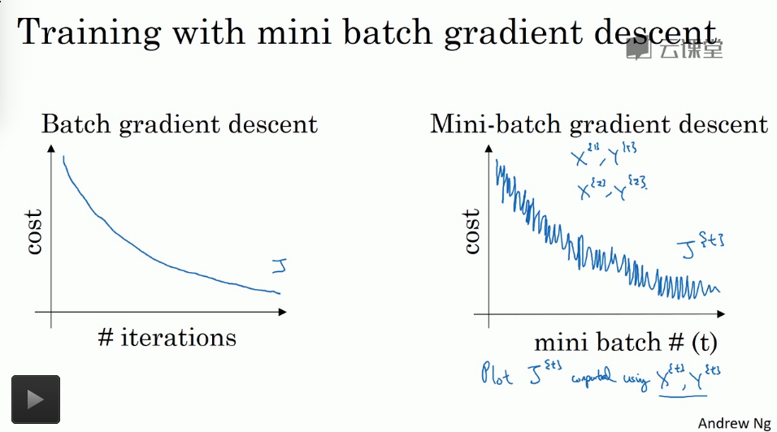
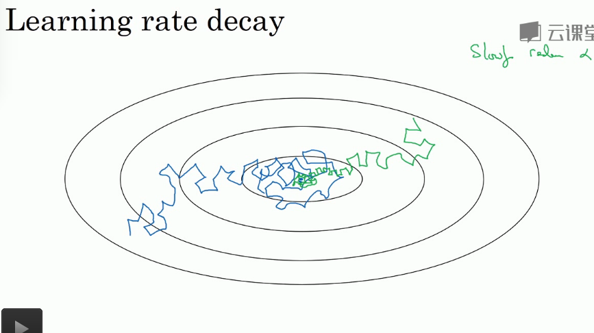

## 优化算法

---

1. `mini-batch` 梯度下降算法

   1. `Batch` 梯度下降

      每一次梯度下降算法执行**一整个训练集** ，计算非常耗时

      * $$X=[x^{(1)},x^{(2)},x^{(3)},...,x^{(m)}]:(n,m)$$
      * $$Y=[y^{(1)},y^{(3)},y^{(3)},...,y^{(m)}]:(1,m)$$

   2. `mini-batch` 梯度下降

      每一次梯度下降算法执行**一部分的训练集**，加快计算的速度

      * 定义符号 : 

        1. $$X^{\{t\}}$$ : 代表一个小的 `mini-batch` 的输入数据
        2. $$Y^{\{t\}}$$ : 代表对应的 `mini-batch` 的输入上数据的标签

      * 明确一个重要的概念 : epoch

        1. `Batch` 梯度下降中，一个epoch指一次梯度下降,同样需要多次的执行epoch

        2. `mini-batch` 梯度下降中，一个epoch指将训练集完整的遍历完的一批梯度下降

           `mini-bacth` 梯度下降中，需要多次的执行epoch

      * 优点 : 相对于 `Bacth` 梯度下降算法来说运行训练集的速度更快

      * 成本函数的收敛情况

        

      * `mini-batch` 分类

        1. `batch-size` = m : `Batch` 梯度下降
           1. 几乎每一次都想着全局最小移动，噪声很小
           2. 但是计算量巨大，无法因对大量计算数据的情况
        2. `batch-size` = 1 : 随机梯度下降
           1. 永远不会收敛，始终在最小值附近波动
           2. 有时候会向着极小移动，有时候则不然，噪声比较大
           3. 通过改善学习率可以一定程度上缓解噪声的影响
           4. 向量化计算带来的速度提升没有充分的利用
        3. 1 < `batch-size` < m : 
           1. 实际上学习率最快
           2. 噪声影响不是很大，并且向着全局最小移动
           3. 学习率衰减可以解决不收敛的问题

        `mini-batch-size` 的大小的判定指导原则

        1. 小于 `2000` 个样本 : 数据量较小，可以直接使用 `Batch` 梯度下降
        2. 大数据量 : 64, 128, 512, 1024 (基本设置成是2的次方，比较贴合计算机运算的配置),**一定要注意 batch 的尺寸一定要符合 CPU / GPU 的内存**
        3. 也是一个需要多次迭代设置的超参数 

2. 重要概念 : 指数加权平均

   1. 通俗理解

      本质就是以指数式递减加权的移动平均。各数值的加权而随时间而指数式递减，越近期的数据加权越重，但较旧的数据也给予一定的加权。

   2. 原理
      $$
      V^{t}=\beta V^{t-1} +(1-\beta)X^{t}
      $$
      **$$V^{t}$$ 相当于是近似对 $$\frac{1}{1-\beta}$$ 个最近数据进行加权平均值结果**

      可以考虑上式的计算过程是对最近的 $$\frac{1}{1-\beta}$$ 个数据的指数加权平均(离当前数据越远的数据，需要多乘 $$\beta$$ 的权重进行加权)的结果

      * $$V$$ : 是指数加权平均值
      * $$X$$ : 是当前的第 t 个数值
      * $$\beta$$ : 是非常重要的学习参数 $$(0,1)$$
        1. $$\beta$$ 越接近1 : 数据的平均值考虑的越多，数据的特征出现延后的现象
        2. $$\beta$$ 越接近0 : 数据平均值考虑的越少，出现噪声和异常值的概率就越大

   3. 优势

      1. 指数加权平均数的所有的权重之和近似接近 1
      2. 指数加权平均数可以节约内存，加快计算速度(相对于将所有的值加在一起求平均值来说，指数加权平均只需要一个数据皆可以进行计算和过程的保存)

   4. 指数加权平均的 **偏差修正** 策略

      1. 帮助平均数计算更准确

      2. 指数加权平均偏差修正

         1. 初始值中的 $$V^{0} = 0$$，在计算的初期，因为初始值的原因导致初期的计算并不是准确的，计算值会偏小

         2. 解决策略
            $$
            V^{t}=\frac{\beta V^{t-1}+(1-\beta)X^t}{1-\beta ^ t}
            $$

            1. 在计算的初期，使用偏差修正可以帮助我们很好的修正初期的计算平均值不足的偏差
            2. 但是在计算一段时间之后，偏差修正基本不起什么作用了(分母近似为１)

3. 动量梯度下降算法

   **基本上要快于我们的传统的梯度下降算法**

   1. 简要概述 : 计算梯度的指数加权平均数，并用来更新梯度

   2. 目的在于，平均梯度，减缓梯度下降的幅度(震荡)但是对于梯度的趋势指向，因为是平均值仍然会更精确更大的指向平均的移动方向，更加平均更快的向最小靠近

   3. 算法

      在运行在每一个 `mini-batch` 或者 `Batch` 上的时候
      $$
      V_{dW} = 0\ \ \ \ \ \ \#just\ the\ begining\\
      V_{db} = 0\ \ \ \ \ \ \#just\ the\ begining\\
      V_{dW} = \beta V_{dW} + (1-\beta)dW\\
      V_{db} = \beta V_{db} + (1-\beta)db\\
      W:=W-\alpha V_{dW}\\
      b:=b-\alpha V_{db}\\
      $$

      1. 一个形象的理解就是 $$\beta V_{dW}$$ 这一项更像是速度， $$(1-\beta)dW$$ 这一项更像是加速度，加速的进行梯度下降
      2. 梯度下降的每一个步骤都是对之前的一种依赖，每一次的梯度下降都不是独立的
      3. 指数加权平均，平均了前几次的梯度计算结果
      4. 一般的超参数选择中，$$\beta$$ = 0.9 相对来说比较好一些
      5. 偏差修正不是很常用

4. RMSprop (Root mean square prop) 均方根梯度下降算法

   **加速梯度下降**

   1. 算法

      在运行在每一个 `mini-batch` 或者 `Batch` 上的时候
      $$
      S_{dW}=0\\
      S_{db}=0\\
      S_{dW}=\beta S_{dW} + (1-\beta)(dW)^2\\
      S_{db}=\beta S_{db} + (1-\beta)(db)^2\\
      W:=W-\alpha \frac{dW}{\sqrt{S_{dW}} + \theta}\\
      b:=b-\alpha \frac{db}{\sqrt{S_{db}}+\theta}
      $$
      对梯度的平方的加权平均数

   2. 作用

      1. 波动大的梯度方向会变化变得很小

         $$\sqrt{S_{dW}}$$ 分母大，变化小

      2. 波动小的梯度方向变化变大

         $$\sqrt{S_{dW}}$$ 分母小，变化大

      3. 可以采用一个大一点的学习率去加快计算，而不需要太过担心出现的迭代震荡现象(算法已经进行了修补减小了梯度下降的震荡现象)

      4. 加入很小的参数 $$\theta$$ 的作用在于避免除 0 从而导致过大的梯度的出现， 1e-8 即可

   3. 注意

      RMSprop 中也会出现和动量梯度下降算法中一样的偏差修正的问题，修正公式也一样，但是一般不使用

5. Adam (Adaptive Moment Estimation) 适应参数估计梯度下降算法

   **结合 RMSprop 和 动量梯度下降**，适合多种的深度学习结构，被证明有效的适用于各种神经网络结构

   1. 算法

      在运行在每一个 `mini-batch` 或者 `Batch` 上的时候
      $$
      init:\ \ V_{dW}=0,V_{db}=0,S_{dW}=0,S_{db}=0\\
      V_{dW} = \beta_1 V_{dW} + (1-\beta_1)dW\\
      V_{db} = \beta_1 V_{db} + (1-\beta_1)db\\
      S_{dW}=\beta_2 S_{dW} + (1-\beta_2)(dW)^2\\
      S_{db}=\beta_2 S_{db} + (1-\beta_2)(db)^2\\
      V_{dW}^{correct}=\frac{V_{dW}}{1-\beta_1^t}\\
      V_{db}^{correct}=\frac{V_{db}}{1-\beta_1^t}\\
      S_{dW}^{correct}=\frac{S_{dW}}{1-\beta_2^t}\\
      S_{dW}^{correct}=\frac{S_{db}}{1-\beta_2^t}\\
      W:=W-\alpha \frac{V_{dW}^{correct}}{\sqrt{S_{dW}}+\theta}\\
      b:=b-\alpha \frac{V_{db}^{correct}}{\sqrt{S_{db}}+\theta}\\
      $$

      1. 必须使用偏差修正

      2. 存在超参数 $$\beta_1,\beta_2,\alpha,\theta$$

         Adam作者推荐的超参数设计标准是

         1. $$\alpha$$ : 需要手动调试
         2. $$\beta_1$$ : 0.9
         3. $$\beta_2$$ : 0.999
         4. $$\theta$$ : 1e-8

6. 学习率衰减规则

   **加速梯度下降算法**

   

   衰减学习率可以保证在初始的时候可以承受较大的步长下降梯度，但是在需要开始收敛的时候，学习率的降低可以保证我们可以将收敛的值更加确定在最小的值的附近，减少震荡，提高效果

   1. 传统的衰减
      $$
      \alpha=\frac{\alpha_0}{1+decade_{rate} * epoch_{num}}
      $$

      - $$\alpha_0$$ : 是一个初始的学习率超参数
      - $$decade_{rate}$$ : 是另一个衰减率超参数
      - $$epoch_{num}$$ : 是 epoch 的学习代数

   2. 其他的衰减

      1. 指数衰减
         $$
         \alpha = 0.95^{epoch_{num}}
         $$
         0.95 也是一个需要调整的超参数

      2. 离散衰减

         在每一个不同的阶段，制定一个固定的学习率

7. 局部最优

   因为在网络中存在有大量的参数，对于成本函数的优化我们通常并不是困在一个军部最优点上，而是困在一个鞍点上(这里包含这样一种含义，并不是所有的参数对应的成本函数都是凸函数，所以必定不会找到最优点)，这也正是Adam算法等算法可以加速我们的梯度下降计算的一个要点