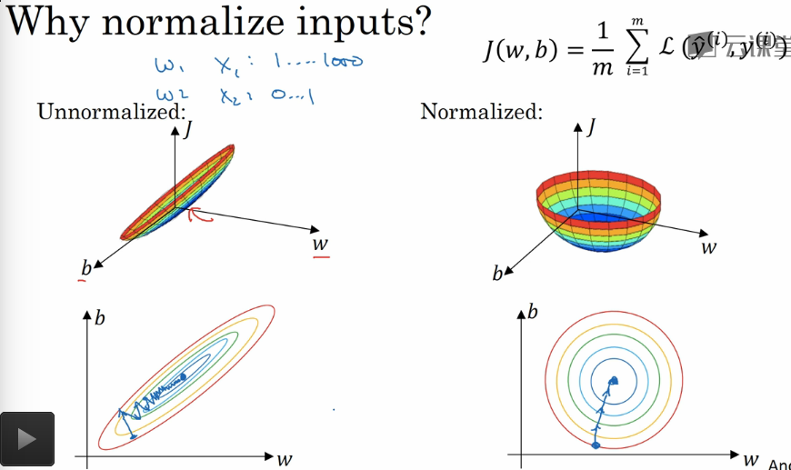

## 深度学习的实用层面

---

1. 数据的划分

   1. 训练集 : 训练模型
   2. 验证集 : 辅助选定模型,选定好的模型算法
   3. 测试集 : 评估模型，数量相对较少，**提供无偏估计**

2. 确保验证集，训练集，测试集中的数据来自于同一分布

3. 可以没有测试集，类似于文本摘要等任务，没有办法或者很难的获得一个真实比对数据的话，我们可以放弃这个过程

4. 偏差和方差

   1. 偏差 : 相对于**最优误差(比如说人的标准)**来说，训练集上的误差高则叫高偏差，用来评断分类的能力

   2. 方差 : 相对于**偏差**来说，验证集和训练集的偏差很大称之为是高方差，用来评断过拟合的情况

   3. 举例

      **最优误差是 0%**

      | 训练集误差 | 验证集误差 | 情况        |
      | ----- | ----- | --------- |
      | 1%    | 11%   | 高方差       |
      | 15%   | 16%   | 高偏差       |
      | 15%   | 30%   | 高偏差 & 高方差 |
      | 0.5%  | 1%    | 低偏差 & 低方差 |

   4. 分析过程

      1. 检查偏差，已决定是否更换模型或者选取一个更大的网络，直到可以理想的拟合数据
         1. 调整迭代次数
         2. 更换模型
         3. 更换算法
      2. 检查方差，如果方差较大，说明可能过拟合了数据
         1. 增加数据的规模
         2. 正则化
         3. 更换网络架构
         4. 更换算法
      3. 知道获得一个基于最优误差的可以接受的偏差和方差的模型
      4. **只要数据合适和网络模型复杂的话，实际上我们可以在不影响另一方的前提下优化另一个数据表现**

5. 正则化 - 修正方差，避免过拟合

   1. 避免过拟合的两种方式

      1. 准备更多的数据，更真实的反应数据的分布
      2. 加入正则化

   2. 引入 Sigmoid 分类的举例
      $$
      J(W,b)=\frac{1}{m}\sum_{i=1}^{m}L(y'^{i},y^{i})+\frac{\lambda}{2m}||W||_2^{2}
      $$

      * 引入 L2 范数的正则化

        $$||W||_2^{2}=\sum_{i=1}^{n_x}W_i^2=W^TW$$

      * 这里只对参数 $$W$$ 进行正则化而不对参数 $$b$$ 正则化的原因在于，参数 $$W$$ 的正则化已经可以反映出高偏差的特性，参数 $$W$$ 内的参数过多，但是如果加上 $$b$$ 的正则化项也没有什么问题

   3. 正则化的类型

      1. L2 正则化 : 目前比较常用的模型

      2. L1 正则化

         $$\frac{\lambda}{m}||W||_1=\frac{\lambda}{m}\sum_{i=1}^{n_X}|W_j|$$

         正则化的结果是稀疏的，结果中可能会出现很多的 0(很多参数值非常的小的情况下保证了我们的选用的特征非常少，没有考虑太多的特殊的特征，从而保证了避免过拟合，避免学习样本中的信息)

   4. 正则化参数 $$\lambda$$ 可以当成超参数，使用验证集去优化

   5. 神经网络的正则化举例
      $$
      J(W^{[1]},b^{[1]},...,W^{[L]},b^{[L]})=\frac{1}{m}\sum_{i=1}^mL(y^{'(i)},y^{(i)})+\frac{\lambda}{2}\sum_{l=1}^L||W^{[l]}||_F^2\\
      ||W^{[l]}||_F^2=\sum_{i=1}^{n1}\sum_{j=1}^{n2}(W_{ij}^{[l]})^2
      $$

      * $$||W||_F^2$$ : 是弗洛贝尼乌斯范数的平方，不是矩阵的平方2范数，实际上是矩阵的所有的数据平方和

   6. 含正则化的梯度下降
      $$
      dW^{[l]}=(from\ backpro)+\frac{\lambda}{m}W^{[l]}\\
      W^{[l]}=W^{[l]}-\alpha dW^{[l]}\\
      W^{[l]}=W^{[l]}-\alpha ((from\ backpro)+\frac{\lambda}{m}W^{[l]})\\
      W^{[l]}=W^{[l]}-\frac{\alpha \lambda}{m}W^{[l]}-\alpha(from backpro)=(1-\frac{\alpha\lambda}{m})W^{[l]}-\alpha(from\ backpro)\\
      $$

      * 无论如何，式子 $$(1-\frac{\alpha\lambda}{m})$$ 系数都让参数 $$W$$ 变得更小(小于 1)，这就是权重衰减的意思
      * L2 正则化被称为权重衰减

   7. 正则化避免过拟合的原因

      1. 如果使用的 Sigmoid 系的函数，如果我们使用功能了正则化的话，会有效的减小 $$W$$ 参数的值，相对的 $$Z$$ 计算的值也会变小，这样子，激活函数基本上接近于线性，网络的复杂度降低
      2. 大多数的参数几乎都是 $$W$$ 可以减少考虑的特征的数目，从而避免过拟合的数目

6. `dropout` 正则化 : 随机失活正则化

   1. 基本含义

      遍历每一层的节点然后以一定的概率随机失活一些节点及其出边和入边，从而简化我们的网络机构，在训练过程中，随机失活可以被认为是对完整的神经网络抽样出一些子集，每次基于输入数据只更新子网络的参数

   2. `dropout` 的方式

      1. 反向随机失活

         >这被称为 **inverted dropout**。当模型使用了dropout layer，训练的时候只有占比为 $$p$$的隐藏层单元参与训练，那么在预测的时候，如果所有的隐藏层单元都需要参与进来，则得到的结果相比训练时平均要大 $$\frac{1}{p}$$ ，为了避免这种情况，就需要测试的时候将输出结果乘以 $$p$$(变小)使下一层的输入预测值保持不变。
         >
         >而利用 inverted dropout，我们可以在训练的时候直接将 dropout 后留下的权重扩大 $$\frac{1}{p}$$ 倍，这样就可以使结果的 scale保持不变，而在预测的时候也不用做额外的操作了，更方便一些。
         >
         > 
         >
         >换句话说 : 
         >
         >​	反向随机失活中 (inverted dropout),我们将结果扩大保持输出(和在测试的时候全层节点都使用的情况一样)，预测的时候可以直接的使用网络进行预测，如果不是的话，普通的随机失活 (dropout) 正则化中需要将结果缩小一定的规模 $$p$$ 从而纠正预测结果

         1. 因为会自动的对数据范围调整，算法在测试的时候可以保持不变
         2. **在测试集上跑的时候不需要 `dropout` ，我们需要完整的网络参数，输出结果不能是随机的**
         3. 丢弃的神经元在训练阶段，对BP算法的前向和后向阶段都没有贡献。无论输入或者相关的参数是什么，它的输出值就会被设置为0。因为这个原因，所以每一次训练，它都像是在训练一个新的网络。

         ```python
         import numpy as np

         # a3是**__第__三层**的隐含层,keep_prob是一个小于等于1的数表示保留一个神经元的概率大小，d3是一个布尔数组,a3->(n,m)
         d3 = np.random.rand(a3.shape[0], a3.shape[1]) < keep_prob
         # 元素相乘，过滤掉忽略的神经元
         a3 = np.multiply(a3, d3)
         # 恢复a3的期望大小,向量输出整体放大
         a3 /= keep_prob
         ```

   3. 理解 `dropout`

      1. `dropout` 因为会随机的删除节点，所以不会过度的依赖某一个节点，`dropout`通过使其他隐藏单元存在不可靠性来防止过拟合，产生了平方范数的权重收缩效果，**功能类似与 L2 正则化**
      2. 不同层因为 $$W$$ 参数数目不同，有的层可能更容易发生过拟合，所以可以根据每一个层设置不同的 `keep_pro` 值来适应不同的层，这些就是超参数跟 L2 范数中的 $$\lambda$$ 一样都是需要调整的超参数
      3. 一定保证输出层 `dropout` 的设置合理性
      4. 缺点 : 成本函数不能被准确的定义

7. 其他的预防过拟合的方式

   1. 人工合成假数据扩增数据集

   2. 及时中断训练

      在验证集的误差上升临界点中断算法运行，减少过拟合的概率，但是因为及时中断的方法会引入非常复杂的超参数分析以及其他的问题 **正交化**，有时候效率并不是很高

8. 归一化输入加速训练

   > **$$z-score$$ 标准化**，将数据转换成均值为0,标准差(方差)是1的正态分布数据，近似为高斯分布

   $$
   x^* = \frac{x- \mu}{\sigma}
   $$

   * $$\mu$$ : 数据均值
   * $$\sigma$$ : 数据标准差

   ​

   归一化可以将每一个特征的尺度控制在相同的范围内，加速学习的过程

   **训练集和测试集采用相同的参数 $$\alpha,\theta$$ 去归一化数据**

   1. 零均值化

      数据均值归到 0
      $$
      \alpha=\frac{1}{m}\sum_{i=1}^{m}X^{i}\\
      X^{i}:=X^{i}-\alpha
      $$

   2. 归一化方差(标准差)

      让方差都等于1
      $$
      \theta^2=\frac{1}{m}\sum_{i=1}^{m}(X^{i})^2\\
      $$

      * 已经执行了零均值化，上述的式子求出的结果是方差向量(每一个特征的方差构成的向量)
        $$
        x/=\theta^2
        $$

      * 方差(标准差)都是1，数据成为正态分布

   归一化的原因:

   数据如果不归一化，如果不同特征上的数据的范围和尺度差异性过大，我们可能需要一个非常小的学习率去适应小尺度的特征，但是如果归一化的话，这个问题就不那么重要了,可以采用较大的步长，加快训练的速度

   

9. 梯度消失和梯度爆炸

   1. 因为网络的深度增加，出现了梯度的指数级增长或者梯度的指数级衰减，导致了深度网络的训练

      困难

   2. 预测值 / 导数 / 梯度 都会因为权重的指数累计出现非常巨大或者非常小的值导致梯度下降算法的不稳定性和难收敛性

   3. 问题的一种不完整的解决方案 : 权重初始化

      1. [权重初始化](http://blog.csdn.net/u012526120/article/details/49153683)
      2. [校验方差的公式推导](https://zhuanlan.zhihu.com/p/21560667?refer=intelligentunit)

      >使用 $$\frac{1}{\sqrt{n}}$$ 校准方差::
      >
      >上面做法存在一个问题，随着输入数据量的增长，随机初始化的神经元的输出数据的分布中的方差也在增大。我们可以除以输入数据量的平方根来调整其数值范围，这样神经元输出的方差就归一化到1了。也就是说，建议将神经元的权重向量初始化为：
      >
      >**w = np.random.randn(n) / sqrt(n)。**其中**n**是输入数据的数量。这样就保证了网络中所有神经元起始时有近似同样的输出分布。实践经验证明，这样做可以提高收敛的速度，一定程度上缓解深度网络的梯度消失问题。
      >
      > 
      >
      >换句话说:
      >
      >通过将 $$W$$ 参数的方差变成 $$\frac{1}{\sqrt{n}}$$ ，保证了所有的网络的神经元的输出分布的方差和输入的分布的方差是一致的 
      >
      >Question:
      >
      >1. 保证了所有的网络的神经元的输出分布的方差和输入的分布的方差是一致的 ，这句话的前提是我们必须要对数据做归一化么
      >2. 为什么方差会影响梯度下降的速度，因为方差大，会偏离0的值过多?

      1. 一般的初始化校正

         $$\frac{1}{\sqrt{n}}$$

      2. ReLU校正

         $$\frac{2}{\sqrt{n}}$$

      3. tanh校正

         $$\frac{1}{\sqrt{n}}$$ or $$\frac{2}{\sqrt{n^{[l]}+n^{[l-1]}}}$$

      ```python
      import numpy as np

      # np.random.randn初始化均值为0,标准差是1的高斯分布， * np.sqrt(n) 校正方差成为 1/n
      np.random.randn(shape) * np.sqrt(1.0 / n)
      ```

      ​

