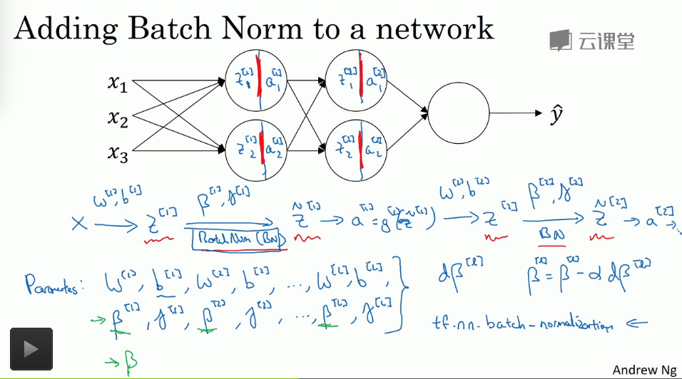
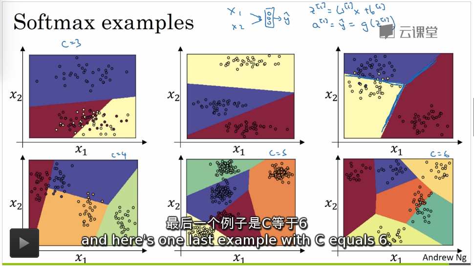

## 超参数调试

---

1. 超参数调试的过程中需要使用超立方体中的随机采样来确定超参数的组合，注意**随机采样的效果比使用网格状搜索的效果要好，实际上你尝试了更多的潜在的选择的可能性的值**

2. 粗糙到精细的调试过程

   在超参数的选择过程中，我们分批的随机采样，首先采样一批之后，可能会发现某一个部分内的超立方体内的超参数设定的值效果很好，可以放大这部分**子超立方体**，然后在其中再次的随机采样，直到超参数的设定符合我们的实际需求

3. 超参数的取值

   如果超参数的范围的尺度过大，我们需要注意不能使用一般 **线性尺度** 上的随机均匀选择，需要使用 **对数尺度上** 的随机选择

   例如在范围 $$(10^a,10^b) $$ 的尺度上每一个对数尺度上都随机的均匀取值从而保证了超参数选择取值的合理性

   ---

   **这么做的原因在于，可能超参数在一个很小的区间内的变化非常的敏感，需要在小尺度上更加随机均匀的设定超参数的值**

4. 超参数调试实践

   1. 超参数调试并不是一次就定死的，随着我们的数据的不断变化或者说是环境变化，实际上我们需要定期的对超参数进行调试和分析，以保证模型的状态一直是相对而言有效的
   2. 超参数的调试过程中，如果我们计算资源足够，可以并行化的训练很多的模型，我们可以考虑一次平行实验多种超参数的选择然后取资中最好的，但是如果计算资源不足或者数据资源过于庞大，我们可以考虑一次只考虑使用其中一个方式的差参数变动去优化性能，不断的迭代去寻找可以使得模型边的更出色的超参数设定方式

5. `Batch` 归一化，正则化激活函数的输出

   1. 在之前我们看到了归一化数据可以加快我们的算法的**训练速度**，但是我们需要注意，这里仅仅是对我们的深层网络的输入层进行了归一化，如果我们可以对整个网络中的每一层的输出都执行这个归一化操作，可以让训练变得更加快速和有意义

      **能否归一化值 $$a$$, 或者说归一化每一个节点的整合函数的值 $$Z$$ 就是一个很重要的问题**

   2. 归一化的对象不只是输入层，甚至是所有的深度隐藏层

   3. 但是在归一化的时候，并不是说数据的分布是 **平均值是0，方差是1** 就一定是最适合的数据分布，实际上我们在 `Batch` 归一化中，我们需要去学习这种最适合的分布，把他当做是网络的普通的参数去学习，**训练数据去找到每一层最合适的均值和方差，从而加快训练速度**

   4. 激活函数输出归一化算法
      $$
      \mu=\frac{1}{m}\sum_{i=1}^mZ^{i}\\
      \sigma^2=\frac{1}{m}\sum_{i=1}^m(Z^{i}-\mu)^2\\
      Z^i_{norm}=\frac{Z^{i}-\mu}{\sigma + 1e^{-8}}\\
      Z^i=\alpha Z^{i}_{norm}+\beta
      $$

      * 首先将输出归一化成 **均值是0方差是1的高斯分布**
      * 学习一个新的分布，参数 $$\alpha$$ 是学习的分布的标准差，$$\beta$$ 是学习的分布均值

   5. 深度网络中的 `Batch` 归一化

      [参考资料](http://blog.csdn.net/hjimce/article/details/50866313)

      [为什么要用BN算法](https://www.zhihu.com/question/38102762?utm_campaign=webshare&utm_source=weibo&utm_medium=zhihu)

      

      对于 `batch` 归一化的两个参数的学习方式，也可以使用梯度下降算法实现

      1. 传统的梯度下降
      2. 动量梯度下降
      3. RMSprop
      4. Adam

      注意点

      1. `batch` 归一化是和 `mini-batch` 一块使用的
      2. 每一个神经元都存在两个参数去学习分布，每一个神经元学习的分布是一个 `mini-batch` 的数据分布
      3. 因为对一个 `mini-batch` 中的数据实现了归一化处理，实际上我们的层中网络参数 $$b$$ 是没有任何意义的，实际上在 `batch` 归一化中，利用参数 $$\beta$$ 代替了参数 $$b$$ 的效果

      ---

      `batch` 归一化的意义 ?

      1. convariate shift 现象

         已经存在有了对 $$X\rightarrow Y$$ 的预测，如果 $$X$$ 改变，需要重新训练算法的现象

      2. `batch` 归一化因为对每一个节点引入了噪声(归一化引入的)，所以相对来说有着轻微的正则化的效果，并且如果 `mini-batch` 的大小如果越小正则化效果越好，但这只是轻微的正则化，是算法带来的有利的副作用

      3. 实际上 `batch` 归一化限制了每一层的输出的值的变化的情况(减少 convariate shift 现象)，保证了输出的值的变化是具有特定的方差和均值的一种分布(使输出值变得更稳定)，这样子的话，可以将每一层读看作是一种独立的学习，层之间的关系减弱的话，每一层都可以独立的进行学习，这样每一层如果没有相应的关联的话，独立学习可以加快学习的速度

      ---

      因为 `batch` 归一化是和 `mini-batch` 一起使用的，但是在测试集上运行的时候，我们可能不会使用 `mini-batch` 的方式去预测输出，这样需要对测试阶段做一些改动

      实际中我们需要的仅仅只是参数 **每一层数据的均值和方差即可**，在这里我们可以使用指数加权平均的方式保留我们在训练中的计算的均值和方差，然后在测试的时候直接带入进 `batch` 算法中进行测试计算即可

6. `Softmax` 回归和深度学习算法框架初窥

   1. `Softmax` 多分类问题

      1. 符号约定 : $$C$$ 表示多分类的个数，结果可能性的数目

      2. `softmax` 激活函数在 `softmax` 层中
         $$
         a^{[L]}=e^{Z^{[L]}}\\
         a^{[L]}=\frac{e^{Z^{[L]}}}{\sum_{j=1}^{n}e^{Z^{[L]}}}
         $$

         1. 输出层的含义就变成了对应类别的概率,概率和是 1
         2. 向量化运算，层中只有一个 `softmax` 激活函数

      3. 是 logistic 回归的多酚类版本，有着类似的线性边界，只不过线性边界存在多个

         **下图使用了单层的 `softmax` 层去训练多个线性边界**

         

      4. 分类问题训练 `softmax` 层

         1. 损失函数定义 : 香农熵
            $$
            L(y',y)=-\sum_{j=1}^{C}y_j\log(y'_j)
            $$

            * 其中 $$y',y$$ 都是一个向量参数， $$C$$ 是分类的数目

            * 损失函数的意义 : 

              如果是多分类问题的话，只有一项可以满足不是0，可以得到
              $$
              L(y',y)=-\log(y'_j)
              $$
              如果此时的 $$y'_j$$ 更接近于1(分类结果预测越准确)，损失函数就会接近于0

         2. 成本函数定义

            $$J=\frac{1}{m}\sum_{i=1}^{m}L(y',y)$$

         3. 梯度下降中的公式和 $$dZ$$ 都是一致的

   2. 框架 - `Tensorflow`

   ​