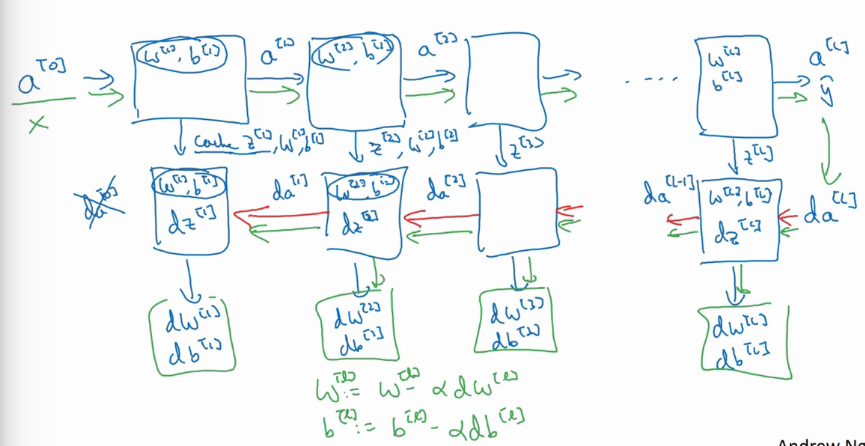

## 深层神经网络

---

1. 符号约定

   1. $$L$$ : 深层网络的层数
   2. $$n^{[l]}$$ : 第 $$l$$ 层上的节点的数目
   3. $$a^{[l]}$$ : 第 $$l$$ 层上的激活函数计算结果
   4. **$$dz/da/dW/db$$ :代表的都是 $$\frac{\partial Loss}{\partial z},\frac{\partial Loss}{\partial a},\frac{\partial Loss}{\partial W},\frac{\partial Loss}{\partial b}$$ 的缩写**

2. 调试网络的最佳方法 - 核对矩阵维数
   $$
   W^{[l]}=(n^{l},n^{[l-1]})\\
   dW^{[l]}=(n^{l},n^{[l-1]})\\
   b^{[l]}=(n^{l},n^{[l-1]})\\
   db^{[l]}=(n^{l},n^{[l-1]})\\
   ...\\
   A^{[l]}=(n^{l},m)\\
   Z^{[l]}=(n^{l},m)\\
   dA^{[l]}=(n^{l},m)\\
   dZ^{[l]}=(n^{l},m)
   $$

3. 深层网络的好处

   1. 低层次的网络用来收集信息，高层次用来将手机的低维信息组合表现特征
   2. 电路中的理论 : 浅层网络如果需要指数级的神经元才可以有效的模拟深层网络拟合的函数
   3. 实际中使用的话，一般都是从最简单的 logistic 回归开始不断增加层数，调节超参数

4. 深度网络的计算

   

   1. 前向计算

      **使用 for 迭代计算每一个层的结果**
      $$
      z^{[1]}=W^{[1]}X+b^{[1]}\\
      a^{[1]}=g(z^{[1]})\\
      z^{[2]}=W^{[2]}X+b^{[2]}\\
      a^{[2]}=g(z^{[2]})\\
      ...\\
      Conclusion : \\
      z^{[l]}=W^{[L]}a^{[l-1]}+b^{[l]}\\
      a^{l}=g(z^{l})
      $$

   2. 反向计算
      $$
      dZ^{[l]}=dA^{[l]} \times g^{'[l]}(Z^{[l]})\\
      dW^[[l]]=\frac{1}{m}dZ^{[l]}A^{[l-1]T}\\
      db^{[l]}=\frac{1}{m}np.sum(dZ^{[l]},axis=1,keepdims=True)\\
      dA^{[l-1]}=W^{[l]T}dZ^{[l]}
      $$

5. 超参数调整

   1. 学习率
   2. 迭代次数
   3. 隐藏层层数
   4. 隐藏层中神经元个数
   5. 激活函数选择
   6. ...