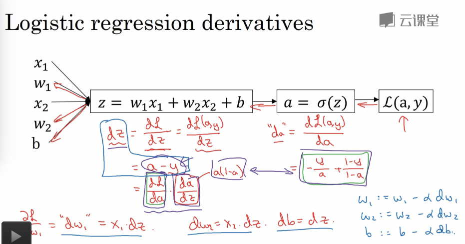

## 神经网络基础

---

### Logistic 回归 - 神经元模型

1. 对数几率回归 : 监督二分类问题

2. 符号定义

   1. $$m$$ : 训练样本的个数

   2. $$n$$ : 训练样本的维数

   3. $$(x, y)$$ : $$x$$ 是 $$n$$ 维特征向量，$$y$$ 是分类结果 $$\{0, 1\}$$,或者说 $$y$$ 是某一个分类的概率是多少

   4. $$X$$ : 训练数据，是 $$x$$ 的 $$m$$ 个列向量的组合成的矩阵,规模是 $$(n,m)$$

   5. $$Y$$ : 是 $$y$$ 的 $$m$$ 个列向量的组合成的矩阵,规模是 $$(1, m)$$

3. 二元分类过程

   1. 参数 $$W$$(列向量, (n,1) -> (1, n)), $$b$$(线性偏置)
      $$
      y = W^{T}X + b
      $$
      这是一个普通的线性回归，效果不是很好，并且不能得到一个很好的在 $$\{0, 1\}$$ 之间的概率值，需要做一次非线性变换(使用 sigmod 将函数值转换到 $$\{0,1\}$$ 之间)
      $$
      y=\frac{1}{1+e^{-(w^Tx+b)}}
      $$

   2. 损失函数

      1. **衡量算法的运行状况**

      2. 常用的损失函数 : $$\frac{1}{2}\sum^{m}_{i=1}(y^{(i)}-y^{'(i)})^2$$

      3. 但是因为为了保证之后的优化函数是凸函数，一般不适用上面的常用的均方误差，不是凸函数的话，容易得到很多的局部最优解，并不会得到最好的值

      4. Logistic 样本的损失函数

         **实际上，只要可以让 $$y'$$ 足够接近 $$y$$ 的函数都可以作为损失函数** 
         $$
         L(y,y')=-(y * \log{(y')} + (1-y)\log{(1-y')})
         $$

         1. 如果 $$y=1$$ : $$L(y,y')=-\log{(y')}$$

            想让损失函数最小的话，$$y'$$ 必须要接近1才可以

         2. 如果 $$y=0$$ : $$L(y,y')=-\log{(1-y')}$$ 

            想让损失函数最小的话，$$y'$$ 必须要接近0才可以

      5. 整体的成本函数

         成本函数衡量了参数在训练集上的效果

         $$J(W,b)=\frac{1}{m}\sum_{i=1}^m L(y^{(i)},y^{'(i)})$$

      6. 损失和成本函数的解释

         1. 损失函数
            $$
            P(y=1|x) = y'\\
            P(y=0|x)=1-y'\\
            P(y|x)=y'^{y}(1-y')^{(1-y)}
            $$

            1. $$y=0$$ : $$P(y=0|x)=1-y'$$
            2. $$y=1$$ : $$P(y=1|x)=y'$$

            为了简化计算，使用不改变性质的 $$log$$ 函数
            $$
            \log{P(y|x)}=y\log{y'} + (1-y)\log{(1-y')}
            $$
            在算法的训练过程中，我们希望 $$P(y|x)$$ 输出概率最大，保证这一点的话我们需要加上负号，保证输出概率最大的情况下，最小化损失函数(换句话说，我们只要保证了最小的损失函数，就可以保证最大的概率 $$P(y|x)$$ 从而保证了正确的情况，当然这只是对一个样本来说)

         2. 成本函数

            **在独立同分布的情况下**
            $$
            P(y|x)=y'^{y}(1-y')^{(1-y)}\\
            P(labels\ \ in\ \ training\ \ set) = \prod_{i=1}^{m}p(y^i|x^i)\\
            \log{P(labels\ \ in\ \ training\ \ set)} = \sum_{i=1}^m\log{p(y^i|x^i)}=-\sum_{i=1}^mL(y^i,y'^i)\\
            $$
            在**极大似然法**中，我们需要极大化 $$\log{P(labels\ \ in\ \ training\ \ set)}$$ ,就需要极小化 $$\sum_{i=1}^mL(y^i,y'^i)$$ (换句话说，只要极小化损失函数和，就可以极大化我们的预测概率，我们的预测模型和实际的真实分布就会越接近)，为了方便对成本函数进行适当的缩放，我们需要加入一个常量因子，得到
            $$
            J(W,b)=\frac{1}{m}\sum_{i=1}^mL(y^i,y'^i) 
            $$

   3. 梯度下降训练

      1. 使用梯度下降训练，如果成本函数是凸函数的话，我们无论如何初始化都可以得到全局最优解，但是需要注意，**全局最优解的含义只是我们的对成本函数的良好拟合，但是泛化能力并不一定见得就是最好的**

      2. 在上面的 Logistic 的例子中，我们的存在有两个变量 $$W,b$$, 这意味着是多元的梯度下降训练，但是可以和单变量的梯度下降一样来理解

      3. 算法
         $$
         Repeat \{\\
           \ \ \ \ \ \ \ \ \ \ \ \ \ \ \ \ \ \ \ \ \ \ \ \ \ \ \ \ \ \ \ \ \ \ \ \ \ w:=w-\alpha \frac{dJ(w)}{d(w)}\\
         \}
         $$

         * $$\alpha$$ : 学习步长
         * $$J$$ : 损失函数，这里的举例中，只考虑了一种变量，多个变量的思路一致
         * $$w$$ : 优化参数

4. 计算图求导

   1. 计算图(`Tensorflow` 中的数据流图)可以很好的描述我们的前向计算和反向传播的例子

   2. 对与计算图的求导正式梯度下降算法在反向传播算法的实践运用

   3. **链式求导法则**

   4. Logistic 中的计算图求导法则训练
      $$
      \frac{dJ(W,b)}{d w_i}=\frac{1}{m}\sum_{i=1}^{m}\frac{d L(y^{(i)}, y^{'(i)})}{d w_i} \\
      \frac{dJ(W,b)}{d b}=\frac{1}{m}\sum_{i=1}^{m}\frac{d L(y^{(i)}, y^{'(i)})}{d b} \\
      $$
      

      更新参数 $$W,b$$ 实现对成本函数的削减

5. 向量化

   1. 经验法则 : 

      **在Python中，能不用循环就不用循环，使用向量化的实现方式 - numpy, numpy的内置函数可以充分的利用CPU / GPU 的并行化计算能力**

   2. Logistic回归训练的向量化

      一次梯度下降算法一次迭代

      1. 前向计算

         ```python
         import numpy as np
         X = ...    # shape is (n,m)
         W = ...    # shape is (n,)
         b = 0      # shape is (1,)

         Z = np.dot(W.T, X) + b    # broadcast
         Y = 1 / (1 + np.e ** (Z)) # 前向计算结果
         ```

      2. 反向传播

         ```python
         # db, Y是前向计算结果，y是标签
         db = np.sum(Y - y) / m
         # dw
         dw = np.dot(X, (Y - y).T) / m
         ```
