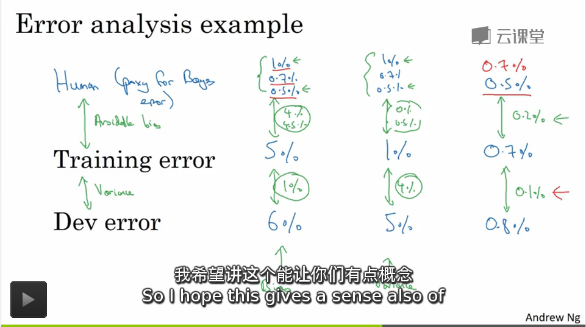

## Machine Learning 策略

诊断系统瓶颈，并找到最合适的用来修正和提高性能的策略

---

1. 正交化

   对系统的改动操作，尽量一次只修正到一个指标上

   比如 : 对系统的改动如果使用 (early stop) 的话，可能对验证集和训练集都存在影响，这个操作并没有很好的正交化

   1. 损失函数的训练集水平

      1. 扩大训练的网络
      2. 优化梯度下降算法

   2. 损失函数的验证集水平

      扩大训练集

   3. 损失函数的测试集水平

      扩大验证集

   4. 系统实际运行表现

      1. 修改成本函数
      2. 修改验证集

2. 单一实数评估指标 (配合验证集使用)

   1. 如果存在一个单一的实数(系统准确率，误差率等等指标都可以)可以评估系统的性能，可以加快迭代开发的速度

   2. 指标举例

      1. 精确率(precision) : $$\frac{N_{正确分类}}{N_{系统分类}}$$

      2. 查全率(recall) : $$\frac{N_{正确分类}}{N_{所有正确分类}}$$

      3. F1 Score : $$\frac{2\cdot precision \cdot recall}{precision + recall}$$

         对精确率和查全率的一个综合评估指标，使用了单一的实数评估，可以更加的快速的鉴定系统的性能，而不是总想着在精确率和查全率之间折中平衡

3. 优化指标的建立

   1. 满足指标 : 系统必须满足的限制条件
   2. 优化指标 : 系统需要最优化的目标
   3. 如果系统存在 $$N$$ 个指标，我们可以选择其中一个作为优化指标，其他的 $$N-1$$ 个当做满足指标的限制条件这样可以快速的判断系统的性能情况

4. 训练集 / 验证集(开发集) / 测试集

   1. 使用训练集训练很多模型，使用开发集评估模型性能，然后不断的迭代去**提高开发集的性能**，最后用测试集评估
   2. **开发集和测试集来自于统一数据分布**
   3. 首先设定一个开发集(验证集)和一个单一实数评估指标(加上一些满足指标)，用来对系统的性能进行暂时的评估
   4. 对训练集的选定决定我们逼近目标的速度是不是足够快，对开发集和测试集的选定的决定我们是不是最终一定会有效的优化我们的目标(而不是打错了靶子)
   5. 为了考虑未来的需求变动，我们最好将**未来可能需要的数据，认为很重要的数据都加入到开发集和测试集中，避免之后的项目重构和重优化的浪费时间**

5. 训练集 / 验证集(开发集) / 测试集 的规模选取

   1. 早期 : 数据集很小

      7 / 3 分 , 6 / 2 / 2 分基本还算合理

   2. 大数据时代 : 

      98 % 训练集，1% 开发，1%测试

   3. 测试集的目的在于 : 用于评估产品投放市场的性能，一般需要有足够高的数据量去以高的置信度去评估系统整体性能，对最终的投产系统有一个很精确的衡量指标

6. 指标或者开发测试集变动

   1. 当我们发现实际上我们的在开发集上的评估指标本质上并不适合我们的应用的时候，我们需要变更我们的模型的评估指标
   2. 如果我们发现训练和测试集上的数据分布和实际运行的应用的分布并不是很契合的时候，还需要重新打额构建训练集和测试集

7. **贝叶斯最优误差(贝叶斯误差)** : 理论上系统更可以达到的最优误差，理论系统性能的上限

   如果算法的效果比人的效果差，我们可以考虑的优化方式，但是如果算法的效果闭人的效果好的话，这些方式的效果并不是非常的有用(原因可能是人的误差已经足够的逼近贝叶斯最优误差，没有很大的优化空间)

   1. 人工标记更好的数据去学习
   2. 从人的角度去发现系统的错误的原因
   3. 分析偏差和方差并优化

   系统在超越人类水平之后很那继续优化的原因 : 

   在超越人的表现效果之后，因为很难对真实的**贝叶斯误差**进行精确的分析，导致我们不容易决定到底是要去优化偏差还是方差，所以，在超越人类的表现水平之后，系统的性能发展变得不在那么的迅速(**失去了目标**)

8. 优化偏差和方差

   决定到底是优化哪一个选项，取决于我们的**贝叶斯误差**的大小

   1. 偏差大 : 系统拟合的效果并不是很好，扩大网络规模并决定运行长一些的梯度下降算法
   2. 方差大 : 系统可能存在过拟合，需要使用正则化或者收集更多的数据等其他的策略避免过拟合

9. 人类表现水平的含义

   人类表现水平可能可以用来估计贝叶斯误差,真正决定这个指标的是我们决定步数的系统的预计性能是多少，如果我们的性能可以满足部署的话，人类的最有表现水平可能也不是必须要达到的硬性要求，但是如果我们的要求是替代**贝叶斯误差**的话，我们需要使用人类最优的表现水平去替代我们估计的**贝叶斯误差**(主要取决于我们要用哪一个人类的表现水平指标去决定当做贝叶斯误差)

   

10. 指导方针

    1. 训练集上的拟合程度 : 偏差的大小

       正交化的优化方式

       1. 扩大网络
       2. 优化算法
       3. 更换网络架构
       4. 更换超参数

    2. 开发测试集上的拟合程度 : 方差的大小

       正交化的优化方式

       1. 正则化
       2. 扩大数据集
       3. 更换网络架构
       4. 更换超参数