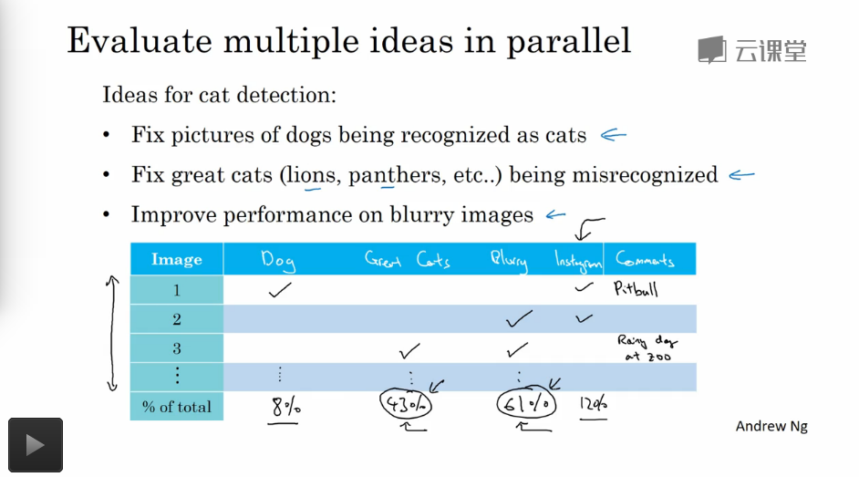

## Machine Learning 策略

---

1. 误差分析

   1. 收集开发集中的一些错误的标记，然后手动的观察我们的错误的标记的类型，然后决定针对某一方向执行的优化策略是否是值得的(这里需要考虑我们特殊的优化策略可以活动的性能优化上限，然后合理的决策)

   2. 多个优化想法的情况下

      

      我们可以通过制作表格的方式快速的选出最高优先级的任务，并查看每一种想法的最高的性能优化上限

2. 如果人工标记的数据集中存在错误的话，如何解决问题

   1. 训练集出现随机错误

      如果出现的误差是随机并且少数的话，可以验证深度网络架构实际上可以在一定程度上湖绿这种随机的误差，不需要对数据集的误差没有什么需要大大修改的，**但是对与系统性的错误则应该仔细慎重的对待和修正**

   2. 开发集和测试集出现误差

      1. 可以将这种误差统计在上面图中，并进行优先级分析，决定是否需要对数据集进行修正
      2. 开发集和测试集需要同时修改，因为这两个数据集必须来自统一分布，保证我们的算法在开发上的测试效果可以很好的在测试集上复现

3. 训练集和开发测试集的数据分布不一致

   1. 混合训练集和开发测试集中的数据，然后随机打乱分布，保证数据的分布式一致的

      但是这样并不是非常好，因为我们的开发测试集中的大部分数据还是来自于原来训练集中的，并不能反应原来的开发测试集中的数据分布

      不建议使用这样的方式去优化

   2. 开发测试集中的数据全部都是原来的分布，将开发测试集中的部分数据分配给训练集，从而修正训练集的数据分布尽可能向开发测试集靠拢

      长期来说，对系统的性能还是有好处

4. 训练-开发集

   再从训练集中分出一部分数据 **训练-开发集**，并且不在其上跑反向传播算法，**这时候训练集和训练-开发集属于同一分布**，如果这时候在训练-开发集上的误差和训练集上的误差相差很大，我们可以认定模型存在很大的方差问题，过拟合比较严重

   如果训练集和训练-开发集的误差相差不大，但是和开发集上的误差相差比较大，这时候数据分布的不一致性可能就是主要的原因了

5. 误差的统一分析

   1. 贝叶斯误差 : 最优理想上限
   2. 训练集误差 : 训练集误差和贝叶斯误差决定了算法的**偏差**的大小
   3. 训练-开发集误差 : 训练-开发集和训练集的误差决定了算法的 **误差** 大小
   4. 开发集误差 : 开发集误差和训练-开发集的误差大小决定了算法的**数据分布不一致**的问题严重程度
   5. 测试集误差 : 测试集和开发集的误差大小决定了对**开发集的过拟合程度**，可能需要更大的开发集

6. 缓解数据不匹配问题

   1. 误差分析，找到数据不匹配的原因，然后看是否可以扩增一些和开发集一样的数据分布的数据加入到训练集中去
   2. 人工合成大量的数据加入到训练集中，但是因为合成的数据样本可能只是真实数据集中的一小部分，可能会对合成的数据发生过拟合

7. 迁移学习

   1. 如果新的任务的数据集很小的话，可以考虑只训练部分层
   2. 但是如果新的任务的数据集很大，可以考虑训练所有的层中的参数(之前的训练过程称之为**预训练**)

   迁移学习的意义在于，我们之前的任务大量的数据预训练得到模型参数和知识可以迁移到一个只有很少的数据的任务中去学习，也可以的很好的效果(知识的迁移)

   1. 如果两个任务存在有相同的 $$X$$ 的话，这样的迁移学习是有一定的意义的
   2. 预训练的数据量比新的训练的任务的数据量大，有价值的训练少数据量的任务
   3. 之前的训练任务的低层次探测特征对之后的训练任务有一定的帮助

8. 多任务学习

   一个网络训练，解决多种问题(标签中存在多种标签，一个问题一种)，其他的任务的学习的只是可能会对我们主要关注的任务的性能有提升