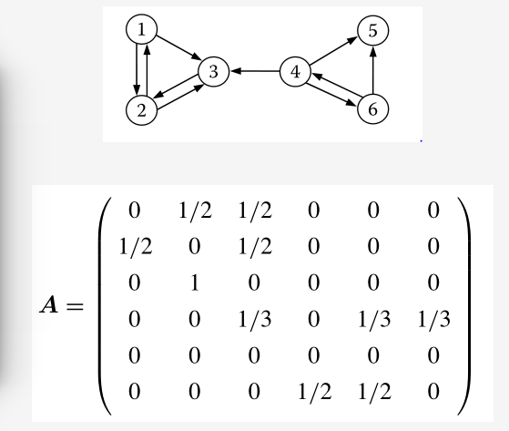

## 文本摘要算法

文本摘要算法简介

* 基于统计 : 词频，位置，计算句子的权重，选择高权重的句子作为文摘，简单易用，但是效果不是非常的理想 - TextTeaser
* 基于图模型 : 构建拓扑结构图，对词句进行排序 - TextRank
* 基于潜在语义 : 挖掘语句的隐藏信息 - LDA | HMM
* 基于整数规划 : 文摘转化成整数线性规划，求解全局最优解

---

### PageRank

>1. 一个网页如果被其他的很多网页连接到的话，重要性会很高
>2. 一个pagerank值很高的网站如果连接到一个其他的网站，被链接的网站的pagerank值也很高

* $$A$$ : 矩阵 $$A$$ 中每一行存放这一个城市对其他的城市的转移概率

* $$PR$$ : 每一个网页的pagerank权重,初始权重是一样的   $$\frac{1}{N}$$

  
  $$
  PR^k = A^{T}PR^{k-1}
  $$
  对上述的公式不断的迭代直到　$$||PR^{k}-PR^{k-1}||<\xi$$  一个给定的误差(一般0.0001)的时候，算法结束

  但是为了保证有解性，我们还需要其他的定义条件

  * 每一行都必须存在一个非0值，也就是必须存在一个外链接(但是实际上并不存在这么理想的情况，我们只能假定没有出边的网页节点对其他的所有节点都有出边并且转移概率相等)
  * 图必须强连通，每个节点必须存在自回路

  最后的结果需要做平滑处理

  $$PR_i^k=(1-d)+d\sum_{(j,i)\in E}\frac{PR_i^{k-1}}{|O_j|}$$

  * $$1-d$$ : 

    d 一般取 0.85

    逃离概率，如果网页没有指向其他的网页的出边的话，假定上网者会以 $$1-d$$ 的概率选择逃离当前的页面，否则会以 $$d$$ 的概率选择页面内的其中一条链接转移到其他的网页

  * 图模型 : $$G(V, E)$$

  * $$O_i$$ : $$i$$ 号节点的出边集合，$$|O_i|$$ 代表出边的个数

---

### TextRank

>PageRank算法变体，文本摘要算法

1. 提取关键字(可以使用`TF-IDF`矩阵)

   - 文章进行句子进行分词，每个句子中去除停用词，保留特定的单词，得到句子的集合和单词的集合

   - 单词作为pagerank中的一个节点，引入**共现窗口**的概念

   - 关键词提取算法

     1. 文本 $$T$$ 切分成句子 

        $$T = [S_1,S_2,S_3,S_4,...,S_m]$$

     2. 对于每一个句子，分词做词性标注，过滤掉停用词，保留特定词性的单词 $$t$$

        $$S_i=[t_{i,1},t_{i,2},t_{i,3},...,t_{i,n}]$$

     3. 利用2)中的候选关键字构建候选**关键词图** $$G=(V,E)$$

        * 使用共现关系构造两点之间的边

          **两点之间存在边，当且仅当节点对应的词汇在长度为K在窗口中共现，K表示窗口大小，最多可以共现K个单词**

        * **边的权重是共现的次数**

     4. 使用textrank算法公式进行迭代(见下图)，直到收敛

     5. 对节点的权重进行倒序排序，选择最重要的几个单词，作为候选的关键词，如果关键词相邻还可以构成关键短语词组

2. 提取关键短语

   如果关键词相邻可以考虑构建成关键短语

3. 提取摘要

   * 将每一个句子看作是图中的一个节点，如果两个句子之间存在相似性(余弦相似性和词袋模型)，则认为图中存在一条无向有权边，权值是相似度
   * 利用pagerank算法计算得到的重要性最高的句子可以构成摘要

4. 相似度计算

   * 余弦相似性

   * 其他

     $$Similarity(S_i,S_j) = \frac{|\{w_k|w_k\in S_i \&w_k\in S_j\}|}{\log{|S_i|} + \log{|S_j|}}$$

     * $$|S_i|$$ : 句子 $$i$$ 的单词数目
     * 分子是公共的单词的数目

   * **TextRank**的公式

     对于PageRank 算法修改，因为PageRank算法中的图中的转移概率都是平均的，但是对于我们的该问题来说，边权重是有权不等的，我们需要对PageRank公式进行调整
     $$
     WS(V_i)=(1-d) + d * \sum_{V_j\in In(V_i)}\frac{w_{ij}}{\sum_{V_k\in Out(V_j)}w_{jk}}WS(V_j)
     $$

     * $$1-d$$ : 转移概率
     * $$w_{ij}$$ : (i, j) 边的权重
     * 可以理解是按照出边(相似度)的权重进行的有概率的加权整合

算法流程

1. 预处理 : 对于每一个句子生成候选关键词

2. 句子的相似度计算(上面的similarity的公式)，如果相似度大于阈值认为语句之间存在相似性并构建有权

   边

3. 根据TextRank公式计算迭代传播句子的得分

4. 抽取得分最高的几个句子形成文摘

P.S. : TextRank公式处理的粒度这里有两种 : 词(关键词) / 句子(关键句 - 摘要)

---

重要参考 : 

[PageRank](http://blog.sohu.com/s/MTAzMjM1NDY0/239636012.html)

