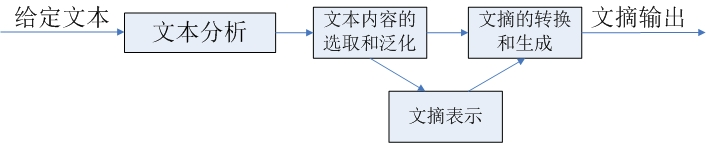

## 文本自动摘要

1. 出现的原因 : 互联网的信息过载

2. 解决的问题 : 用精炼的话语概括整个文章的大意

3. 分类

   * 抽取式 : 从原文中找到一些关键的句子，组合成一篇摘要
     * 主流
     * 使用广泛，最容易
     * 效果不是很好
   * 生成式 : 这需要计算机可以读懂原文的内容，并且用自己的意思将其表达出来
   * 单文档摘要
   * 多文档摘要

4. 成熟度分析

   * 目前的抽取式的算法最为成熟并且参考资料和文献很多，也有基线测试，但是效果不是很好
   * 生成式困哪度比较高

5. 基本流程分析

   

* 文本分析 : 对原文文本进行分析处理，识别冗余信息

* 文本内容的选取和泛化 : 

  是从文档中辨识重要信息，通过摘要或概括的方法压缩文本，或者通过计算分析的方法形成文摘表示

* 文摘的转化和生成 : 实现对原文内容的重组或者根据内部表示生成文摘，并确保文摘的连贯性

---

### 抽取式

1. 抽取式的方法基于一个假设，*一篇文档的核心思想可以用文档中的某一句或几句话来概括。那么摘要的任务就变成了找到文档中最重要的几句话，也就是一个排序的问题。*

2. 关注点

   * 相关性 : 相关性是指摘要所用的句子最能够代表本文档的意思
   * 新颖性 : 候选句子包含的冗余信息要少

3. 处理流程

   1. 预处理

      * 分句 : 一般使用标点符号分句

   2. 词句表示 : (打分)

      词、句子表示成计算机能理解的量，然后计算一些指标进行排序

      * 词袋模型 : 

        词袋模型将词定义为一个维度，一句话表示成在所有词张成的空间中的一个高维稀疏向量

      * `TF-IDF` + 余弦相似性:

        可以理解为带权重的词袋模型，计算出每个词的TFIDF值，作为该词的权重。 

        权重还可以用词频来代替，那就是另一种考虑方式了

      * `LDA / LSI`

      * `Word Embedding` : Word2Vec模型，让word很容易的表示成一个低维度稠密向量

   3. 排序(打分)

      1. 图排序算法

         *将文档的每句话作为节点，句子之间的相似度作为边权值构建图模型，用`pagerank`算法进行求解，得到每个句子的得分。*

      2. 特征排序算法

         代表算法 : `TextTeaser`

         1. 句子长度 : 

            长度为某个长度的句子为最理想的长度，依照**距离这个长度**的远近来打分

         2. 句子位置:

            根据句子在全文中的位置，给出分数。（比如每段的第一句是核心句的比例大概是70%） 

         3. 句子是否包含标题词 : 

            根据句子包含的标题词的多少来打分

         4. 句子的关键词打分

            文本进行预处理之后，按照词频统计出排名前10的关键词，通过比较句子中包含关键词的情况，以及关键词分布的情况来打分

   4. 后处理

      1. 排序的结果只考虑了**相关性**，没有考**新颖性**，表达信息可能出现冗余

      2. 需要引入句子的相似形度量(可以考虑余弦相似性)

      3. 引入惩罚因子加入**新颖性**的考虑，对所有的句子进行重新打分

         **MMR(Maximum Margin Relevance)** : 最大边缘相关性算法
         $$
         a \times score(i) - (1-a)\times similarity(i, i-1)\ \ \ \ i=2,3,...N
         $$

         * $$i$$ : 排序后的句子的顺序
         * $$a$$ : 惩罚因子
         * $$similarity$$ : $$i$$ 号句子和前一句的相似性

   5. 输出

      1. 一般取排序后的前N句话
      2. 可读性是缺点
         * 可以将排序后的话按照在原文中出现的顺序排序组成摘要，有些许可读性的提升

4. 新思路

   **压缩式摘要**

   1. 压缩
   2. 抽取

   经典的方法为ILP：句子中的每个词都对应一个二值变量表示该词是否保留，并且每个词都有一个打分，目标函数就是最大化句子中的词的打分，在处理的过程中给出限制。能有效提高ROUGE值（在后面会介绍到，对摘要进行评价），但会牺牲句子可读性。

---

### 生成式

1. 要求系统可以理解文档表达的含义，用可读性强的人类语言简练总结出来

2. 难点

   * 理解文档

   * 可读性

   * 简练的总结 : 用简单的话语总结出来文章的简单的含义

   * 效果的评价

     评价标准非常的重要，是论文中的算法优劣比较和行业发展的前提和重点

     1. 人工评价 : 可信度高，成本高效率低
     2. 自动评价 : 将获得的摘要和参考摘要作比对，统计，利用一系列标准打分

3. 常用算法 : 

   * `RNN`
   * `Encoder-decoder` : 处理问题的思路框架
     * encoder部分是将输入序列表示成一个带有语义的向量，使用最广泛的表示技术是Recurrent Neural Network，RNN是一个基本模型，在训练的时候会遇到gradient explode或者gradient vanishing的问题，导致无法训练，所以在实际中经常使用的是经过改良的LSTM RNN或者GRU RNN对输入序列进行表示，更加复杂一点可以用BiRNN、BiRNN with LSTM、BiRNN with GRU、多层RNN等模型来表示，输入序列最终表示为最后一个word的hidden state vector。
     * decoder部分是以encoder生成的hidden state 
       vector作为输入“解码”出目标文本序列，本质上是一个语言模型，最常见的是用Recurrent Neural Network Language Model(RNNLM)，只要涉及到RNN就会有训练的问题，也就需要用LSTM、GRU和一些高级的model来代替。目标序列的生成和LM做句子生成的过程类似，只是说计算条件概率时需要考虑encoder向量。
   * `seq2seq`

---

### 内部评价方法

>1. ##### Edmundson评价方法
>
>2. ##### ROUGE准则

#### Edmundson评价方法

1. 内部评价方法

   1. 比较机械文摘和目标文摘的句子重合率来进行评价
   2. 也可以使用主观评价，就是由专家比较机械文摘与目标文摘所含的信息，然后给机械文摘一个等级评分

   类如等级可以分为：完全不相似，基本相似，很相似，完全相似等

2. 比较单位是句子，使用标点符号分割开来的句子

3. 并且只允许专家从原文中抽取句子，而不允许专家根据自己对原文的理解重新生成句子，专家文摘和机械文摘的句子都按照在原文中出现的先后顺序给出

4. 计算公式

   类似于**召回率**，当然也可以求精确率
   $$
   P=\frac{N(f)}{N}
   $$

   * $$P$$ : 重合率
   * $$N(f)$$ : 匹配句子数目
   * $$N$$ : 专家文摘句子总数
   * 需要多次(多专家)求平均值