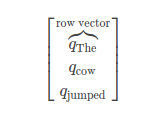

## 针对 NLP 的 Pytorch 深度学习

### 1. Pytorch

库导入

```python
import torch
import torch.autograd as autograd
import torch.nn as nn
import torch.nn.functional as F
import torch.optim as optim

# set the seed for generating the random numbers
torch.manual_seed(1)
```

创建张量，默认的数据类型是浮点类型 `torch.float32`

* `torch.LongTensor`: 创建整数 Tensor
* ...

```python
# 利用给定数据创建一个torch.Tensor对象.这是一个一维向量
V_data = [1., 2., 3.]
V = torch.Tensor(V_data)
print(V)

# 创建一个矩阵
M_data = [[1., 2., 3.], [4., 5., 6]]
M = torch.Tensor(M_data)
print(M)

# 创建2x2x2形式的三维张量.
T_data = [[[1., 2.], [3., 4.]],
          [[5., 6.], [7., 8.]]]
T = torch.Tensor(T_data)
print(T)
```

张量操作

```python
x = torch.Tensor([1., 2., 3.])
y = torch.Tensor([4., 5., 6.])
z = x + y
print(z)

# cat 连接张量
# 默认情况下, 它沿着第一轴连接 (连接行)
x_1 = torch.randn(2, 5)
y_1 = torch.randn(3, 5)
z_1 = torch.cat([x_1, y_1])    # 默认是第一条轴连接
print(z_1)

# 连接列:
x_2 = torch.randn(2, 3)
y_2 = torch.randn(2, 5)
# 第二个数指定了沿着哪条轴连接
z_2 = torch.cat([x_2, y_2], 1)    # 选择第二条轴连接
print(z_2)

# 如果你的tensors是不兼容的,torch会报错.取消注释来查看错误.
# torch.cat([x_1, x_2])
```

重构 Tensor

```python
x = torch.randn(2, 3, 4)
print(x)
print(x.view(2, 12))  # 重构为2行12列
# 同上.如果维度为-1,那么它的维度根据数据推断出来
print(x.view(2, -1))
```

### 2. 计算图和自动求导

* 如果是自己搭建的计算图，没有使用 `nn` 模块中的网络层高级抽象的话，`backward` 每一次都是累计的
* 但是如果是使用 `Linear` 或者其他的层的话，`backward` 需要使用 `retain_graph` 才可以多次累计

```python
x = torch.randn((2, 2))
y = torch.randn((2, 2))
z = x + y  # 这些是Tensor类型,反向是不可能的

var_x = autograd.Variable(x, requires_grad=True)
var_y = autograd.Variable(y, requires_grad=True)
# var_z 包含了足够的信息去计算梯度,如下所示
var_z = var_x + var_y
print(var_z.grad_fn)

var_z_data = var_z.data  # 从 var_z中得到包裹Tensor对象...
# 在一个新的变量中重新包裹tensor
new_var_z = autograd.Variable(var_z_data)

# new_var_z 有去反向x和y的信息吗?
# 没有!
print(new_var_z.grad_fn)
# 怎么会这样? 我们将 tensor 从 var_z 中提取 (提取为var_z.data). 这个张量不知道它是如
# 何计算的.我们把它传递给 new_var_z.
# 这就是new_var_z得到的所有信息. 如果 var_z_data 不知道它是如何计算的, 那么就不会有 new_var_z 的方法.
# 从本质上讲, 我们已经把这个变量从过去的历史中分离出来了.

# 简而言之一句话，求导链不能断开，数据和产生数据的方法必须都存在才能保留自动反向求导需要的所有信息
```

### 3. Pytorch 深度学习

深度学习巧妙的将线性和非线性混合在一起构建了强大的模型。

#### 1. 仿射变换

深度学习中的核心工作之一就是仿射变换，又称线性变换 $$f(x)=Ax+b$$，其中的矩阵 $$A$$ 和向量 $$x,b$$ 其中的 $$A,b$$ 是学习参数

`torch.nn.Liner(in_features, out_features, bias=True)`:

对输入数据应用线性变换, $$y = x A^T+b$$ ,其中的 $$A$$ 是 $$(out_{features}, in_{features})$$ 规模的矩阵，在 `torch` 中存储的矩阵规模是 $$(out_{features}, in_{features})$$ 所以计算的时候需要进行转置进行

* `in_features`: 输入的样本的特征数目
* `out_features`: 输出的样本的的特征数目
* `bias`: 选择是否添加偏置项

内置的数据

* `.weight`: 可学习参数
* `.bias`: 一个输出神经元一个

#### 2. 非线性变换

简单的线性变换的堆叠还是线性变换，模型没有新的复杂度引入，但是如果在线性变换之间引入了非线性变换，就可以获得函数空间异常巨大的模型

```python
# 在pytorch中, 很多的non-linearities是在torch中是功能性的 (我们将它记为 F)
# 这意味着 non-linearites 不像 affine maps 一样拥有参数.也意味着它们再训练时没有可以更新的参数.
#
data = autograd.Variable(torch.randn(2, 2))
print(data)
print(F.relu(data))
```

#### 3. softmax和概率分布

`softmax` 函数也是非线性函数，但是特殊点是 `softmax` 可以将实数向量映射成为概率分布，**没有正数负数的限制** $$\frac{\exp(x_i)}{\sum_j\exp(x_j)}$$

输出的概率分布中，每一个元素都是非负的并且元素的总和是 1,可以看做是一个指数归一化函数

`torch.nn.functional.softmax(input, dim=None)`:

* `input`: 输入的实数向量
* `dim`: 将 `softmax` 应用的维度

`torch.nn.functional.log_softmax(input, dim=None)`

* `input`: 输入的实数向量
* `dim`: 将 `log_softmax` 应用的维度
* 数学公式: `log(softmax(input))`

```python
# Softmax也在 torch.nn.functional
data = autograd.Variable(torch.randn(5))
print(data)
print(F.softmax(data, dim=0))
print(F.softmax(data, dim=0).sum())  #总和为一因为他是概率分布
print(F.log_softmax(data, dim=0))  # 他也是 log_softmax
```

#### 4. 目标函数

Objective function 是一个目标函数，你训练网络的目的是使其最小(在这种情况下, 它通常被称为 *损失函数* 或 *成本函数* ). 首先选择一个训练实例, 通过神经网络运行它, 计算输出的损失. 然后利用损失函数的导数来更新模型的参数. 直观地说, 如果你的模型对答案完全有信心, 但答案是错误的, 你的损失就会很高. 如果它的答案非常有信心, 而且答案是正确的, 那么损失就会很低.

将训练样例的损失函数最小化的想法是, 你的网络希望能够很好地产生, 并且在开发集, 测试集或生产环境中未知的示例有小的损失. 一个示例的损失函数是 *负对数似然损失* , 这是多类分类的一个非常普遍的目标函数. 对于有监督的多类别分类, 这意味着训练网络以最小化正确输出的负对数概率(或等同地, 最大化正确输出的对数概率).

#### 5. 优化和训练

$$
\theta^{(t+1)}=\theta^{(t)}-\eta\nabla_{\theta}L(\theta)
$$

* $$\theta$$ 是网络参数
* $$L(\theta)$$ 是损失函数
* $$\eta$$ 是正学习率
* 一般来说，只要使用 Adam 或者 RMSProp 就可以显著提升 SGD 的效果

### 4. Pytorch 中创建神经元区分英语和西班牙语

> 基于词袋表示法的 Logistic 回归

词袋模型的基本表示方法是 $$[Count(hello),Count(world)]$$,将这个表示的实数向量作为 $$x$$ 送入网络中进行分类

`nn.NLLLoss(x, target)`:

这个损失函数需要将进行过 softmax 处理的得到的概率分布然后计算损失函数，其中的 target 是对每一个 mini-batch 中的样本 一个target对应的正确标签，计算这一个总的mini-batch的负对数似然函数。下面的实例中，target是一个标量原因在于训练的时候的mini-batch中只有一个数据样本
$$
log Softmax (Ax+b)
$$

```python
data = [("me gusta comer en la cafeteria".split(), "SPANISH"),
        ("Give it to me".split(), "ENGLISH"),
        ("No creo que sea una buena idea".split(), "SPANISH"),
        ("No it is not a good idea to get lost at sea".split(), "ENGLISH")]

test_data = [("Yo creo que si".split(), "SPANISH"),
             ("it is lost on me".split(), "ENGLISH")]

# word_to_ix 将在词汇中的单词映射为一个特征数,
# 这个特征数就是单词在词袋中的索引
# 构建词袋模型的索引值
word_to_ix = {}
for sent, _ in data + test_data:
    for word in sent:
        if word not in word_to_ix:
            word_to_ix[word] = len(word_to_ix)
print(word_to_ix)

VOCAB_SIZE = len(word_to_ix)
NUM_LABELS = 2
label_to_ix = {"SPANISH": 0, "ENGLISH": 1}    # 定义哪一个标签是哪一个类别

class BoWClassifier(nn.Module):  # 从 nn.Module继承!
    def __init__(self, num_labels, vocab_size):
        # 在 nn.Module中调用初始化函数. 不要被这个困惑,
        # 这个做法经常在 nn.Module见到
        super(BoWClassifier, self).__init__()

        # 定义你需要的变量. 在本例中, 我们需要affine mapping的系数 A 和 b.
        # Torch 定义了可提供 affine map的nn.Linear().
        # 确定你理解了为什么输入矩阵的维度是 vocab_size而输出的是num_labels!
        self.linear = nn.Linear(vocab_size, num_labels)

        # 注意!  non-linearity log softmax 没有系数!
        # 所以我们在这并不需要担心

    def forward(self, bow_vec):
        # 将输入引入到线性神经元层中, 随后引入到log_softmax.
        # 在torch.nn.functional中有很多非线性和其他的函数
        # dim=1确定不是在batch维度上进行softmax激活函数
        return F.log_softmax(self.linear(bow_vec), dim=1)

def make_bow_vector(sentence, word_to_ix):
    # 将输入的句子分割成词袋输入向量 x
    vec = torch.zeros(len(word_to_ix))
    for word in sentence:
        vec[word_to_ix[word]] += 1
    return vec.view(1, -1)

def make_target(label, label_to_ix):
    return torch.LongTensor([label_to_ix[label]])

model = BoWClassifier(NUM_LABELS, VOCAB_SIZE)

# model知道它的系数.第一个输出的是A, 第二个是b.
# 当你在模块__init__函数中指定一个神经元去分类变量, self.linear = nn.Linear(...)被执行
# 随后从Pytorch devs通过Python magic, 你的模块(在本例中, BoWClassifier) 将会存储 nn.Linear的系数
for name, param in model.named_parameters():
    print(name, param)

# 要运行该模型, 请传入一个BoW vector, 但要将其封装在一个autograd.Variable中.
sample = data[0]
bow_vector = make_bow_vector(sample[0], word_to_ix)
log_probs = model(autograd.Variable(bow_vector))
# print(log_probs)

# 训练过程
# 在我们训练前运行训练集, 去看看前后的变化
for instance, label in test_data:
    bow_vec = autograd.Variable(make_bow_vector(instance, word_to_ix))
    log_probs = model(bow_vec)
    print(log_probs)

loss_function = nn.NLLLoss()    # NLL不计算对应的softmax需要我们计算，但是交叉熵损失函数会计算softmax
optimizer = optim.SGD(model.parameters(), lr=0.1)

# 通常你想要多次浏览训练集.100比起实际数据集是很多的, 但实际数据集会多于2个实例.
# 通常, 在5到30之间是合理的.
for epoch in range(100):
    for instance, label in data:
        # 步骤 1. 牢记 Pytorch 会积累梯度.
        # 我们需要在每一例前清理掉
        model.zero_grad()

        # 步骤 2. 制作我们的 BOW 向量 并且我们必须将目标封装在变量中并且为整数 .
        # 例如, 如果目标是"西班牙语", 则封装为整数0.对于损失函数而言, 概率分布的
        # 第0列对应的是"西班牙语"的损失函数.
        bow_vec = autograd.Variable(make_bow_vector(instance, word_to_ix))
        target = autograd.Variable(make_target(label, label_to_ix))

        # 步骤 3. Run our forward pass.
        log_probs = model(bow_vec)

        # 步骤 4. 计算损失, 梯度, 通过调用optimizer.step()来更新系数
        loss = loss_function(log_probs, target)
        loss.backward()
        optimizer.step()

for instance, label in test_data:
    bow_vec = autograd.Variable(make_bow_vector(instance, word_to_ix))
    log_probs = model(bow_vec)
    print(log_probs)
```

### 5. 词嵌入编码语义

单词嵌入是一个密集的特征向量，表示一个特定的单词的特征或者说是语义，维度是 $$V$$ 维，其中 $$V$$ 是词汇表的大小这也是 one-hot 向量，但是这样的特征给你并不能有效的表示语义的信息，需要将这个大一点的 one-hot 向量嵌入到一个维度较小并且足够表示语义的密集向量中去，比如说表示相似性等等语义信息。

*语义相似度*, 不仅仅是拼字一样的表示. 它是一种通过连接我们所看到的和我们没有看到的东西之间的点来对抗语言数据稀疏性的技术. 这个例子当然要依赖于一个基本的语言假设:**在相似的语境中出现的单词在语义上是相互关联的.**

#### 1. Word Embedding

我们可以将每一个单词抽象成一个新的具有很多不同特征的词向量，通过计算这些词向量之间的余弦相似度表示这些词在语义上的相似性。其中 one-hot 词向量是一个很特殊的向量，所有的向量的余弦相似度都是0没有有效的编码词向量的语义信息

但是这些新的向量是一种巨大的痛苦:你可以想到数千种不同的语义属性,它们可能与决定相似性有关, 而且究竟你怎样把它们设置成不同的属性? **深度学习的中心思想是比起需要程序员去自己设计特征, 神经网络学习特征的表示. 所以为什么不在我们的模型中让单词嵌入到系数中,然后让它们在训练中更新呢? **这就是我们要做的. 我们会有一些 *潜在的语义属性* 网络可以, 严肃来讲, 学习. 注意, 嵌入词可能无法解释. 那就是尽管如上所示我们手工制作的矢量图,我们可以看到数学家和物理学家的相似之处是他们都喜欢咖啡. 如果我们允许神经网络学习嵌入, 并看到数学家和物理学家在第二个维度中有很大的价值, 但是它意味着什么很不清晰. 在潜在语义来讲它们是相似的, 但是对我们来说是无法解释的.

**特征嵌入是 NLP 的核心思想**

#### 2. Pytorch Word Embedding

嵌入矩阵的维度是 $$V \times D $$ 其中 $$V$$ 是 one-hot 向量的维度，$$D$$ 是嵌入矩阵的维度，因为输入的是 one-hot 向量，所以本质上相当于是对嵌入矩阵按照行进行索引提取，抽取出对应的嵌入向量。

允许使用 `torch.nn.Embedding` 这个需要参数,其中的参数是需要训练的嵌入矩阵

* 词汇量 $$V$$
* 嵌入的维度 $$D$$

索引必须是 LongTensor 对象

```python
word_to_ix = {"hello": 0, "world": 1}
embeds = nn.Embedding(2, 5)  # 2 单词, 5 维嵌入
lookup_tensor = torch.LongTensor([word_to_ix["hello"]])
hello_embed = embeds(autograd.Variable(lookup_tensor))
print(hello_embed)
```

#### 3. N-Gram 语言模型例子

在 N-Gram 语言模型中，给定一系列的单词 $$w$$, 我们需要计算 $$P(w_i|w_{i-1},w_{i-2},...,w_{i-n+1})$$ 其中 $$w_i$$ 是句子中的第 $$i$$ 个单词

```python
# CBOW
CONTEXT_SIZE = 2
EMBEDDING_DIM = 10
# 我们将使用 Shakespeare Sonnet 2
test_sentence = """When forty winters shall besiege thy brow,
And dig deep trenches in thy beauty's field,
Thy youth's proud livery so gazed on now,
Will be a totter'd weed of small worth held:
Then being asked, where all thy beauty lies,
Where all the treasure of thy lusty days;
To say, within thine own deep sunken eyes,
Were an all-eating shame, and thriftless praise.
How much more praise deserv'd thy beauty's use,
If thou couldst answer 'This fair child of mine
Shall sum my count, and make my old excuse,'
Proving his beauty by succession thine!
This were to be new made when thou art old,
And see thy blood warm when thou feel'st it cold.""".split()
# 我们应该对输入进行标记,但是我们将忽略它
# 建造一系列元组.  每个元组 ([ word_i-2, word_i-1 ], 都是目标单词)
trigrams = [([test_sentence[i], test_sentence[i + 1]], test_sentence[i + 2])
            for i in range(len(test_sentence) - 2)]
# 输出前 3, 为了让你看到他的各式
print(trigrams[:3])

vocab = set(test_sentence)    # size of 97
word_to_ix = {word: i for i, word in enumerate(vocab)}

class NGramLanguageModeler(nn.Module):
    def __init__(self, vocab_size, embedding_dim, context_size):
        super(NGramLanguageModeler, self).__init__()
        self.embeddings = nn.Embedding(vocab_size, embedding_dim)
        self.linear1 = nn.Linear(context_size * embedding_dim, 128)
        self.linear2 = nn.Linear(128, vocab_size)

    def forward(self, inputs):
        embeds = self.embeddings(inputs).view((1, -1))    # 2个10维嵌入融合成20维的上下文表示，然后预测 target 
        out = F.relu(self.linear1(embeds))
        out = self.linear2(out)
        log_probs = F.log_softmax(out, dim=1)
        return log_probs

losses = []
loss_function = nn.NLLLoss()
model = NGramLanguageModeler(len(vocab), EMBEDDING_DIM, CONTEXT_SIZE)
optimizer = optim.SGD(model.parameters(), lr=0.001)

for epoch in range(10):
    total_loss = torch.Tensor([0])
    for context, target in trigrams:
        # 步骤 1. 准备好进入模型的数据 (例如将单词转换成整数索引,并将其封装在变量中)
        context_idxs = [word_to_ix[w] for w in context]
        context_var = autograd.Variable(torch.LongTensor(context_idxs))

        # 步骤 2. 回调 *积累* 梯度. 在进入一个实例前,需要将之前的实力梯度置零
        model.zero_grad()

        # 步骤 3. 运行反向传播,得到单词的概率分布
        log_probs = model(context_var)

        # 步骤 4. 计算损失函数. (再次注意, Torch需要将目标单词封装在变量中)只有这样才可以构建计算图尽心反向传播
        # 反性传播链上的所有变量必须全部欧式 Variable(0.4好像不需要，Tensor和Variable合并了)
        loss = loss_function(log_probs, autograd.Variable(
            torch.LongTensor([word_to_ix[target]])))

        # 步骤 5. 反向传播并更新梯度
        loss.backward()
        optimizer.step()
        total_loss += loss.data
    losses.append(total_loss)
print(losses)  # 在训练集中每次迭代损失都会减小,输出查看
```

#### 4. CBOW

Skip-Gram 是根据中心词预测上下文(一次预测一个)，但是 CBOW 是根据上下文预测中心词，CBOW被用来快速训练单词嵌入，成为预训练嵌入用来作为一些复杂嵌入的初始化操作，提升效果非常明显。

CBOW的模型如下:

给定目标单词 $$w_i$$ ,$$N$$ 代表单词每一遍的滑窗距，$$w_{i-1},...,w_{i-N}$$ 和 $$w_{i+1},...,w_{i+N}$$ 将所有的2N个上下文单词统称为 $$C$$ ，CBOW试图最小化
$$
-\log p(w_i|C)=-logSoftmax(A(\sum_{w\in C}q_w)+b)
$$
其中的 $$q_w$$ 是单词 $$w$$ 的嵌入

### 6. 序列模型和 LSTM

序列模型是依赖于时间信息的模型，经典的序列模型是 HMM, CRF，递归神经网络是可以保存某种状态的神经网络，对于 LSTM 来说序列中的每一个元素都有相应的隐状态 $$h_t$$ ，可以使用这个隐藏状态预测语言模型中的单词，标签或者其他的感兴趣的东西。

#### 1. Pytorch for LSTM

开始例子之前,有几个点说明一下. Pytorch 中, LSTM 的所有的形式固定为3D 的 tensor. 每个维度有固定的语义含义, 不能乱掉. 其中第一维是序列本身, 第二维以 mini-batch 形式 来索引实例, 而第三维则索引输入的元素. 因为我们没有讨论过 mini-batch, 所以在这里我们 假设第二维的维度总是1. 如果我们想在句子 “The cow jumped” 上运行一个序列模型, 模型 的输入类似这样:



处理一个额外的代销是 1 的第二维的维度(横向)，并且也可以向网络中一个单词一个单词输入序列，这样的话第一个维度(竖向)大小也是1第三个维度是词向量的维度

库导入

```python
import torch
import torch.autograd as autograd
import torch.nn as nn
import torch.nn.functional as F
import torch.optim as optim

torch.manual_seed(1)
```

简单的 LSTM

---

`torch.nn.LSTM(input_size, hidden_size, num_layers, bias, batch_first, dropout, bidirectional)`

构建对输入序列的多层 LSTM，对输入序列的每一个元素，每一层执行下面的计算
$$
\begin{array}{ll}
        i_t = \sigma(W_{ii} x_t + b_{ii} + W_{hi} h_{(t-1)} + b_{hi}) \\
        f_t = \sigma(W_{if} x_t + b_{if} + W_{hf} h_{(t-1)} + b_{hf}) \\
        g_t = \tanh(W_{ig} x_t + b_{ig} + W_{hg} h_{(t-1)} + b_{hg}) \\
        o_t = \sigma(W_{io} x_t + b_{io} + W_{ho} h_{(t-1)} + b_{ho}) \\
        c_t = f_t c_{(t-1)} + i_t g_t \\
        h_t = o_t \tanh(c_t)
        \end{array}
$$

* $$h_t$$: 第 t 步的隐藏层
* $$c_t$$: 第 t 步的细胞内状态
* $$x_t$$: 代表第 t 步输入
* $$h_{(t-1)}$$: 是上一步 t-1 的隐藏层或者是初始化层 $$h_0$$
* $$i_t, f_t, g_t, o_t$$: 更新门，遗忘门，临时结果，输出门
* $$\sigma$$: 是 `sigmoid` 函数

函数的参数解析

* `input_size`: 期待输入的词向量的规模 $$x_t$$ 的规模
* `hidden_size`: 隐藏层的神经元数目
* `num_layers`: 循环神经网络的数目，比如，这个值如果是2代表堆叠2个 LSTMs 网络构建一个 `stacked LSTM` 其中第二个 LSTM 接收第一个 LSTM 的输出计算最后的输出，默认是1
* `bias`: True / False 表示是否添加偏置
* `batch_first`: 输入和输出的张量的格式是 $$(batch, seq, feature)$$ ,默认是 False, 因为默认是 $$(seq, batch, feature)$$ 的格式
* `dropout`: 默认是0,应用dropout
* `bidirectional`: 如果是 True, 构建双向的 LSTM, 默认是 False

输入格式

input, $$(h_0, c_0)$$

- input 的格式是 $$(seq_{len}, batch,input_{size})$$
- $$h_0$$: 对每一个batch的初始化的隐藏层，$$(num_{layers}, num_{directions}, batch, hidden_{size})$$
- $$c_0$$: 同理
- 如果不提供 $$h_0, c_0$$, 默认全部是 0

输出格式

output, $$(h_n, c_n)$$

* output 的格式是 (seq_len, batch, num_directions, hidden_size)
* $$h_n$$: (num_layers, num_directions, batch, hidden_size)
* $$c_n$$: 同上

---


```python
lstm = nn.LSTM(3, 3)  # 输入维度是3, 输出维度也是3， 1层堆叠
inputs = [autograd.Variable(torch.randn((1, 3)))
          for _ in range(5)]  # 构造一个长度为5的序列

# 初始化隐藏状态，h_0, c_0
hidden = (autograd.Variable(torch.randn(1, 1, 3)),
          autograd.Variable(torch.randn((1, 1, 3))))
for i in inputs:
    # 将序列的元素逐个输入到LSTM
    # 经过每步操作,hidden 的值包含了隐藏状态的信息
    out, hidden = lstm(i.view(1, 1, -1), hidden)
    print(out, hidden)
    
print('-' * 20)

# 另外, 我们还可以一次对整个序列进行训练. LSTM 返回的第一个值表示所有时刻的隐状态值,
# 第二个值表示最近的隐状态值 (因此下面的 "out"的最后一个值和 "hidden" 的值是一样的).
# 之所以这样设计, 是为了通过 "out" 的值来获取所有的隐状态值, 而用 "hidden" 的值来
# 进行序列的反向传播运算, 具体方式就是将它作为参数传入后面的 LSTM 网络.

# 增加额外的第二个维度
inputs = torch.cat(inputs).view(len(inputs), 1, -1)
hidden = (autograd.Variable(torch.randn(1, 1, 3)), autograd.Variable(
    torch.randn((1, 1, 3))))  # 清空输出隐状态
out, hidden = lstm(inputs, hidden)
print(out)
print(hidden)
```

#### 2. LSTM 做词性标注

符号定义

* 输入句子定义: $$w_1, ..., w_M$$ 
* 输入句子中的动词定义为 $$w_1,...,w_M$$
* 标签集合定义为 $$T$$
* 单词 $$w_i$$ 的实际标签是 $$y_i$$
* 单词 $$w_i$$ 的预测标签是 $$y_i'$$
* 输出序列是 $$y_1',...,y_M'$$，其中 $$y_i' \in T$$

在进行预测的时候需要将每一个次输入到 LSTM 中，将第 $$i$$ 时刻的隐含状态记做 $$h_i$$同样的，对每一个标签进行一个索引
$$
y_i'=\arg\max(logSoftmax(Ah_i+b))
$$
即对隐含状态进行一个仿射变换，计算一个对数 softmax 将最后的预测标签记做预测最大值的标签，即将 $$h_i$$ 映射到 $$|T|$$ 维上

准备数据

```python
def prepare_sequence(seq, to_ix):
    idxs = [to_ix[w] for w in seq]
    tensor = torch.LongTensor(idxs)
    return autograd.Variable(tensor)

training_data = [
    ("The dog ate the apple".split(), ["DET", "NN", "V", "DET", "NN"]),
    ("Everybody read that book".split(), ["NN", "V", "DET", "NN"])
]

# 获得单词的索引
word_to_ix = {}
for sent, tags in training_data:
    for word in sent:
        if word not in word_to_ix:
            word_to_ix[word] = len(word_to_ix)
print(word_to_ix)
tag_to_ix = {"DET": 0, "NN": 1, "V": 2}

# 实际中通常使用更大的维度如32维, 64维.
# 这里我们使用小的维度, 为了方便查看训练过程中权重的变化.
EMBEDDING_DIM = 6
HIDDEN_DIM = 6
```

创建模型

```python
class LSTMTagger(nn.Module):
    def __init__(self, embedding_dim, hidden_dim, vocab_size, tagset_size):
        super(LSTMTagger, self).__init__()
        self.hidden_dim = hidden_dim
        self.word_embeddings = nn.Embedding(vocab_size, embedding_dim)
        # LSTM 以 word_embeddings 作为输入, 输出维度为 hidden_dim 的隐状态值
        self.lstm = nn.LSTM(embedding_dim, hidden_dim)

        # 线性层将隐状态空间映射到标注空间
        self.hidden2tag = nn.Linear(hidden_dim, tagset_size)
        self.hidden = self.init_hidden()    # 获得初始的隐含层 h_0, c_0

    def init_hidden(self):
        # 开始时刻, 没有隐状态
        # 关于维度设置的详情,请参考 Pytorch 文档
        # 各个维度的含义是 (num_layers, minibatch_size, hidden_dim)
        # 一个batch输入一个数据样本
        return (autograd.Variable(torch.zeros(1, 1, self.hidden_dim)),
                autograd.Variable(torch.zeros(1, 1, self.hidden_dim)))

    def forward(self, sentence):
        embeds = self.word_embeddings(sentence)    # 获得一个句子所有单词的emneding 构成的矩阵(seq, embed_dim)
        lstm_out, self.hidden = self.lstm(
            embeds.view(len(sentence), 1, -1), self.hidden)
        tag_space = self.hidden2tag(lstm_out.view(len(sentence), -1))    # 省略了batch维度然后只有seq长度维度和隐藏层的维度大小
        tag_scores = F.log_softmax(tag_space, dim=1)
        return tag_scores    # 返回的输出中含有的是seq的维度和tag的维度
```

训练模型

```python
model = LSTMTagger(EMBEDDING_DIM, HIDDEN_DIM, len(word_to_ix), len(tag_to_ix))
loss_function = nn.NLLLoss()
optimizer = optim.SGD(model.parameters(), lr=0.1)

# 查看下训练前得分的值
# 注意: 输出的 i,j 元素的值表示单词 i 的 j 标签的得分
inputs = prepare_sequence(training_data[0][0], word_to_ix)
tag_scores = model(inputs)    # 输入的 input 是 one-hot 类型的数据
print(tag_scores)

for epoch in range(300):  # 再次说明下, 实际情况下你不会训练300个周期, 此例中我们只是构造了一些假数据
    for sentence, tags in training_data:
        # Step 1. 请记住 Pytorch 会累加梯度
        # 每次训练前需要清空梯度值
        model.zero_grad()

        # 此外还需要清空 LSTM 的隐状态
        # 将其从上个实例的历史中分离出来
        model.hidden = model.init_hidden()

        # Step 2. 准备网络输入, 将其变为词索引的 Variables 类型数据
        sentence_in = prepare_sequence(sentence, word_to_ix)
        targets = prepare_sequence(tags, tag_to_ix)

        # Step 3. 前向传播
        tag_scores = model(sentence_in)

        # Step 4. 计算损失和梯度值, 通过调用 optimizer.step() 来更新梯度
        loss = loss_function(tag_scores, targets)
        loss.backward()
        optimizer.step()

# 查看训练后得分的值
inputs = prepare_sequence(training_data[0][0], word_to_ix)
tag_scores = model(inputs)
# 句子是 "the dog ate the apple", i,j 表示对于单词 i, 标签 j 的得分.
# 我们采用得分最高的标签作为预测的标签. 从下面的输出我们可以看到, 预测得
# 到的结果是0 1 2 0 1. 因为 索引是从0开始的, 因此第一个值0表示第一行的
# 最大值, 第二个值1表示第二行的最大值, 以此类推. 所以最后的结果是 DET
# NOUN VERB DET NOUN, 整个序列都是正确的!
print(tag_scores)
```

### 7. Bi-LSTM + CRF

