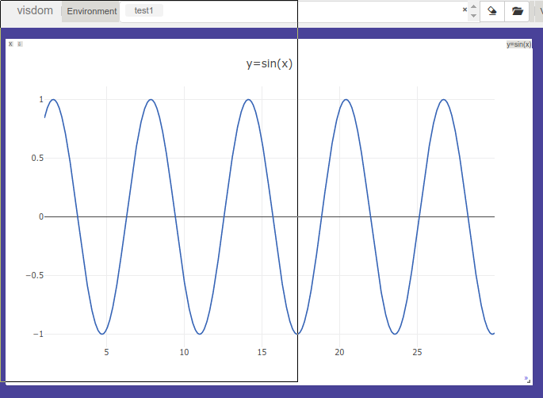

# PyTorch 常用工具

---

## 1. 数据加载

数据加载可以通过自定义数据集类实现，数据集对象被抽象成对应的 `Dataset` 类，实现自定义数据集对象需要继承该类并实现具体方法。

0. `__init__`: 实现对应的初始化，包括文件路径读取等等


1. `__getitem__`: 返回一条数据样本

   ```python
   obj[index]
   obj.__getitem__(index)
   ```

2. `__len__`

   返回样本的数目

   ```python
   len(obj)
   obj.__len__()
   ```

`Dataset` 主负责对数据的抽象，一次调用一个 `__getitem__` 返回一个样本，但是在神经网络的训练过程中一般都是用 batch 训练的，并且还要对数据集做 shuffle 和并行加速，这时需要使用 `DataLoader`

```python
DataLoader(dataset, batch_size=1, shuffle=False, sampler=None, batch_sampler=None, num_workers=0, collate_fn=<function default_collate at 0x7fdb9a522488>, pin_memory=False, drop_last=False, timeout=0, worker_init_fn=None)
```

* dataset: `Dataset` 对象
* batch_size: batch大小
* shuffle: 数据是否打乱
* sampler: 样本抽样
* num_workers: 多进程数目，默认不适用多进程
* collate_fn: 如何将多个样本拼接成 batch 的具体方法，一般使用默认即可
* pin_memory: 数据是否保存在 pin_memory 中，这样做可以加快数据到 GPU 转移的速度
* drop_last: dataset 的数据数目可能不是 batch 的整数倍，True可以省略最后多出来的一部分batch

库导入

```python
from torch.utils import Dataset, DataLoader
```

返回的 dataloader 对象是一个可迭代对象，可以迭代获取 batch 进行训练

## 2. 可视化神经网络 visdom

---

1. env: 环境，不同的环境的可视化结果相互隔离，互不影响，使用的时候不指定默认使用 main
2. pane: 窗格，可视化图像，可视化数值或者打印文本，每一个pane可视化或者记录一个信息
3. 支持 torch tensor 和 numpy tensor，不支持 python 的 int, float 需要转换数据类型到 numpy or torch

visdom 服务是一个 web server 服务，默认绑定 8097端口使用 tornado 非阻塞交互通信

1. 需要手动保存 env 否则下次启动服务会丢失
2. 客户端和服务器的交互采用 tornado 一步框架，可视化操作不会阻塞程序的训练和运行，网络异常程序也不会退出

启动 visdom 服务器

```bash
python -m visdom.server
nohup python -m visdom.server &    # 后台启动
```

创建新的 visdom 客户端，连接 server

```python
import visdom
vis = visdom.Visdom(env='test1')    # 创建新的环境 test1, 可以指定host, port 参数
x = torch.arange(1, 30, 0.01)
y = torch.sin(x)

# 支持常见的画图函数
# 1. line: loss or acc
# 2. image: show or plot the image
# 3. text: log in text ot html
# 4. histgram: 数据和参数的分布
# 5. scatter: 散点图
# 6. bar: 柱状图
# 7. pie: 饼状图

# win: pane name;    opts: config such as title, xlabel, ylabel, width ...
vis.line(X=x, Y=y, win='sinx', opts={'title': 'y=sin(x)'})   # 标题是 y=sin(x)

for i range(10):
    x = torch.Tensor([i])
    y = x ** 2 / 9
    # same line in the sinx but the name is different
    vis.line(X=x, Y=y, win='sinx', update='append', name='newline')
    
    
# image
# image: H * W / 3 * H * W
# images: N * C * H * W, 默认实现了 make_grid 方法拼接多个图片
vis.images(torch.randn(36, 3, 64, 64).numpy(), nrow=6, win='random3', opts={'title': 'random_imgs'})

# text, support html
vis.text('''<h1>Visdom is better than tensorboard !!!</h1>''')
```

在浏览器上打开效果



---

## 3. GPU

* `.cuda` 方法可以生成对应的 GPU 对象，`Tensor, nn.Module` ，其中 `tensor.cuda` 返回一个新的对象只有新对象在 GPU 上，但是 `nn.Module` 会返回 self 并搬运数据到 GPU 上

  ```python
  tensor = torch.Tensor(3, 4)
  tensor.cuda(0)    # no
  tensor.is_cuda   # False
  tensor = tensor.cuda(0)   # yes
  tensor.is_cuda   # True

  # model is different from the tensor and the variable
  model = nn.Linear(3, 4)
  model.weight.is_cuda    # False
  model.cuda(0)
  mode.weight.is_cuda    # True
  ```

* 大部分的损失函数都不用使用 cuda 方法，因为没有可以学习的参数，但是有的损失函数需要参数的时候(带权重的交叉熵损失函数)需要调用对应的 cuda 方法 (同 model)

* 多 GPU 训练的时候，可以考虑设置环境变量 `CUDA_VISIBLE_DEVICES` 

  ```python
  CUDA_VISIBLE_DEVICES = 1
  CUDA_VISIBLE_DEVICES = 0,1,2
  ```

  ​