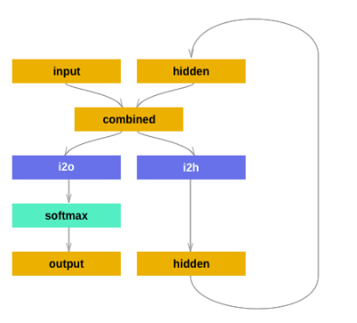
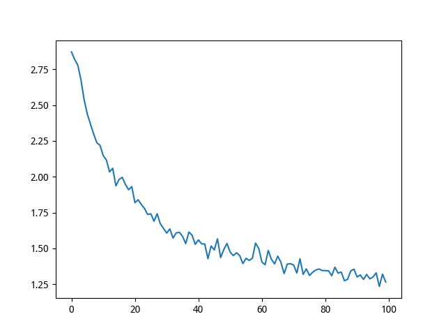
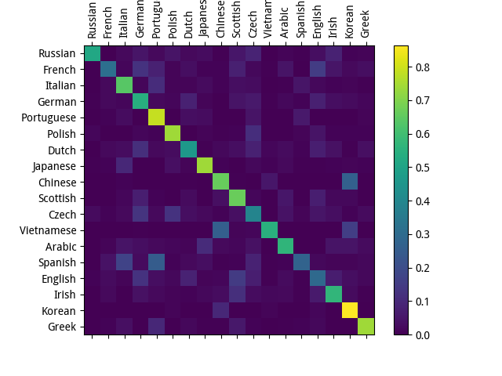

### 字符级 RNN 分类名称

我们将建立和训练一个基本的字符级RNN进行分类单词. 字符级别的RNN将单词读为一系列字符 - 在每个步骤输出一个预测和“隐藏状态”, 将先前的隐藏状态作为下一步的输入. 我们采取最后的预测作为输出,即该单词属于哪一类.

**具体来说,我们将用18种语言的几千个姓氏作为训练集并根据拼写预测名称来自哪种语言:**

#### 1. 准备数据

在 `data/names` 目录中包含18个人名的文本文件 “[Language].txt” . 每个文件都包含一堆名称,每个名称一行大多是罗马化（但我们仍然需要从Unicode转换为ASCII）.

我们最终会得到每种语言的名称列表字典 `{language: [names ...]}` 通用变量“类别”和“行” （在我们的例子中用于语言和名称）用于以后的扩展性.

```python
from __future__ import unicode_literals, print_function, division
from io import open
import glob

def findFiles(path): 
    return glob.glob(path)

print(findFiles('/home/lantian/Downloads/dataset/data/names/*.txt'))

import unicodedata
import string

all_letters = string.ascii_letters + " .,;'"
n_letters = len(all_letters)

# 将 Unicode 字符串转换为纯 ASCII 编码, 这里感谢 http://stackoverflow.com/a/518232/2809427
def unicodeToAscii(s):
    return ''.join(
        c for c in unicodedata.normalize('NFD', s)
        if unicodedata.category(c) != 'Mn'
        and c in all_letters
    )

print(unicodeToAscii('Ślusàrski'))

# 构建category_lines字典, 每种语言的名称列表
category_lines = {}
all_categories = []

# 读取一个文件并分成几行
def readLines(filename):
    lines = open(filename, encoding='utf-8').read().strip().split('\n')
    return [unicodeToAscii(line) for line in lines]

for filename in findFiles('/home/lantian/Downloads/dataset/data/names/*.txt'):
    category = filename.split('/')[-1].split('.')[0]
    all_categories.append(category)
    lines = readLines(filename)
    category_lines[category] = lines

n_categories = len(all_categories)

# test output
print(category_lines['Italian'][:5])
```

#### 2. 名字转换成张量

现在我们已经组织了所有的名字,我们需要将它们变成张量以便使用它们.

为了表示单个字母,我们使用大小为26的 one-hot 向量. 除了当前字母的索引处的1以外,单热矢量剩余填充0, `"b" = <0 1 0 0 0 ...>`.

为了说出一个词,我们将其中的一部分加入到二维矩阵中 `<line_length x 1 x n_letters>`.

额外的1维度是因为PyTorch假定所有内容都是批量的 - 我们在这里只使用1的批量大小.

```python
import torch

# 从all_letters中查找字母索引, e.g. "a" = 0
def letterToIndex(letter):
    return all_letters.find(letter)

# 只是为了演示, 把一个字母变成一个 <1 x n_letters> 张量
def letterToTensor(letter):
    tensor = torch.zeros(1, n_letters)    # batch = 1
    tensor[0][letterToIndex(letter)] = 1
    return tensor

# 把一行变成一个 <line_length x 1 x n_letters>,
# 或一批单热字符向量
def lineToTensor(line):
    tensor = torch.zeros(len(line), 1, n_letters)
    for li, letter in enumerate(line):
        tensor[li][0][letterToIndex(letter)] = 1
    return tensor

print(letterToTensor('J'))

print(lineToTensor('Jones').size())
```

#### 3. 构建神经网络



按照上图构建纯粹的 RNN

```python
import torch.nn as nn
from torch.autograd import Variable

# 构建网络
class RNN(nn.Module):
    def __init__(self, input_size, hidden_size, output_size):
        super(RNN, self).__init__()
        self.hidden_size = hidden_size
        self.i2h = nn.Linear(input_size + hidden_size, hidden_size)    # input to hidden
        self.i2o = nn.Linear(input_size + hidden_size, output_size)    # input to output
        self.softmax = nn.LogSoftmax(dim=1)

    def forward(self, input, hidden):
        combined = torch.cat((input, hidden), 1)    # 0是batch, 1是对应的one-hot向量和隐藏层向量
        hidden = self.i2h(combined)
        output = self.i2o(combined)
        output = self.softmax(output)
        return output, hidden

    def initHidden(self):
        return Variable(torch.zeros(1, self.hidden_size))

n_hidden = 128
rnn = RNN(n_letters, n_hidden, n_categories)

# 加载测试输入(char)
input = Variable(letterToTensor('A'))
hidden = Variable(torch.zeros(1, n_hidden))

# ouput 是 (1, 18) 的张量，next_hidden 是 (1, 128) 的张量
output, next_hidden = rnn(input, hidden)

# 加载整体的测试输入(word)
input = Variable(lineToTensor('Albert'))
hidden = Variable(torch.zeros(1, n_hidden))

output, next_hidden = rnn(input[0], hidden)   # 但是网络的定义决定一次只能输入一个字母的向量
print(output)
```

为了运行这个网络的一个步骤, 我们需要传递一个输入 (在我们的例子中是当前字母的张量，一个字母一个字母的输入) 和一个先前的隐藏状态 (我们首先初始化为零) . 我们将返回输出 (每种语言的概率) 和下一个隐藏状态 (我们为下一步保留). 请记住, PyTorch模块对变量进行操作, 而不是直接对张量进行操作.

#### 4. 训练

在训练之前,我们应该做一些辅助功能. 首先是解释网络的输出, 我们知道这是每个类别的可能性. 我么可以使用 `Tensor.topk` 得到最大价值的指数:

```python
# 使用 Tensor.topk 抽取类别
def categoryFromOutput(output):
    top_n, top_i = output.data.topk(1) # Tensor out of Variable with .data
    category_i = top_i[0][0]
    return all_categories[category_i], category_i

# print(categoryFromOutput(output))

# 准备数据集
import random

def randomChoice(l):
    return l[random.randint(0, len(l) - 1)]

def randomTrainingExample():
    # 随机抽取数据集进行训练
    category = randomChoice(all_categories)    # 随机抽取类别
    line = randomChoice(category_lines[category])   # 在随机的类别中随机抽取姓名
    category_tensor = Variable(torch.LongTensor([all_categories.index(category)]))
    line_tensor = Variable(lineToTensor(line))    # (seq, 1, embed)
    return category, line, category_tensor, line_tensor

for i in range(10):
    category, line, category_tensor, line_tensor = randomTrainingExample()
    print('category =', category, '/ line =', line)
```

训练网络

```python
criterion = nn.NLLLoss()    # 简答的负对数似然函数
learning_rate = 0.005       # 如果设置得太高, 可能会爆炸. 如果太低, 可能无法学习.

def train(category_tensor, line_tensor):
    hidden = rnn.initHidden()    # 这是普通的 RNN 不是 LSTM, 只需要一个 h_0 即可不需要 c_0
    rnn.zero_grad()

    for i in range(line_tensor.size()[0]):   # line_tensor.size()[0] 是序列的长度
        output, hidden = rnn(line_tensor[i], hidden)    # 之前的 output 被覆盖是因为我们只关心最后一次 output

    loss = criterion(output, category_tensor)
    loss.backward()

    # 将参数梯度添加到它们的值,再乘以学习速率
    for p in rnn.parameters():
        p.data.add_(-learning_rate, p.grad.data)    # p.data += -lr * p.grad.data

    return output, loss.data[0]

# 在训练的过程中，记录损失的结果
import time
import math

n_iters = 100000
print_every = 5000
plot_every = 1000
# 跟踪绘图的损失
current_loss = 0
all_losses = []

def timeSince(since):
    # 记录时间差
    now = time.time()
    s = now - since
    m = math.floor(s / 60)
    s -= m * 60
    return '%dm %ds' % (m, s)

start = time.time()

# 迭代训练过程
for iter in range(1, n_iters + 1):
    category, line, category_tensor, line_tensor = randomTrainingExample()
    output, loss = train(category_tensor, line_tensor)
    current_loss += loss

    # 打印循环数,损失,名称和猜测
    if iter % print_every == 0:
        guess, guess_i = categoryFromOutput(output)
        correct = '✓' if guess == category else '✗ (%s)' % category
        print('%d %d%% (%s) %.4f %s / %s %s' % (iter, iter / n_iters * 100, timeSince(start), loss, line, guess, correct))

    # 将当前损失平均值添加到损失清单
    if iter % plot_every == 0:
        all_losses.append(current_loss / plot_every)
        current_loss = 0
        
# 绘制结果
import matplotlib.pyplot as plt
import matplotlib.ticker as ticker

plt.figure()
plt.plot(all_losses)
plt.show()
```

loss 损失下降的结果



#### 5. 评估结果

要查看网络在不同类别中的表现如何, 我们将创建一个混淆矩阵, 为每个实际语言 (行) 指示网络猜测哪种语言 (列). 为了计算混淆矩阵,一堆样本通过网络运行 `evaluate()`, 这和 `train()` 减去反向传播是一样的.

```python
# 在混淆矩阵中跟踪正确的猜测
confusion = torch.zeros(n_categories, n_categories)
n_confusion = 10000

# 只要返回给定一行的输出即可
def evaluate(line_tensor):
    hidden = rnn.initHidden()
    for i in range(line_tensor.size()[0]):
        output, hidden = rnn(line_tensor[i], hidden)
    return output

# 通过一堆示例并记录哪些是正确的猜测,计算正确的概率
for i in range(n_confusion):
    category, line, category_tensor, line_tensor = randomTrainingExample()
    output = evaluate(line_tensor)
    guess, guess_i = categoryFromOutput(output)
    category_i = all_categories.index(category)
    confusion[category_i][guess_i] += 1

# 通过将每一行除以其每一行总和来标准化
for i in range(n_categories):
    confusion[i] = confusion[i] / confusion[i].sum()

# 设置绘图
fig = plt.figure()
ax = fig.add_subplot(111)
cax = ax.matshow(confusion.numpy())
fig.colorbar(cax)

# 设置轴
ax.set_xticklabels([''] + all_categories, rotation=90)
ax.set_yticklabels([''] + all_categories)

# Force label at every tick
ax.xaxis.set_major_locator(ticker.MultipleLocator(1))
ax.yaxis.set_major_locator(ticker.MultipleLocator(1))

# sphinx_gallery_thumbnail_number = 2
plt.show()
```



可以看出来，预测正确的概率非常大(对角线的预测数目很多)