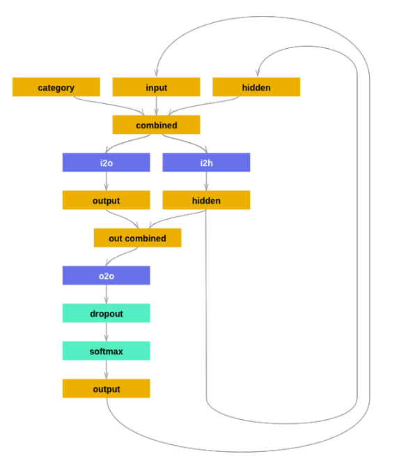
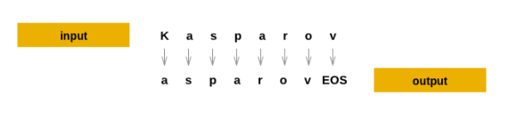
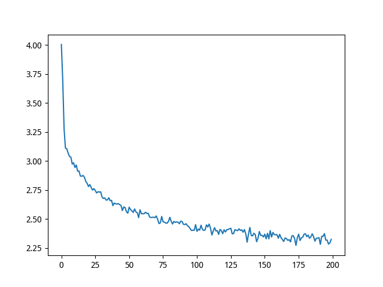

## 基与字符级RNN（Char-RNN）的人名生成

和 `2-1` 的教程类似，数据集一样，但是这次的任务是生成人名，在`2-1`里我们使用RNN把名字分类到它所属的语言中, 这次我们改变一下来学习从语言中生成名字

我们仍然手工搭建一个包含几个线性层的小的RNN. **这次的最大的不同是输入一个类别, 每次输出一个字母**, 而不是读入所有名字的字母来预测一个类别. 循环的预测每一个字母来构成语言（也可以用文 字或者其他更高级的结构完成）, 通常被称为“语言模型”.

### 1. 数据准备

每一行一个人名，并转换成 ASCII 存放入字典中

```python
from __future__ import unicode_literals, print_function, division
from io import open
import glob
import unicodedata
import string

all_letters = string.ascii_letters + " .,;'-"
n_letters = len(all_letters) + 1 # 添加 EOS 标记

def findFiles(path): 
    return glob.glob(path)

# 将 Unicode 字符串转换为纯 ASCII 编码, 感谢 http://stackoverflow.com/a/518232/2809427
def unicodeToAscii(s):
    return ''.join(
        c for c in unicodedata.normalize('NFD', s)
        if unicodedata.category(c) != 'Mn'
        and c in all_letters
    )

# 读取文件并分割成行
def readLines(filename):
    lines = open(filename, encoding='utf-8').read().strip().split('\n')
    return [unicodeToAscii(line) for line in lines]

# 构建映射字典 category_lines , 每个类别是由很多个行组成的list
category_lines = {}
all_categories = []
for filename in findFiles('/home/lantian/Downloads/dataset/data/names/*.txt'):
    category = filename.split('/')[-1].split('.')[0]
    all_categories.append(category)
    lines = readLines(filename)
    category_lines[category] = lines

n_categories = len(all_categories)
# 总共 18 个类别，每一个类别有一个名称的列表
# print('# categories:', n_categories, all_categories)
# print(unicodeToAscii("O'Néàl"))
```

### 2. 创建网络

* 类别张量是一个 one-hot 向量，表示一个类别
* 采样的时候，上一次的时间步的输出会被当做下一个时间步的输入

网络结构



这里的 dropout 层的目的上让输入的部分值通过给定的概率随机的变成0,这样的目的是为了防止过拟合，在网络的最末端使用，是的采样比较多样化。

网络构建

```python
import torch
import torch.nn as nn
from torch.autograd import Variable

class RNN(nn.Module):
    def __init__(self, input_size, hidden_size, output_size):
        super(RNN, self).__init__()
        self.hidden_size = hidden_size
        self.i2h = nn.Linear(n_categories + input_size + hidden_size, hidden_size)
        self.i2o = nn.Linear(n_categories + input_size + hidden_size, output_size)
        self.o2o = nn.Linear(hidden_size + output_size, output_size)
        self.dropout = nn.Dropout(0.1)    # 以 0.1 的概率随机失活
        self.softmax = nn.LogSoftmax(dim=1)

    def forward(self, category, input, hidden):
        input_combined = torch.cat((category, input, hidden), 1)   # 0维是batch,1维是向量层
        hidden = self.i2h(input_combined)
        output = self.i2o(input_combined)
        output_combined = torch.cat((hidden, output), 1)
        output = self.o2o(output_combined)
        output = self.dropout(output)
        output = self.softmax(output)
        return output, hidden

    def initHidden(self):
        return Variable(torch.zeros(1, self.hidden_size))
```

### 3. 训练

数据准备，产生随机的数据

```python
import random

# 从list中随机选取项
def randomChoice(l):
    return l[random.randint(0, len(l) - 1)]

# 获取随机的类别和该类别中随机的行
def randomTrainingPair():
    category = randomChoice(all_categories)
    line = randomChoice(category_lines[category])
    return category, line
```

对每一个时间步（生成过程中，也就是说在训练集中词的每个字母）网络的输入是 `(类别, 上一个时间步产生的字母, 隐藏层状态)` , 输出是 `(下一个字母, 下一个隐藏层状态)` . 对于每一个训练集, 我们需要的是类别、输入的字母集、输出/目标字母集.

因为在每一步, 我们从前上一个的字母预测当前的字母, 这样的字母对是在原有行中连续字母的集合, 例如, 对于 `"ABCD<EOS>"` 将会产生 (“A”, “B”), (“B”, “C”), (“C”, “D”), (“D”, “EOS”).



如上图所示，在预测过程中，首先是 k 预测出下一个字母是 a,之后a在预测出s等等以此类推，**其中类别向量是一个one-hot向量，在训练的每一个时间步上都输入网络**

```python
# 类别的 one-hot 向量
def categoryTensor(category):
    li = all_categories.index(category)
    tensor = torch.zeros(1, n_categories)
    tensor[0][li] = 1
    return tensor

# 输入串从第一个字母到最后一个字母（不包括 EOS ）的 one-hot 矩阵
def inputTensor(line):
    tensor = torch.zeros(len(line), 1, n_letters)
    for li in range(len(line)):
        letter = line[li]
        tensor[li][0][all_letters.find(letter)] = 1
    return tensor

# 目标的第二个字母到结尾（EOS）的 LongTensor
def targetTensor(line):
    letter_indexes = [all_letters.find(line[li]) for li in range(1, len(line))]
    letter_indexes.append(n_letters - 1) # EOS
    return torch.LongTensor(letter_indexes)
```

为了训练过程的便利, 添加一个 `randomTrainingExample` 函数, 获取随机的 (category, line) 对, 并把他们转换成需要的 (category, input, target) 张量。**对输入和输出进行建模，目的是让网络在指定类别的情况下输出对应的下一个字母的概率分布**

```python
# 从随机的（category, line）对中生成 category, input, and target 张量
def randomTrainingExample():
    category, line = randomTrainingPair()
    category_tensor = Variable(categoryTensor(category))
    input_line_tensor = Variable(inputTensor(line))
    target_line_tensor = Variable(targetTensor(line))
    return category_tensor, input_line_tensor, target_line_tensor
```

开始训练，与分类相比, 分类只用到了最后的输出, 而这里每个步都会产生一个预测, 所以我们需要计算每一步的损失.

**自动求导（autograd）的魔力就在于, 它允许将每一步的损失简单的加和, 并在最后调用 backward**

```python
criterion = nn.NLLLoss()
learning_rate = 0.0005

def train(category_tensor, input_line_tensor, target_line_tensor):
    target_line_tensor.unsqueeze_(-1)  # this line is very important, 这样索引到的是一个张量而不是一个数，否则之后没有办法计算损失
    hidden = rnn.initHidden()
    rnn.zero_grad()
    loss = 0

    for i in range(input_line_tensor.size()[0]):
        output, hidden = rnn(category_tensor, input_line_tensor[i], hidden)
        l = criterion(output, target_line_tensor[i])
        loss += l

    # 统一进行反向传播
    loss.backward()

    for p in rnn.parameters():
        p.data.add_(-learning_rate, p.grad.data)

    # 返回平均损失
    return output, loss.data[0] / input_line_tensor.size()[0]

import time
import math

def timeSince(since):
    now = time.time()
    s = now - since
    m = math.floor(s / 60)
    s -= m * 60
    return '%dm %ds' % (m, s)

# 开始训练
rnn = RNN(n_letters, 128, n_letters)
n_iters = 100000
print_every = 5000
plot_every = 500
all_losses = []
total_loss = 0 # 每 plot_every 次迭代需要重置
start = time.time()

for iter in range(1, n_iters + 1):
    output, loss = train(*randomTrainingExample())
    total_loss += loss

    if iter % print_every == 0:
        print('%s (%d %d%%) %.4f' % (timeSince(start), iter, iter / n_iters * 100, loss))

    if iter % plot_every == 0:
        all_losses.append(total_loss / plot_every)
        total_loss = 0
        
# 绘制损失的下降过程
import matplotlib.pyplot as plt
import matplotlib.ticker as ticker

plt.figure()
plt.plot(all_losses)
plt.show()
```



上图是训练后的loss下降图

### 4. 采样输出

```python
max_length = 20

# 从类别和起始字母采样
def sample(category, start_letter='A'):
    category_tensor = Variable(categoryTensor(category))
    input = Variable(inputTensor(start_letter))
    hidden = rnn.initHidden()
    output_name = start_letter

    for i in range(max_length):
        output, hidden = rnn(category_tensor, input[0], hidden)
        topv, topi = output.data.topk(1)
        topi = topi[0][0]
        if topi == n_letters - 1:
            break
        else:
            letter = all_letters[topi]
            output_name += letter
        input = Variable(inputTensor(letter))

    return output_name

# 给定一个类别和多个起始字母 获取个采样结果
def samples(category, start_letters='ABC'):
    for start_letter in start_letters:
        print(sample(category, start_letter))

samples('Russian', 'RUS')
samples('German', 'GER')
samples('Spanish', 'SPA')
samples('Chinese', 'CHI')
```

