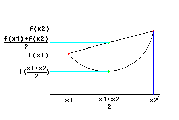

## 数学工具

---

### 1. 凸函数

凸函数定义  :

* 对区间 $$[a, b]$$ 上定义的函数 $$f$$, 如果对于区间中任意两点 $$x_1,x_2$$ 均满足

  $$f(\frac{x_1+x_2}{2}) \le \frac{f(x_1) + f(x_2)}{2}$$

  称函数 $$f$$ 是在区间 $$[a, b]$$ 上的凸函数

凸函数的判定 :

* 二阶导数在区间上是非负的就是凸函数
* 二阶导数在区间上是正的，称为严格凸函数

---

### 2. 矩阵，向量求导法则

1. 参考资料

   [维基百科](https://en.wikipedia.org/wiki/Matrix_calculus#Scalar-by-vector_identities)

---

### 3. 满秩矩阵

1. 满秩矩阵在机器学习中的意义

---

### 4. 极大似然法

---

